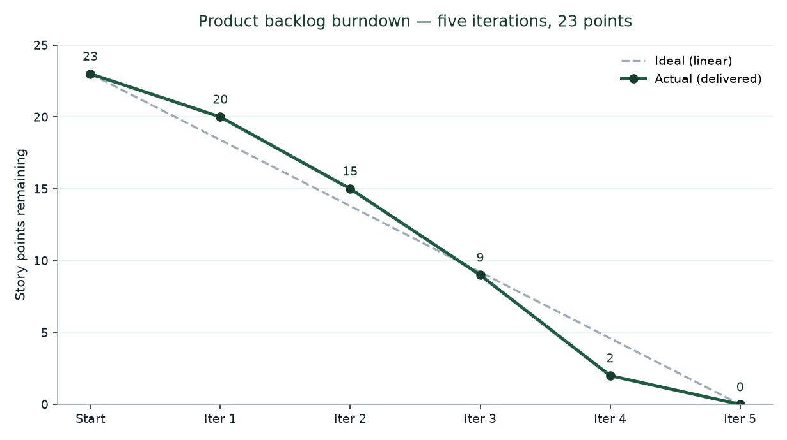
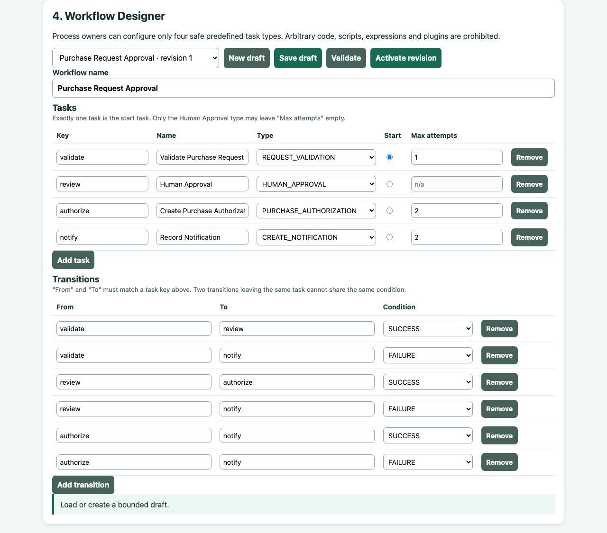

<style>
@page { size: A4; margin: 19mm 17mm 20mm 17mm; @bottom-center { content: counter(page); font-size: 8pt; color: #5a6470; } }
body { font-family: "Arial", sans-serif; font-size: 10.3pt; line-height: 1.42; color: #17212b; }
header#title-block-header { display: none; }
h1 { color: #163d2e; font-size: 20pt; margin-top: 1.4em; break-after: avoid; }
h2 { color: #1f5c44; font-size: 15pt; break-after: avoid; }
h3 { color: #2d7a5c; font-size: 12pt; break-after: avoid; }
table { width: 100%; border-collapse: collapse; margin: 0.8em 0 1.2em; font-size: 8.5pt; }
thead { display: table-header-group; }
tr { break-inside: avoid; }
th, td { border: 0.5pt solid #9eabb7; padding: 4px 5px; vertical-align: top; }
th { background: #e8f2ec; color: #163d2e; }
img { display: block; max-width: 100%; max-height: 215mm; margin: 0.8em auto; }
figure { break-inside: avoid; }
figcaption { text-align: center; font-size: 8.5pt; color: #4c5964; }
pre { font-size: 8.3pt; white-space: pre-wrap; background: #f4f6f8; padding: 7px; }
code { font-family: "Menlo", monospace; font-size: 0.9em; }
.page-break { break-after: page; }
.cover { text-align: center; padding-top: 28mm; }
.cover h1 { font-size: 25pt; margin-bottom: 18mm; }
.cover p { margin: 0.7em 0; }
</style>

<div class="cover" markdown="1">

# Event-Driven Workflow Management System

**University of Messina**<br>
**Project:** Event-Driven Workflow Management System<br>
**Reference workflow:** Purchase Request Approval<br>
**Student:** Yermek Aubayev<br>
**Matricola:** 551098<br>
**Academic year:** 2025/2026

</div>

<div class="page-break"></div>

# Table of contents

1. Executive summary
2. Introduction
3. Real-world problem and system boundary
4. Objectives, scope, and effort
5. Requirements engineering
6. Development process and project control
7. Evolution history
8. Product description
9. Reference workflow behavior
10. Architecture
11. Workflow Designer
12. Custom algorithms and invariants
13. Orchestration and choreography comparison
14. Verification and evidence
15. Quality evaluation
16. Reuse disclosure
17. Limitations and future work
18. Conclusion
19. References
20. Appendices (traceability, API summary, defense checklist, claim ledger)

<div class="page-break"></div>

# Executive summary

This is a solo Software Engineering project: a workflow-management system scoped down to one reference process, Purchase Request Approval. A requester submits structured purchase data. The system validates it, opens a persistent approval task for a manager, and waits for a decision (nothing held in memory while it does). Once the decision arrives, the same run resumes; on approval it creates an internal Purchase Authorization plus an Internal Notification, all logged in an ordered audit trace. The negative paths get the same care as the happy path. Bad input never reaches a human approver. A rejection blocks authorization outright. A transient authorization failure gets a bounded number of retries, and exhausting those retries routes to manual action instead of looping forever.

The core engineering comparison is two ways of driving the same run. Orchestration is a central loop that walks the run forward. Choreography reacts to a run-scoped event published on a synchronous, in-process EventBus. Both sit on top of the same immutable workflow revision, the same task executors, retry policy, transition resolver, SQLite persistence, and approval lifecycle, so the comparison is about who owns the "what happens next" decision, not about two different products. I want to be precise about what the choreography claim covers: event-reaction control inside one modular application. It says nothing about distributed services, durable messaging, or asynchronous delivery, and I do not present it that way anywhere in this report.

The part of this project that is genuinely mine, rather than framework configuration, is the workflow core underneath both modes. Deterministic graph validation. Transition precedence. Retry that is bounded and resolved before routing. A persistent versioned cursor. Run isolation. Immutable revisions. Human wait-and-resume. Idempotent decisions with conflict detection. An ordered trace. Recovery after a real process restart. On top of that sits a Workflow Designer, closed on purpose to four task types and three transition conditions, with no arbitrary executable logic allowed in.

The evidence behind these claims comes from source inspection, connected API journeys, domain and application tests, persistence tests, deployment checks, and two tests that restart a real process mid-run. Running the unchanged suite currently reports **99 passed**. Throughout this report I have tried to keep executed evidence, inspected design, and open limitations visibly separate rather than letting one read as the other. There is no production performance data, no user research, no security testing, and no claim of a real deployment anywhere in what follows.

# Introduction

It is easy for a workflow-management project to become a demonstration of motion rather than a useful system: a screen where nodes turn green and events fire, without ever answering who owns the next action, what happens while that person is away, or what the process was actually for. My goal with this project was to tie the technical mechanics to one small, concrete organizational process, so that every diagram and every test maps back to something a non-technical reader would recognize as real work.

I picked Purchase Request Approval because it gives me the engineering situations the course direction calls for: structured input, deterministic validation, a genuine human wait, positive and negative outcomes, an automatic effect that follows approval, a retryable technical failure, history, and a safe configuration surface, all without needing any real financial or procurement infrastructure behind it. It is also something an evaluator can follow at a glance while still exercising both accepted complex functionalities, orchestration and choreography.

Where the system stops matters as much as what it does. A Purchase Authorization is an internal record that says "the workflow approved this," nothing more. It is not a purchase order, a budget reservation, a supplier instruction, an invoice, an accounting entry, or a payment. The Internal Notification is a row in the database, not an email. The scripted failures used for demonstration are deterministic switches I control, not observations of some third-party service breaking. I keep repeating these boundaries because it would be easy, in a demo, to let the audience assume the system does more than it does.

This report is meant to stand on its own: problem, requirements, process, evolution, product, architecture, algorithms, the orchestration/choreography comparison, evidence, quality, reuse, limitations, and a defense checklist at the end. The UML figures appear where they support an argument in the text, not as a gallery at the back.

# Real-world problem and system boundary

## Target organization and actors

Picture a small organization that needs to control a repeatable internal approval process but has no appetite for a full enterprise process platform. Left informal, requests arrive as messages or spreadsheet rows. Required fields vary from one submission to the next. It is not always clear whose turn it is to act, duplicate decisions slip through, and a server restart can leave nobody sure what state things were in. A process owner in that situation also has no safe way to adjust the sequence of steps short of asking a developer to change code.

| Stakeholder or actor | Goal | Product response | Claim class |
|---|---|---|---|
| Requester | Submit complete purchase information and see the authoritative outcome | Structured form, request/run status, notification, audit history | Implemented and inspected |
| Approver | Receive persistent work with meaningful context and decide once | Inbox, work-item detail, approve/reject endpoint, idempotency/conflict rules | Implemented and tested |
| Process owner | Configure a bounded reusable process safely | Draft CRUD, validation, closed task catalog, immutable activation | Implemented and tested |
| Academic evaluator | Understand value and compare two control strategies | Business-first UI, shared scenarios, UML and paired tests | Implemented and inspected |
| Professor | Evaluate whether the final project satisfies academic expectations | Evidence report and defense script; acceptance remains external | Documented limitation |

None of these are security identities. There is no login, no password, no role assignment, no authorization middleware standing between a browser tab and the API. Whoever can reach the local application can use every endpoint. That is fine within the academic/local boundary this project sets for itself, and it is the first thing I would fix before letting anyone near a real deployment.

## Before and after

| Concern | Informal before-state | System after-state |
|---|---|---|
| Input | Inconsistent messages or spreadsheet rows | Required structured fields with deterministic validation |
| Ownership | Next actor may be unclear | Pending approval work item identifies the required action |
| Waiting | State depends on conversation context | Run and cursor persist in SQLite while no process action is active |
| Duplicate action | Repeated messages may create ambiguity | Identical decision is idempotent; conflicting decision is rejected |
| Temporary failure | Manual repetition may be uncontrolled | Retry is classified and bounded before graph routing |
| Process changes | Ad-hoc instructions | Validated draft and immutable activated revision |
| History | Timestamps/messages are fragmented | Ordered run-local audit trace and persisted effects |
| Restart | In-memory progress can disappear | Committed cursor and records permit same-run recovery |

This table describes how I framed the problem and what the system does about it. It is not drawn from interviews or measurements at a real organization, and I do not present it as such.

## Useful result

What the system produces, at the end of a run, is a state you can explain and defend. An approved run reaches `AUTHORIZED` with a Purchase Authorization and an Internal Notification attached to it. A rejected request reaches `REJECTED` and never touches authorization. An invalid submission reaches `VALIDATION_FAILED` before any human is even asked to look at it. An authorization that keeps failing technically, past its retry bound, reaches `NEEDS_MANUAL_ACTION` instead of silently stalling. The run projection plus the ordered trace tell you exactly how each of these was reached, step by step.

Figure 1 lays out the actors and the use cases this system actually supports.


## Explicit boundary

To say it plainly one more time: this system does not place orders, move money, confirm budgets, contact suppliers, send external notifications, make accounting entries, run fraud checks, or talk to an ERP. It does not authenticate anyone, does not spread execution across services, and makes no promise about production uptime. These are not features I ran out of time for. They were never in scope.

# Objectives, scope, and effort

## Objectives and Must Have scope

The objective was to demonstrate a configurable, persistent, event-driven workflow core through a process a person can actually follow. The Must Have scope I committed to:

| ID | Functional scope | Completion evidence |
|---|---|---|
| M1 | Represent and validate a conditional acyclic workflow | Validator and constructor tests |
| M2 | Activate immutable revisions and bind each run to one revision | Persistence/constructor tests |
| M3 | Submit and validate structured Purchase Request data | Domain and connected journey tests |
| M4 | Persist human approval work and resume the same run | Approval and restart tests |
| M5 | Resolve success/failure transitions deterministically | Resolver tests |
| M6 | Retry classified technical failures within a positive bound | Retry and step-service tests |
| M7 | Execute equivalent semantics by orchestration and choreography | Paired scenario tests |
| M8 | Persist attempts, effects, cursor, decisions, and ordered trace | Persistence and journey evidence |
| M9 | Provide four understandable browser views | HTML inspection and local application smoke evidence |
| M10 | Provide reproducible local and optional single-service container startup | Launcher and Compose verification |

## Exclusions

I left out authentication/RBAC, external integrations, distributed brokers, microservices, arbitrary user code, full BPMN, cycles, parallel fork/join, nested workflows, external notification delivery, production monitoring, high availability, and any verified scalability. Cutting these was not about running out of time. It kept the project honest about what one student can actually build and test in the time available, instead of quietly wiring up a framework and calling the wiring "custom engineering."

## One-student, 100-hour justification

I used a peer report as a structural reference only; that project had three students and roughly 300 hours behind it. This one has one student and about 100 hours, which is why it settles on one reference workflow, four task types, one deployable process, a compact browser UI, and no external service integration.

| Activity | Hours |
|---|---:|
| Problem framing, feedback analysis, and scope control | 8 |
| Requirements and traceability | 12 |
| Domain graph, resolver, and retry logic | 16 |
| Persistence, revision, cursor, and transaction design | 15 |
| Human approval, idempotency, and recovery | 13 |
| Orchestration/choreography implementation and comparison | 12 |
| API, UI, and bounded Workflow Designer | 9 |
| Automated verification and debugging | 9 |
| Documentation, UML, report, and defense reconciliation | 6 |
| **Total** | **100** |

This is a retrospective allocation by activity category, put together after the fact from what I actually worked on. It is not a timesheet, and I am not going to pretend it tracks individual meetings or dates.

# Requirements engineering

## Stakeholder goals and functional requirements

I organized requirements at two levels on purpose, because a problem-level goal and a testable system rule are not the same thing and should not be written as if they were. The actor-level goals below describe the useful outcome each stakeholder needs, without naming a technology or a solution. The numbered functional requirements underneath them say exactly what the system must do to satisfy that goal, each paired with how it was actually verified.

### User-level goals

| Actor | User goal |
|---|---|
| Requester | Submit a Purchase Request and see its validation, approval, authorization, failure, and notification state. |
| Approver | See a pending work item, inspect the submitted information, and approve or reject it once. |
| Workflow operator | Configure and validate a bounded purchase request workflow, select an execution mode, and inspect runs and trace. |
| Academic evaluator | Follow one understandable purchase request outcome and compare both execution modes using equivalent evidence. |

These are logical demonstration roles, not security identities; there is no login behind any of them, consistent with the boundary stated earlier.

A requester has to provide a name, department, item or service, supplier, a positive amount, a three-letter uppercase currency code, a justification long enough to mean something, and a required date that is not in the past. Domain validation reports every field-specific problem it finds, not just the first one. A valid request moves to exactly one human approval task. The approver sees the context and submits approve or reject; reject requires a reason, approve does not. Approval is the only path that leads to a Purchase Authorization, and rejection closes that door immediately. Every automatic step persists its own attempt and carries a failure classification. Every run stays isolated, keeps its own ordered trace, and stays bound to the revision it was created against for its entire lifetime.

### Structured input boundary

| Field | Rule |
|---|---|
| requester_name | Required; trimmed length 1-120 characters. |
| department | Required; trimmed length 1-120 characters. |
| item_or_service | Required; trimmed length 1-200 characters. |
| supplier | Required; trimmed length 1-120 characters. |
| amount | Decimal greater than 0, at most 999999999.99, with no more than two fractional digits. |
| currency | Exactly three uppercase ASCII letters. |
| business_justification | Trimmed length 20-1000 characters. |
| required_date | Valid YYYY-MM-DD date not earlier than the submission date. |

### System-level functional requirements

Every rule below is atomic, has one executed verification method, and one pass/fail acceptance condition. 53 are active; identifiers keep their historical numbers so evidence stays traceable across the project's revisions, which is why the numbering has gaps.

**Workflow definition and routing**

| ID | Requirement | Verification method | Acceptance condition |
|---|---|---|---|
| FR-001 | The system shall represent each workflow definition as explicit task nodes connected by directed transitions. | Definition inspection and executable definition test | Stored nodes and transitions can be retrieved without deriving edges from display order. |
| FR-002 | The system shall require exactly one designated start task in every accepted workflow definition. | Validation test | Zero-start and multiple-start definitions are rejected before revision activation or run creation. |
| FR-003 | The system shall require at least one terminal task reachable from the designated start. | Validation test | A definition without a reachable terminal is rejected. |
| FR-004 | The system shall require every task to be reachable from the designated start. | Graph-validation test | Every unreachable task is identified and the definition is rejected. |
| FR-005 | The system shall reject a workflow definition containing a self-edge or directed cycle. | Graph-validation test | Self-edge and multi-node-cycle examples are rejected; the equivalent DAG is accepted. |
| FR-006 | The system shall complete all definition validation before activating a revision or creating run state. | Validation/persistence test | Any definition violation creates no active revision, run, attempt, work item, or trace. |
| FR-007 | The system shall accept only SUCCESS, FAILURE, or ALWAYS as transition conditions. | Validation test | Every other condition is rejected. |
| FR-008 | The resolver shall select a matching SUCCESS or FAILURE transition before considering ALWAYS. | Resolver test | A matching outcome-specific edge suppresses an ALWAYS edge from the same task. |
| FR-009 | The resolver shall select ALWAYS only when no transition matches the final task outcome. | Resolver test | Exactly one fallback is selected only in the absence of a matching specific edge. |
| FR-010 | The system shall reject equal-precedence transition ambiguity. | Validation test | Duplicate specific or duplicate fallback edges from one task are rejected. |
| FR-011 | A final SUCCESS with no eligible transition shall produce a successful terminal decision. | Terminal test | The run trace ends with a successful terminal observation. |
| FR-012 | A final FAILURE with no eligible transition shall produce an unsuccessful terminal decision. | Terminal test | The run trace ends with an unsuccessful terminal observation. |
| FR-013 | Both execution modes shall use the same workflow revision. | Paired-mode inspection | One revision identifier is used without mode-specific conversion. |
| FR-014 | Both execution modes shall use the same transition resolver. | Design inspection and paired resolver test | Equal task result and outgoing transitions produce the same selection or terminal decision. |

**Execution, state, retry, and trace**

| ID | Requirement | Verification method | Acceptance condition |
|---|---|---|---|
| FR-015 | Orchestration mode shall advance an accepted run under centralized application control. | Orchestration acceptance test | Only resolver-selected tasks execute and the run records mode orchestration. |
| FR-016 | Choreography mode shall advance an accepted run through run-scoped in-memory EventBus reactions. | Choreography acceptance test | The run records mode choreography, advances through in-memory events, and requires no broker. |
| FR-017 | Both modes shall produce semantic parity for the same workflow revision, purchase request input, approval decision, and deterministic fault schedule. | Paired normalized-trace comparison | Reached tasks, final outcomes, selected transitions, retry counts, waiting/resume observations, purchase request state, notification result, and terminal run state are equivalent. |
| FR-018 | The system shall create run-specific execution state for every run. | Persistence inspection | Attempts, decisions, transitions, trace, and terminal state reference exactly one run. |
| FR-019 | A later sequential run shall not overwrite an earlier run's state or trace. | Sequential isolation test | Both complete histories remain retrievable. |
| FR-020 | Concurrent runs shall not read or write each other's runtime or business state. | Controlled-concurrency test | No purchase request, work item, attempt, decision, notification, or trace crosses run identity. |
| FR-021 | Every automatic task shall have a positive maximum-total-attempt bound. | Definition-boundary test | Missing, zero, or negative bounds are rejected; one permits one attempt and zero retries. |
| FR-022 | The system shall retry an automatic task if and only if its result is a retryable technical failure and the completed-attempt count is below its bound. | Two-sided retry test | Retry occurs below the bound; it does not occur for business failure, non-retryable failure, human task, or exhausted bound. |
| FR-023 | The system shall persist every automatic attempt's ordinal, outcome, failure classification when applicable, reason, start time, and finish time. | Persistence/restart test | Retrieved attempts match the executed sequence before and after restart. |
| FR-024 | Retry shall repeat the current automatic task without selecting a workflow transition. | Trace inspection | A retry observation occurs between attempts and no transition is selected during that interval. |
| FR-025 | After attempt exhaustion, the final FAILURE shall enter normal FAILURE then ALWAYS transition resolution. | Exhaustion/resolver test | Specific failure route precedes fallback; absence of both produces the FR-012 terminal. |
| FR-026 | The system shall persist an ordered trace for each run. | Expected-versus-retrieved trace comparison | The trace contains all applicable run, task, attempt, retry, transition, waiting, resume, approval, purchase request-state, notification, and terminal observations in committed order. |

**Request submission and validation**

| ID | Requirement | Verification method | Acceptance condition |
|---|---|---|---|
| FR-031 | The requester shall be able to submit the structured Purchase Request fields defined above. | API/UI acceptance test | A syntactically accepted payload creates one request in SUBMITTED state and one run. |
| FR-032 | REQUEST_VALIDATION shall validate every required field against the input boundary before human approval. | Parameterized validation test | Every invalid field produces business FAILURE with a field-specific reason and no approval work item. |
| FR-033 | Request validation shall use structured values only and shall not depend on uploaded files or external services. | Source inspection and connected API test | The request API accepts JSON and the executor invokes domain validation. |
| FR-034 | An accepted submission shall start one run linked to the purchase request, selected active workflow revision, and selected execution mode. | Persistence test | The purchase request, run, mode, and revision references are mutually retrievable. |
| FR-035 | A validation business failure shall set purchase request state VALIDATION_FAILED and shall create no approval work item. | Invalid-submission scenario | The failure route and notification are recorded, with zero approval work items for the run. |

**Human approval and continuation**

| ID | Requirement | Verification method | Acceptance condition |
|---|---|---|---|
| FR-036 | Reaching HUMAN_APPROVAL shall create exactly one PENDING approval work item for the purchase request and run. | Approval-creation test | One pending item exists even if the reach command/event is delivered twice. |
| FR-037 | After creating the work item, the system shall set the purchase request to PENDING_APPROVAL and the run to WAITING_FOR_APPROVAL. | State test | No successor task or terminal decision occurs before a decision is accepted. |
| FR-038 | The approver shall be able to list pending work items and inspect meaningful Purchase Request context. | API/UI inspection | The selected item displays associated request fields and run identity. |
| FR-039 | The approver shall be able to approve one pending work item with an optional note of at most 500 characters. | Approval test | The item becomes APPROVED, purchase request becomes APPROVED, and task outcome becomes SUCCESS. |
| FR-040 | The approver shall be able to reject one pending work item with a trimmed reason of 1-500 characters. | Rejection/boundary test | The item becomes REJECTED, purchase request becomes REJECTED, and task outcome becomes FAILURE; empty or oversized reasons are rejected. |
| FR-041 | The first valid decision shall be authoritative; an identical repeat shall be idempotent and a conflicting later decision shall be rejected without state change. | Duplicate/conflict test | One decision record exists, identical replay returns the existing result, and conflicting replay returns a controlled conflict. |
| FR-042 | An accepted approval decision shall resume the same waiting run exactly once. | Continuation/isolation test | The original run leaves waiting state, no second run is created, and another waiting run is unchanged. |

**Business completion and notification**

| ID | Requirement | Verification method | Acceptance condition |
|---|---|---|---|
| FR-043 | PURCHASE_AUTHORIZATION shall create an internal authorization record and set the request to AUTHORIZED when execution succeeds. | Approved-request scenario | The authorization identifier and state are retrievable and committed before successor dispatch. |
| FR-044 | Exhausted authorization failure shall set the purchase request to NEEDS_MANUAL_ACTION before failure routing. | Permanent-failure scenario | Attempts reach the configured bound, purchase request state changes once, and normal failure routing follows. |
| FR-045 | The system shall provide explicit deterministic authorization behaviors for normal processing, one retryable failure followed by success, and retry exhaustion, without deriving behavior from task display names. | Adapter, API, and UI scenario tests | The selected behavior is persisted with the run, is repeatable in both modes, and task renaming does not alter routing policy. |
| FR-046 | CREATE_NOTIFICATION shall persist one internal notification describing the purchase request's final business state or required manual action. | Scenario inspection | One notification exists for each reference scenario after the notification task succeeds. |
| FR-047 | The submitter shall be able to retrieve the purchase request's current state, approval result/reason when present, notification, run state, and ordered trace. | Status/history test | All values belong to the selected purchase request/run and agree with persisted execution records. |

**Bounded constructor and user interface**

| ID | Requirement | Verification method | Acceptance condition |
|---|---|---|---|
| FR-048 | The workflow operator shall be able to create, retrieve, update, and delete draft workflow definitions. | CRUD acceptance test | Each operation affects only the selected draft and returns its current representation. |
| FR-049 | The constructor shall allow tasks only from REQUEST_VALIDATION, HUMAN_APPROVAL, PURCHASE_AUTHORIZATION, and CREATE_NOTIFICATION. | Constructor validation test | Unsupported task types are rejected and no executable code can be supplied. |
| FR-050 | The constructor shall allow task name, task type, one start designation, automatic-task attempt bound, and SUCCESS/FAILURE/ALWAYS transitions to be configured through bounded form controls. | UI/API inspection | A reference workflow can be configured without editing source or submitting scripts. |
| FR-051 | The constructor shall visualize the current directed graph and display all definition-validation issues before activation. | UI inspection | Tasks, labeled edges, start designation, and complete validation feedback are visible. |
| FR-052 | Activating a valid draft shall create an immutable workflow revision; editing a definition used by a run shall require a new revision. | Revision test | Earlier runs continue to reference unchanged revision content after a later edit. |
| FR-053 | The browser demonstration shall provide connected views for purchase request submission/status, deterministic authorization behavior, pending approval/decision, bounded workflow configuration, execution-mode selection, and run trace. | End-to-end UI inspection | Approved, rejected, invalid, retry-success, and manual-action outcomes can be demonstrated in one application while the business state remains primary. |

## Non-functional requirements

Rather than write vague quality statements, I paired each one with a threshold and a way to check it. The summary table gives the shape of the ten qualities that matter most; the numbered table below it is the exact, executed baseline behind that summary.

| Quality | Metric/threshold | Evidence |
|---|---|---|
| Determinism | Same revision/input/decision/fault schedule produces equivalent semantic outcome in both modes | Paired normalized scenario tests |
| Retry safety | Automatic executions never exceed configured positive max_attempts | Retry and step-service tests |
| Restart recovery | Waiting run reaches the same authorized result after real process recreation | Two Uvicorn restart tests |
| Isolation | No request, attempt, decision, effect, or trace crosses run identity | Sequential and controlled concurrent tests |
| Configuration safety | Invalid graph/task configuration cannot activate a revision | Constructor/validator negative tests |
| Trace completeness | Relevant committed state changes have ordered run-local observations | Exact trace and journey assertions |
| Deployment boundedness | Compose defines one application service and no broker | docker compose config --quiet and inventory tests |
| API inspectability | Current OpenAPI exposes request, approval, run, and workflow routes | OpenAPI smoke inspection |
| Maintainability | Business algorithms remain independent of FastAPI and SQLite types | Layer/source inspection and domain tests |
| Usability evidence | Four task-oriented headings and business context precede technical controls | HTML/manual inspection; no user-study claim |

| ID | Requirement | Verification method | Acceptance condition |
|---|---|---|---|
| NFR-001 | Repeating one acceptance scenario in the same mode from equivalent state shall produce an equivalent normalized trace. | Two runs per mode/scenario | All normalized observations match; only generated identities and timestamps may differ. |
| NFR-002 | Each acceptance scenario shall satisfy semantic parity across orchestration and choreography. | Five paired comparisons covering ten executions | Every orchestration case has one equivalent choreography case under FR-017. |
| NFR-003 | Workflow revisions, purchase requests, runs, attempts, waiting work, decisions, notifications, and trace shall survive a controlled application restart. | Restart-retention test | Pre-restart values are retrievable after restart; a waiting item remains decidable and resumes its original run. |
| NFR-004 | Every trace shall be complete for the committed state changes of its run. | Expected-versus-retrieved comparison | No expected observation is absent, duplicated, out of order, or associated with another run. |
| NFR-005 | Pre-activation validation shall cover every graph, retry-bound, and constructor rule (FR-002-FR-007, FR-010, FR-021, FR-049-FR-052). | Rule-path inspection and parameterized cases | Every invalid class is rejected without active revision or runtime state; valid boundaries are accepted. |
| NFR-006 | The deployed target shall remain one FastAPI application backed by one persistent SQLite database. | Deployment inventory | One application service is present; no microservice or broker is required. |
| NFR-007 | All sequential, concurrent, duplicate-decision, and resume tests shall preserve purchase request/run isolation. | State-partition comparison | No record contains another case's purchase request or run identity and no state is overwritten across cases. |
| NFR-008 | Acceptance execution shall require no random outcome generation, distributed broker, payment/accounting system, content-extraction service, or external notification provider. | Dependency/source inspection and isolated execution | All reference cases run with local controlled inputs and no prohibited dependency or call. |
| NFR-009 | Structured field validation shall enforce the complete input boundary before a request reaches human approval. | Boundary suite | Every invalid field class fails with a controlled reason and creates no approval item. |
| NFR-010 | On the recorded reference environment, 95 of 100 consecutive reads of purchase request status and trace for a completed reference run shall finish within 1 second each. | Timed local acceptance run with environment recorded | At least 95 measured reads meet the threshold; no external service is used. |
| NFR-011 | The primary purchase request-status view shall show purchase request identity, current business state, required next human action when any, final result, and execution mode without requiring raw-trace inspection. | UI content inspection | All five items are visible for the selected purchase request; trace remains available as secondary technical evidence. |

There is no response-time, throughput, concurrent-user, or uptime number beyond NFR-010's local read threshold. I never had a credible performance environment or a real production workload to measure against.

## Constraints

The stack is Python/FastAPI, SQLAlchemy, Pydantic, SQLite, a static browser client, pytest, and Docker as an optional extra. It stays a modular monolith. Workflow definitions are conditional DAGs. The task catalog is closed. The EventBus is synchronous and in-process. Runtime databases are not version-controlled. Some of these are feasibility calls. Some are deliberate boundaries on what the system claims to be. In practice they end up being the same list, and the numbered constraints below are the exact, checkable form of that list.

| ID | Constraint | Verification |
|---|---|---|
| CON-001 | The target is one FastAPI application, not a microservice or distributed-execution system. | Deployment inventory. |
| CON-002 | Persistent SQLite storage is required; final tables and columns remain architecture decisions. | Requirements/design boundary inspection. |
| CON-003 | Choreography uses a run-scoped in-memory EventBus and no Kafka, ZooKeeper, or other broker. | Dependency and deployment inspection. |
| CON-004 | Workflow task definitions do not store mutable run, attempt, decision, waiting, purchase request, or terminal state. | Domain and persistence review. |
| CON-005 | Product outcomes come from validated input, explicit decisions, and bounded task behavior; verification faults are deterministic and no outcome is random. | Source and fixture inspection. |
| CON-006 | Retry does not create or require a graph cycle. | Definition and trace inspection. |
| CON-007 | Parallel fork/join execution remains outside scope. | Requirements/design/implementation review. |
| CON-008 | Acceptance scenarios make no external business-service calls. | Isolated execution and dependency inspection. |
| CON-009 | Authentication, role authorization, billing, analytics, external email, payment, accounting integration, automated content extraction, and fraud detection remain outside scope; internal notifications are included. | Scope and dependency inspection. |
| CON-010 | Requirements do not prescribe final endpoint paths, schema layout, classes, or UML structure. | Document inspection. |
| CON-011 | Users cannot upload or enter executable code, scripts, templates with executable expressions, or executor plugins. | Constructor/API negative tests. |
| CON-012 | A general BPMN editor, arbitrary drag-and-drop modeler, marketplace, and full low-code platform are outside scope. | UI and scope inspection. |
| CON-013 | Human approval decisions are never automatically retried. | Retry and decision trace inspection. |
| CON-014 | Camunda, n8n, and Temporal are behavioral references only; their engines and workflow definitions are not runtime dependencies. | Dependency, source, and report-reference inspection. |

CON-003 is worth being explicit about, since it marks a real change from an earlier direction. Kafka was part of the architecture I originally proposed and that was approved to proceed. Once the choreography comparison was actually being built, a distributed broker added deployment complexity and a second failure surface without making the orchestration-versus-choreography evidence any stronger, so I replaced it with the in-process EventBus described in the Architecture section. The comparison this project makes is about control ownership, not about distributed messaging, and CON-003 is where that boundary is enforced rather than just asserted.

## Acceptance criteria and traceability

| Scenario | Input/action | Expected observable result | Automated evidence |
|---|---|---|---|
| Valid approval | Valid request, approve | `AUTHORIZED`; authorization and notification exist | Connected journey in both modes |
| Rejection | Valid request, reject with reason | `REJECTED`; no authorization | Connected journey in both modes |
| Invalid request | Invalid required field | `VALIDATION_FAILED`; no approval work item | Domain/journey tests |
| Retry then success | Valid approval, deterministic transient fault | Two authorization attempts, retry trace, `AUTHORIZED` | Retry scenario tests |
| Retry exhaustion | Valid approval, unavailable scenario | Bound reached, `NEEDS_MANUAL_ACTION` | Exhaustion scenario tests |
| Duplicate decision | Repeat identical decision | Existing result returned; no second advancement | Approval idempotency tests |
| Conflicting decision | Submit different second decision | Controlled conflict; state unchanged | Conflict tests |
| Restart/resume | Stop at wait, recreate process, decide | Same run resumes and reaches `AUTHORIZED` | Two real-Uvicorn tests |

Tied to specific requirement IDs, the same eight scenarios collapse to five business cases, each run once per execution mode for ten acceptance executions in total:

| Scenario | Expected outcome | Key requirements | Evidence |
|---|---|---|---|
| S1 Approved | AUTHORIZED, final notification, completed run | FR-031-FR-039, FR-042, FR-043, FR-046 | Both execution modes |
| S2 Rejected | REJECTED, reason visible, authorization skipped | FR-036-FR-042, FR-046 | Both execution modes |
| S3 Invalid | VALIDATION_FAILED, no approval work item | FR-032, FR-033, FR-035 | Structured field boundary suites |
| S4 Retry then success | Two authorization attempts, one retry, AUTHORIZED | FR-022-FR-025, FR-043, FR-045 | Explicit UI/API scenario in both modes |
| S5 Manual action | Bound exhausted, NEEDS_MANUAL_ACTION | FR-022-FR-025, FR-044, FR-045 | Explicit UI/API scenario in both modes |

The traceability runs both ways in practice. Requirements point down to the code and tests that satisfy them, and Appendix A points back up from requirement groups to source files and test files directly, so nothing here requires opening a second document to check.

# Development process and project control

## Solo incremental method

I chose an incremental process over a waterfall one because the two things most likely to change during the project were exactly the things waterfall commits to early: the practical scenario and the reviewer's understanding of what the product was for. The first full plan-driven pass at requirements and architecture produced a technically correct but hard-to-explain demonstration, and that only became visible once there was something concrete to react to. An incremental process lets that reaction become the next increment's planning input instead of a change request against a frozen design; a waterfall structure would have forced the correction to happen inside a single late "maintenance" phase instead of as a normal step in the process. Scrum concepts (a backlog, a Definition of Done, a review-then-retrospective rhythm) gave that incremental loop a name and a discipline without requiring a team that does not exist for a solo project.

I worked incrementally, borrowing Scrum concepts where they made sense, without pretending one person constitutes a Scrum team. There were no daily standups, no stakeholder interviews, no formal sprint ceremonies to report, because none of those happened. What I did keep were a product backlog, a Definition of Done, a risk register, an evidence register, and a change record, so implementation and documentation would not drift apart from each other.

The Definition of Done asked for working behavior, tests, consistency between source and docs, a clean dependency direction, a reproducible startup, and evidence proportional to the size of the change. Git served as configuration management: a named branch and atomic commits kept the migration and the final reconciliation reviewable after the fact. CR-003 records the final product correction while keeping the earlier evolution visible rather than erasing it.

## Product backlog

The backlog below is where the four increments in the next section actually came from: each user story carries a relative point estimate, a priority, and the iteration that pulled it. Must-priority items were always pulled before Should-priority ones inside an iteration, which is why the Should-priority configuration and deployment stories (PB-09, PB-10, PB-11) sit inside Iteration 4 rather than earlier — the Must-priority business path for that iteration came first.

| ID | User story | Points | Priority | Iteration | Status |
|---|---|---:|---:|---:|---|
| PB-01 | As a workflow operator, I want to define and validate an acyclic conditional workflow, so that no unsafe or ambiguous configuration can ever be activated. | 3 | Must | 1 | Done |
| PB-02 | As an academic evaluator, I want the same workflow executed by orchestration and by choreography, so that I can compare the two control strategies under identical business rules. | 3 | Must | 2 | Done |
| PB-03 | As a workflow operator, I want the run cursor, attempts, trace, and terminal state persisted, so that a run's progress and history survive independently of any single request. | 2 | Must | 2 | Done |
| PB-04 | As a requester, I want to submit structured Purchase Request business data, so that my request is captured completely and unambiguously. | 2 | Must | 3 | Done |
| PB-05 | As an approver, I want the run to pause for exactly one persistent human decision, so that I can review context and decide without racing another advancement. | 2 | Must | 3 | Done |
| PB-06 | As a requester, I want an approved purchase request authorized internally with the outcome recorded as a notification, so that I have one clear, final result to point to. | 2 | Must | 3 | Done |
| PB-07 | As a requester, I want a temporary authorization failure retried automatically within a bound, and to be told when the bound is exhausted, so that a transient problem never silently stalls or loops my request forever. | 2 | Must | 4 | Done |
| PB-08 | As a requester or approver, I want to see the purchase request's state, next action, result, mode, and trace in one place, so that I never have to guess what happened or what happens next. | 1 | Must | 4 | Done |
| PB-09 | As a workflow operator, I want to configure bounded drafts and activate immutable revisions, so that I can safely change the process without breaking runs already in flight. | 2 | Should | 4 | Done |
| PB-10 | As an academic evaluator, I want a waiting run to survive a real process restart, so that I can verify recovery is genuine and not just an in-memory illusion. | 2 | Should | 4 | Done |
| PB-11 | As a workflow operator, I want one local or containerized deployment path, so that the system is reproducible without extra infrastructure. | 1 | Should | 5 | Done |
| PB-12 | As an academic evaluator, I want the requirements, UML, report, and defense script kept synchronized, so that what I read matches what I can run. | 1 | Must | 5 | Done |

Twenty-three points, all delivered, none dropped silently. A handful of candidates were considered and explicitly rejected instead of quietly disappearing:

| Candidate | Decision |
|---|---|
| Payment or banking execution | Excluded: the product approves purchase requests; it does not move money. |
| Automated content extraction and fraud detection | Excluded: unnecessary for the bounded course objective. |
| Authentication and organizational authorization | Future work: logical roles are sufficient for the demonstration. |
| Kafka, microservices, durable distributed messaging | Excluded: one process is the accepted deployment boundary (see CON-003). |
| Full BPMN/drag-and-drop low-code platform | Excluded: the constructor is deliberately closed and form-based. |
| Arbitrary scripts, plugins, or user executors | Excluded for safety and scope control. |
| Fork/join and cyclic workflows | Future research; the current engine is a conditional DAG. |
| External email/accounting systems | Future adapters; internal notification is the accepted outcome. |



## Four honest increments

### Increment 1 - Generic workflow core

My goal here was a reusable conditional workflow engine, so I defined immutable task and transition types, the graph rules, a deterministic resolver, attempts, trace, and isolated runs, and built domain modules over a persistence-backed runtime with tests for the validator, resolver, retry, and isolation. It worked. Reviewing it honestly, though, the product value was hard to explain through abstract nodes with no recognizable business meaning. I came out of this increment convinced the next one needed a real requester, a real decision, and a result someone would actually want. What I kept from it was a solid reusable core, not yet a product anyone could explain in one sentence.

### Increment 2 - Human lifecycle and dual control

Here I made time and control ownership explicit: a persistent cursor state, approval work that survives a wait, same-run resume, orchestration, and run-scoped choreography, built out as approval services, a coordinator, the synchronous EventBus strategy, state-version checks, and an ordered trace, with tests for waiting/resume, idempotency/conflict, both modes in parallel, and handler cleanup. This is where the two complex functionalities became genuinely testable under shared semantics rather than just described. What was still missing was a business scenario clear enough to hang that technical parity on.

### Increment 3 - Intermediate Invoice/PDF application

I tried attaching the workflow behavior to a concrete artifact by building an Invoice Approval direction with uploaded PDF handling. It made the input tangible, but it dragged in a whole second set of concerns (file safety, parsing, storage) that had nothing to do with workflow management and started to dominate the explanation instead of supporting it. I kept the lesson and dropped the direction. It is preserved here as an honest record of where the project went before I pulled it back.

### Increment 4 - Purchase Request product and reconciliation

The goal for this increment was a structured reference workflow I could explain without any file-processing detour: keep the workflow core, add structured domain validation, internal authorization and notification effects, four browser views, the closed designer, and evidence to back all of it. By the end there were 98 passing tests across domain, application, persistence, presentation, restart, and deployment, and the running system matched what this report describes. The one thing that needed a second pass afterward was the documentation itself. Enough terminology had shifted mechanically along the way that it had picked up small contradictions, and I went back through to reconcile them. What is left is the implementation and the report you are reading now.

## Configuration and change management

The repository carries requirements, ADRs, PlantUML sources, rendered SVGs, the report source, the build script, and the final PDF. Runtime databases and caches stay out of version control. Immutable revisions do most of the configuration-management work at the product level on their own: a run never points at a mutable draft, so an edit made later can never quietly change what an earlier run meant.

## Risks and mitigations

| Risk | Impact | Mitigation/evidence | Residual limitation |
|---|---:|---|---|
| Product appears as a node simulator | High | Business-first UI, reference scenario, defense sequence | Evaluator acceptance remains external |
| Modes diverge | High | Shared services and paired normalized tests | Only one-process semantics demonstrated |
| Duplicate decision advances twice | High | uniqueness, idempotency, conflicts, tests | Multi-node database contention not evaluated |
| In-memory event is mistaken for durable state | High | persistent cursor and explicit claim boundary | No durable messaging |
| Retry loops or routes prematurely | High | positive bounds and retry-before-resolver tests | External backoff policies excluded |
| Run data contamination | High | run keys, constraints, versioning, isolation tests | Large-scale concurrency unmeasured |
| Unsafe workflow configuration | Medium | closed catalog and graph validation | No general BPMN features |
| Documentation overclaims evidence | High | claim ledger, stale-term audit, exact commands | Administrative title fields incomplete |

# Evolution history

I do not see the pivots below as something to hide. They are the clearest evidence I have that the requirements work actually happened. The original generic demonstration was built to show engine behavior, and feedback made it obvious that a viewer could not connect that behavior to any organizational benefit on their own. The Invoice/PDF direction that followed was a reasonable attempt to fix that by giving the input something tangible, but it created a second center of gravity, file processing, that competed with the workflow story instead of supporting it. The final correction dropped that and settled on structured Purchase Request Approval.

| Core element | Final disposition | Reason |
|---|---|---|
| Graph validation | Preserved | Safe configuration remains fundamental |
| Transition resolver | Preserved | Mode-independent business routing |
| Bounded retry | Preserved and classified | Demonstrates controlled failure without graph cycles |
| Run isolation and trace | Preserved | Necessary for auditability and concurrent correctness |
| Orchestration | Preserved | Accepted complex functionality and clear central control |
| Choreography | Preserved and bounded | Accepted complex functionality; internal comparison only |
| Persistent cursor/recovery | Preserved and strengthened | Human waiting and restart require authoritative continuation |
| Invoice/PDF modules | Removed from active system | Distracted from workflow-management objective |
| Structured Purchase Request validation | Added | Makes business input explicit without file concerns |
| Purchase Authorization/Internal Notification | Added | Provide useful bounded outcomes |
| Four-view UI | Added/reframed | Leads with user work and result |

CR-003 is the authoritative record of this evolution. Whether the final result satisfies the course is, as always, the professor's call to make.

# Product description

The browser client is a single page built around four numbered views. **Submit Request** takes the business fields and starts a run. **Approver Inbox** lists the pending work and gives the approver context before they decide. **Run Status / History** loads the authoritative projection plus an optional technical trace. **Workflow Designer** creates and validates bounded drafts and activates immutable revisions.

Execution mode and the deterministic failure choice sit inside a collapsed **Demonstration Controls** section on purpose. A normal user should see their request and its outcome first, while the examination controls stay reachable without being presented as everyday business functionality.


The API mirrors these same four tasks. `POST /api/requests` creates a request and its run. `GET /api/approvals` lists pending work; `GET /api/approvals/{id}` returns one item's context; `POST /api/approvals/{id}/decision` commits a decision. `GET /api/runs/{run_id}` returns status and history. Everything under `/api/workflows` manages drafts, validation, activation, and reading back an activated revision.

Figure 2 shows how these responsibilities are actually split up in the running system.


# Reference workflow behavior

The default workflow has four tasks. `REQUEST_VALIDATION` is the start: on success it moves to `HUMAN_APPROVAL`, on failure it follows whatever negative route the revision defines or terminates. Approval success moves to `PURCHASE_AUTHORIZATION`; rejection routes to failure and skips authorization entirely. A successful authorization reaches `CREATE_NOTIFICATION`. If authorization keeps failing past its retry bound, the run passes through the manual-action state before final failure routing takes over.

## Normal approval

A valid request creates the run and cursor state. Validation records one automatic attempt and succeeds. Human approval opens a persistent work item and hands control back. Once the decision comes in, it is committed and the cursor resumes. Authorization succeeds, the notification is recorded, and the run reaches its successful terminal state with `AUTHORIZED` as the request state.


## Rejection

The submission and the wait look identical to the approval case. This time the approver rejects and supplies a reason. That decision maps straight to workflow failure semantics, so authorization never runs. The request settles at `REJECTED`, the notification records that outcome, and the trace shows the decision, the resume, the routing, and the terminal step in order.

## Invalid request

Domain validation reports whatever issues it finds, often more than one at once. The validation executor returns a business failure, and business failures are never retried. No approval work item ever gets created. The configured route handles notification and termination, and the request ends at `VALIDATION_FAILED`.

## Retry then success

The deterministic adapter makes the first authorization attempt fail with a retryable technical error. That attempt gets committed as-is. Since the attempt count is still below the bound, the retry policy keeps the cursor on the same task and records the retry without selecting any transition. The second attempt succeeds, the effects apply, and the run continues down the normal success path.


## Retry exhaustion

Here the adapter keeps returning retryable failure for every attempt the task is allowed. Once the completed count hits the bound, retry stops. The business-effect policy surfaces `NEEDS_MANUAL_ACTION`, and only then does final failure enter the ordinary resolver precedence. The run cannot spin forever waiting for an authorization that is not coming.

## Restart and resume

At the moment a run starts waiting for human approval, everything authoritative is already committed and nothing is being held in memory: no subscriber, no open request. A brand-new application process, pointed at the same database, can pick it up. The decision service loads the work item and cursor, commits the decision, and re-enters whichever mode the run was stored under. The run that resumes is the same run, not a replacement.

Figure 3 lays out this persistent lifecycle end to end.


# Architecture

## Modular-monolith rationale

I kept this as one process because the academic comparison here is about control style, not about network distribution. Splitting it into services would have added deployment complexity, contracts, new failure modes, and broker operations without making the business-rule evidence any stronger. The layers still separate presentation, application, domain, and persistence responsibilities from each other. It is just that a process boundary is not the thing enforcing that separation.

The trade-off worth naming is enforcement. Without a process boundary, nothing stops a route or an infrastructure adapter from reaching in and owning domain policy, except source organization, ports, tests, and review discipline. For a project this size, that cost is smaller than the cost of running a distributed topology, so I accepted it.

## Persistence and transaction boundaries

Figure 4 shows the conceptual ownership. Drafts are mutable; revisions, once activated, are not. A run points at exactly one revision and one Purchase Request, and everything downstream of that (cursor, attempts, approval records, effects, trace) belongs to the run/request context, never back to the reusable definition.


Every observable step commits its state and its trace entry together, in the same unit of work. Submission commits the request, the run, the cursor, and the initial trace in one go. An automatic step commits its attempt, its effect, the updated cursor, and its observations together. Entering approval commits the work item and the waiting state together. A decision commits the authoritative choice and the resumed cursor together. The point of doing it this way is that there is never a partial state to explain. Recovery just reads the cursor.

## EventBus semantics

The EventBus is a small, synchronous piece of infrastructure and nothing more. The choreographer registers a callback keyed by run, publishes an `AdvanceRun` event, and removes that handler the moment its processing scope ends. The event itself only carries stable identity and version information, never a copy of business state. Every advancement re-reads the committed SQLite state fresh.

That is enough to compare choreography with orchestration inside one process, and nothing more is intended. There is no queue behind it, no persistence of its own, no delivery acknowledgment, no replay, no consumer groups, no backpressure handling, and none of the distributed transaction semantics a real broker would carry.

## Deployment

Figure 5 shows the only topology this project supports: a browser, one FastAPI application, and SQLite. Local startup and the Compose file describe the exact same boundary. Compose just adds a named volume for the database, not any additional service.


## ADR summary

Nine ADRs record the decisions that shaped this: the modular monolith, definition/revision/run ownership, the shared result/retry/resolver contract, orchestration waiting, transient EventBus choreography, the persistent cursor and atomic steps, the deterministic fault adapter, the structured request boundary, and the closed designer. An ADR status means I made and implemented that decision. It does not mean the professor separately approved it.

# Workflow Designer

The point of the designer is to prove the workflow core is reusable beyond one hard-coded sequence, without opening the door to unsafe configuration. A process owner can create a draft, name it, define tasks with stable keys and display names, pick exactly one start task, choose from the four available task types, set a positive attempt bound on automatic tasks, and wire up directed transitions using `SUCCESS`, `FAILURE`, or `ALWAYS`.



Validation catches zero or multiple start tasks, unknown task types, invalid keys, missing references, self-edges, cycles, tasks nothing can reach, missing terminal paths, two edges tied on precedence, missing or invalid attempt bounds, and an attempt bound sitting on a human approval task where it does not belong. All of that gets reported before activation, not after. Activating a draft snapshots its accepted content into an immutable revision, and every run from then on references that snapshot, never the mutable draft it came from.

To be clear about what this is not: it is not a general low-code product. There is no drag-and-drop BPMN parity. Scripts, expressions, plugins, user-supplied executors, nested workflows, cycles, timers, parallel gateways, compensation, and service discovery are all absent by design. Keeping it closed is the actual engineering feature here: every executable type the system can run is known to both the validator and the executor registry, with nothing left unaccounted for.

# Custom algorithms and invariants

| Algorithm | Purpose / input / output | Invariant and failure behavior | Source and tests | UML |
|---|---|---|---|---|
| Graph validation | Input draft/revision graph; output ordered issues or acceptance | Exactly one start, reachable acyclic graph, valid tasks/edges; invalid input never activates | `app/domain/validation.py`, domain/constructor tests | Figure 6 |
| Transition resolver | Input task result and outgoing edges; output selected edge or terminal | Specific outcome precedes `ALWAYS`; ambiguity rejected earlier | `app/domain/resolver.py`, resolver tests | Figure 6 |
| Bounded retry | Input task type/result/count/bound; output retry yes/no | Only retryable automatic failure below bound retries; no edge during retry | `app/domain/retry.py`, step/retry tests | Figure 6 |
| Orchestration | Input run identity/cursor; output waiting or terminal projection | Central loop uses committed shared steps; stops at wait/terminal | `app/application/orchestration.py`, orchestration tests | Figure 7 |
| Choreography | Input run trigger/version; output waiting or terminal projection | One run-scoped handler; cursor authoritative; handler removed | `app/application/choreography.py`, EventBus/choreography tests | Figure 8 |
| Persistent wait/resume | Input human task/decision; output work item then resumed cursor | No open request/subscriber while waiting; same run resumes | `app/application/approval.py`, approval/restart tests | Figures 3, 7, 8 |
| Decision idempotency/conflict | Input work item and choice; output existing/new result or conflict | One authoritative choice; identical replay cannot advance twice | approval domain/service, approval tests | Figure 4 |
| Run/revision isolation | Input run creation/step; output run-owned records | Run keeps one immutable revision; records never cross run identity | constructor/persistence services and tests | Figure 4 |

Figure 6 is the one I would point to first in a defense. It lays out the exact order retry and routing happen in.


## Graph validation

Validation exists to protect runtime assumptions before a revision ever goes active. It normalizes task types and conditions, checks the structural constraints, computes reachability, walks the graph for directed cycles, and checks that outgoing transitions do not tie on precedence. Clean input returns no issues and activation proceeds. Anything else comes back as a deterministic list of what is wrong, and nothing gets activated from a rejected specification.

## Deterministic resolver

I kept the resolver deliberately small and completely unaware of Purchase Request semantics. Given a task result and its outgoing transitions, it picks the one edge that matches the specific outcome. If there is not one, it falls back to a unique `ALWAYS` edge if one exists. If neither exists, it returns a successful or unsuccessful terminal based on the final result. Retry and business effects both happen outside the resolver on purpose. Otherwise the two coordination modes could end up disagreeing about routing.

## Bounded retry

Retry takes the task type, the failure classification, how many attempts have completed, and the configured maximum. Human work is never retried automatically; that path does not even reach this logic. Business failures and non-retryable technical failures route immediately, no second attempt offered. Only a retryable technical failure gets repeated, and only while another attempt is still available. Once the bound is hit, control goes back to ordinary failure routing. The invariant this guarantees is simple: every automatic task finishes in a bounded number of steps.

## Persistent approval

Reaching human approval does not create an automatic attempt; that is a deliberate distinction from every other task type. The service creates or retrieves the work item, records the waiting state, and commits. Decision validation keeps an approval note and a rejection reason as separate things. Replay the same decision and you get the already-established result back unchanged. Submit a different one and it conflicts instead of silently overwriting. Once a decision commits, the cursor goes back to ready and the coordinator re-enters whichever strategy the run was already using.

## Isolation and revision consistency

Every read and every write in this system carries a run identity with it, and the uniqueness rules (run keys, task keys) enforce that at the data layer too. A run's revision identifier never changes after creation. A later edit to the draft can only ever produce a new revision. It can never reach back and change what an old attempt or an old trace entry meant, which is exactly the guarantee audit interpretation needs.

# Orchestration and choreography comparison

| Dimension | Orchestration | Choreography |
|---|---|---|
| Control owner | Central loop | Temporary run-scoped event handler |
| Trigger | Direct strategy progression | Synchronous `AdvanceRun` publication |
| Business semantics | Shared services/rules/effects | Same shared services/rules/effects |
| Durable state | SQLite cursor and records | Same SQLite cursor and records |
| Human wait | Loop returns | Handler scope ends |
| Resume | Coordinator calls orchestrator | Coordinator creates a new handler scope |
| Strength | Straightforward control and debugging | Explicit event-reaction decoupling of advancement |
| Main risk | Central coordinator can accumulate responsibility | Handler lifecycle/version mistakes can cause leaks or stale work |
| Not claimed | Distributed scheduler | Durable/distributed messaging |

Figure 7 shows the central-control version. The HTTP request returns the moment the run starts waiting, and approval later restarts the loop from whatever was persisted.


Figure 8 shows the event-reaction version instead. Every commit happens before the next trigger fires, and no handler survives across the waiting period.


What I am actually claiming here is semantic parity for this repository's own reference workflows, inputs, decisions, and deterministic fault schedules, nothing broader than that. Orchestration and choreography are not generally interchangeable once you are talking about distributed systems, and I would push back on that reading if it came up during defense.

# Verification and evidence

## Evidence classification

| Claim class | Meaning in this report | Examples |
|---|---|---|
| Implemented and tested | Executed automated evidence asserts behavior | resolver, retry, approval, paired modes, restart |
| Implemented and inspected | Source/configuration directly shows structure | API paths, task catalog, SQLite models |
| Manually verified | Verified directly by inspection rather than an automated test | report render, headings, current UI labels |
| Documented limitation | Deliberately absent or unverified | authentication, distribution, performance |
| Historical decision | Earlier direction preserved for evolution | generic prototype, Invoice/PDF increment |
| Professor-approved direction | Explicitly supplied project fact | WMS direction and two complex functionalities |
| Final design decision not separately approved | Implemented choice without approval claim | Purchase Request reference scenario, detailed ADR choices |

## Test categories and result

| Category | Representative coverage | Result |
|---|---|---|
| Domain | Purchase Request fields, approval input, types, graph, resolver, retry | Included in 99 passed |
| Application | step service, constructor, orchestration, choreography, decisions | Included in 99 passed |
| Infrastructure | synchronous EventBus behavior and handler lifecycle | Included in 99 passed |
| Persistence | drafts/revisions, cursor, attempts, effects, conflicts, isolation | Included in 99 passed |
| Presentation | constructor API and connected Purchase Request journeys | Included in 99 passed |
| Deployment | real Uvicorn restart and deployment inventory | Included in 99 passed |
| Quality | dependencies and repository constraints | Included in 99 passed |
| **Total** | Cache-suppressed unchanged repository suite | **99 passed** |

The command that produces this number is:

```bash
PYTHONDONTWRITEBYTECODE=1 python -m pytest -p no:cacheprovider -q
```

I would rather report the exact count from actually running the unchanged suite than round it or estimate it. The count on its own is not the point. What matters is what it is made of: the business matrix, the negative cases, restart behavior, and the source-level boundaries the tests enforce, all described above.

## Restart evidence

The restart tests do not reconstruct application objects inside a single test process. They use a temporary, isolated SQLite database and a real Uvicorn subprocess. Each one starts the server, submits a request, confirms the work is waiting, stops the process entirely, launches a fresh server against that same database, submits the decision, and checks that the same run reaches `AUTHORIZED`. One test does this in orchestration mode, the other in choreography. This is evidence of recovery within this local architecture. It is not high-availability evidence, and I am not presenting it as such.

## API and OpenAPI evidence

OpenAPI inspection shows 12 current paths: `/api/requests`, the approval collection/detail/decision routes, run status, and the workflow draft/validation/activation/revision endpoints. There is no leftover `/api/v3` runtime anywhere. The connected presentation tests exercise real JSON payloads through the FastAPI boundary itself, not just the domain functions underneath it.

## UI evidence

Source inspection and a local smoke check confirm the exact headings: **1. Submit Request**, **2. Approver Inbox**, **3. Run Status / History**, **4. Workflow Designer**, plus the collapsed **Demonstration Controls** section. The screenshots placed throughout this report (Product description, Reference workflow behavior, Workflow Designer) are not mockups. Each one was captured from the actual local application while it was running, against the reference workflow, using the same API calls a real submitter or approver would trigger. I did not invent any usability-study results while reconciling this report. The screenshots stand as inspection evidence of the current UI, not as a substitute for the user research this project never claims to have done.

## Docker and static verification

`docker compose config --quiet` checks Compose syntax and interpolation for the single service. It proves the file is valid, not that a production deployment would succeed. Beyond that, Node checks JavaScript syntax, `pip check` verifies installed dependency consistency, `git diff --check` catches whitespace errors, link and path validation checks repository references, and a terminology search flags language that has gone stale. These are supporting quality checks, not business-scenario tests, and I treat them that way.

# Quality evaluation

## Correctness

Correctness rests on deterministic domain tests, the business journeys, the negative cases, and the fact that both coordination modes walk through the exact same shared semantic path. The design choice doing the most work here is that both modes call the same step service, resolver, retry policy, approval service, and persistence operations. There is very little surface area left where the two could quietly drift apart.

## Reliability and recovery

Bounded attempts rule out an infinite automatic retry loop. Persistent work means the system is not holding any runtime resource hostage while a person decides. State-version conflicts catch stale advancement before it can do damage. Replaying an identical decision is idempotent. The real-process restart tests cover the long-lived boundary that matters most here. What reliability does not cover: this is one application and one SQLite database, with no redundant node and no failover if either goes down.

## Usability

What I have on usability is structural, not experimental. The page leads with the product name, the structured request, the pending work, and the business result. The technical trace and the failure controls sit secondary and collapsed. The context an approver needs shows up right where they need to decide. There is no user interview, no task-completion measurement, no accessibility audit, and no comparative usability study behind any of that, so none of those is claimed.

## Maintainability

The domain algorithms are small and testable on their own, with no HTTP or database dependency to drag along. Application services coordinate ports and controlled effects. Infrastructure handles the synchronous events and persistence. Because the task catalog is a closed enum, executor completeness is something you can actually check rather than hope for. Immutable revisions protect how history gets interpreted later. If there is a maintainability risk worth naming, it is the amount of persistence/application coordination needed to keep state and trace atomic. Focused tests and clear ownership are what keep that manageable.

## Security

Input validation and a closed task catalog cut down on accidental misuse, but that is where it stops. There is no authentication, no RBAC, no CSRF strategy, no secret-management design, no rate limiting, no audit access control. No security-headers review has been done, no penetration testing, no threat-model validation. This should not go anywhere near a production deployment without a lot more work first.

## Scalability

I am not making a scalability claim here at all. SQLite, synchronous EventBus dispatch, and a single FastAPI service are enough for demonstration and automated testing, and nothing more was measured. There are no load-test numbers, throughput measurements, queue-depth observations, or horizontal-scaling experiments. A distributed design, if it were ever needed, would require rethinking event durability, idempotency, and partitioning from scratch. None of that is attempted here.

# Reuse disclosure

FastAPI handles HTTP routing and dependency injection. Uvicorn is the ASGI server. Pydantic validates the transport shapes. SQLAlchemy maps persistence. SQLite stores local state. pytest and HTTPX drive the tests. Docker/Compose provide optional packaging. PlantUML renders the diagrams. Pandoc and WeasyPrint build this report. All of that is general-purpose tooling.

None of it supplies this project's graph rules, transition precedence, retry policy, cursor lifecycle, work-item semantics, decision-conflict behavior, revision model, run isolation, audit vocabulary, scenario matrix, or the two control strategies. Those are mine. Camunda, n8n, and Temporal were behavioral references only, consulted for ideas; no engine, workflow, UI, or line of source code from any of them is embedded here. The full disclosure lives in `docs/REUSE_DISCLOSURE.md`.

# Limitations and future work

| Current limitation | Consequence | Credible future work |
|---|---|---|
| No authentication/RBAC | Logical actors are not access-controlled | Identity integration, role policies, authorization tests |
| Internal authorization only | No order or budget operation occurs | Explicit procurement adapter and transactional boundary |
| Internal notification only | No external delivery | Outbox and email/provider adapter with delivery evidence |
| Synchronous in-process EventBus | No durable/distributed choreography | Durable broker only if multi-service need is justified |
| SQLite single service | Limited operational topology | Production database, migrations, backup/recovery plan |
| Conditional DAG only | No parallel/cyclic/compensation patterns | Formal semantics and new validator/runtime design |
| Closed designer | Not a general low-code platform | Carefully add bounded configuration, not arbitrary code |
| No measured usability/accessibility | UI quality is structurally inspected only | Task study and WCAG-focused audit |
| No security testing | Unsafe for public production exposure | Threat model, auth, hardening, dependency and penetration review |
| No load/performance evidence | Scalability is unknown | Workload model, benchmarks, observability, capacity targets |
| Deterministic examination faults | Not representative of real integrations | Adapter contract tests and controlled integration sandbox |
| Old Invoice data not migrated | Previous development DB is incompatible | Migration only if historical data becomes a real requirement |

If I were continuing this project, I would start with identity and security, and with real requirements for organizational integration. Not with more workflow features that look impressive in a demo but are not backed by evidence.

# Conclusion

What this project turns into, by the end, is a technical workflow core wrapped in a product a person can actually follow. A requester submits structured purchase information, a manager gets persistent work to act on, and the system resumes that same run to produce either an internal authorization or a controlled negative result, with an ordered trail of evidence either way. Graph validation, deterministic routing, bounded retry, immutable revisions, run isolation, idempotent decisions, and restart recovery are what make that behavior explainable, not just now but after a failure and after time has passed.

Orchestration and choreography get compared fairly here because they share business semantics and persistence; only the control ownership differs. The orchestrator centralizes advancement. The choreographer reacts through a temporary, synchronous, run-scoped handler. I am not extending that result to distributed systems, and I do not think the evidence here would support doing so.

This stayed appropriately sized for one student and roughly 100 hours. What I would point to as its strongest evidence is not breadth of features. It is how closely the problem, the requirements, the custom logic, the test scenarios, the architecture, and the stated limitations all line up with each other. Whether that is enough is, as it should be, the professor's decision to make.

# References

1. FastAPI documentation, framework concepts used for HTTP presentation.
2. SQLAlchemy documentation, ORM and transaction concepts used for persistence.
3. SQLite documentation, local relational database behavior.
4. pytest documentation, automated test execution.
5. PlantUML documentation, architecture diagram rendering.
6. Docker Compose specification, optional single-service configuration.
7. Project repository: requirements, ADRs, CR-003, source modules, tests, and evidence register.
8. Camunda, n8n, and Temporal public product concepts, consulted only as behavioral references as disclosed in the reuse record.

# Appendix A - Requirement-to-implementation/test traceability

Forward coverage, from requirement to the code that implements it to the test that checks it. Every functional and non-functional requirement listed earlier falls into exactly one row.

| Requirement IDs | Product responsibility | Main implementation | Verification evidence |
|---|---|---|---|
| FR-001-FR-006 | Definition graph and complete validation before activation | `app/domain/validation.py`, constructor service/repository | `tests/domain/test_validation.py`, constructor tests |
| FR-007-FR-014 | Transition conditions, precedence, terminal meaning, shared resolver | `app/domain/resolver.py`, `app/domain/types.py` | resolver and paired-mode tests |
| FR-015 | Centralized orchestration | `app/application/orchestration.py` | orchestration and integrated persistence scenarios |
| FR-016, FR-017 | Run-scoped choreography and mode parity | `app/application/choreography.py`, EventBus adapter | choreography, subscriber-cleanup, and paired-mode tests |
| FR-018-FR-020 | Run-owned state and isolation | persistence models and unit-of-work adapters | sequential and threaded isolation tests |
| FR-021-FR-025 | Positive attempt bounds, failure classes, retry-before-routing | `app/domain/retry.py`, `app/application/step_service.py` | retry boundary, exhaustion, and exact-trace tests |
| FR-026 | Ordered persistent trace | `app/persistence/step.py`, run-query services | trace completeness and restart tests |
| FR-031-FR-035 | Structured JSON submission and Purchase Request field validation | `app/domain/purchase_request.py`, submission API/service, validation executor | submission, domain, invalid-input, and connected journey tests |
| FR-036-FR-042 | Persistent human work and idempotent same-run resume | `app/application/approval.py`, approval repository, execution coordinator | approval boundary, duplicate/conflict, restart, and isolation tests |
| FR-043, FR-044 | Authorization success and controlled manual action | authorization executor and business effect policy | approved, retry, and exhausted-failure scenarios |
| FR-045 | Explicit deterministic authorization behaviors | `AuthorizationDemoFaultExecutor`, persisted run scenario | executor, HTTP, and both-mode scenario tests |
| FR-046, FR-047 | Final notification and consistent status projection | notification executor and run-query service | all scenario and API projection tests |
| FR-048-FR-052 | Bounded draft CRUD, closed catalog, immutable revision activation | constructor application/persistence/presentation modules | constructor service, persistence, API, and UI tests |
| FR-053 | Connected Purchase Request-first browser demonstration | `app/static/index.html` and presentation APIs | UI structure and integrated HTTP paths |
| NFR-001, NFR-002 | Repeatability and cross-mode semantic parity | shared services and normalized trace vocabulary | repeated five-scenario matrix in both modes |
| NFR-003, NFR-004 | Restart survival and complete committed trace | SQLite persistence and versioned execution cursor | file-backed and OS-process restart tests; exact trace tests |
| NFR-005 | Complete pre-activation validation | domain validator and constructor activation boundary | positive and negative rule-path tests |
| NFR-006, NFR-008 | One local service with no broker or external business system | Docker inventory and local adapters | deployment/source/dependency inspections |
| NFR-007 | Isolation and concurrency protection | run keys, unique constraints, state versions | threaded partitions and decision-conflict tests |
| NFR-009 | Complete structured field validation before approval | Purchase Request domain validator | field-boundary and invalid-request cases |
| NFR-010 | Responsive local status reads | query-only persistent projection | timed local query matrix |
| NFR-011 | Business state is primary in the UI | purchase request status panel | UI content inspection |

## Constraint coverage

| Constraint IDs | Evidence |
|---|---|
| CON-001-CON-003 | One FastAPI service, one SQLite volume, run-scoped in-memory EventBus, no broker |
| CON-004-CON-007 | Immutable definitions, run-specific state, deterministic outcomes, no retry edges or fork/join |
| CON-008-CON-010 | No external business calls; excluded integrations absent; requirements remain solution-independent |
| CON-011-CON-013 | Closed constructor, no executable user input, human decisions never retried |
| CON-014 | Reference products disclosed; no external workflow engine included |

## Reverse coverage

Nothing in the implementation exists without a requirement behind it: purchase request submission, approval, authorization, notification, and status satisfy the business requirements; graph validation, retry, resolver, cursor, and trace satisfy correctness and recoverability; the two coordination strategies satisfy the course comparison objective; the constructor satisfies bounded configurability without becoming a general low-code platform; deployment and the test suite support a repeatable academic demonstration.

# Appendix B - API summary

| Method/path | Purpose |
|---|---|
| `POST /api/requests` | Submit structured Purchase Request data and start execution |
| `GET /api/approvals` | List pending approval work |
| `GET /api/approvals/{work_item_id}` | Read one work item and request context |
| `POST /api/approvals/{work_item_id}/decision` | Commit approve/reject and resume the run |
| `GET /api/runs/{run_id}` | Read business/run state, effects, attempts, and trace |
| `GET /api/workflows/drafts` | List drafts |
| `POST /api/workflows/drafts` | Create a bounded draft |
| `GET/PUT/DELETE /api/workflows/drafts/{draft_id}` | Read, update, or delete a draft |
| `POST /api/workflows/validate` | Validate a supplied draft projection |
| `POST /api/workflows/drafts/{draft_id}/validate` | Validate a stored draft |
| `POST /api/workflows/drafts/{draft_id}/activate` | Create an immutable revision |
| `GET /api/workflows/revisions/{revision_id}` | Read an immutable revision |

# Appendix C - Defense evidence checklist

1. State the problem and system boundary before showing execution details.
2. Submit a valid structured request in orchestration mode.
3. Show persistent approval context and explain that the initial request returned.
4. Approve and show `AUTHORIZED`, authorization identifier, notification, and trace.
5. Demonstrate retry-then-success or show exact retry evidence.
6. Show the bounded Workflow Designer and immutable activation.
7. Compare Figures 7 and 8 while emphasizing shared semantics.
8. Show `99 passed`, including the two real-process restart tests.
9. Show one-service Compose/deployment evidence and the absence of a broker.
10. End with limitations; never imply ordering, payment, distributed choreography, production security, performance, or separate professor approval of the reference scenario.

# Appendix D - Final claim ledger

| Claim | Classification | Evidence/boundary |
|---|---|---|
| WMS direction and two complex functionalities were approved | Professor-approved direction | Project brief supplied for final reconciliation |
| Purchase Request is the reference workflow | Final design decision not separately approved | Current implementation and CR-003 |
| Four task types and immutable revisions exist | Implemented and tested | source, constructor tests |
| Retry precedes routing and is bounded | Implemented and tested | domain/application tests and Figure 6 |
| Both modes preserve repository scenario semantics | Implemented and tested | paired normalized tests |
| Waiting survives real process recreation | Implemented and tested | two Uvicorn restart tests |
| API has current request/approval/run/workflow paths | Implemented and inspected | OpenAPI and routes |
| UI has four task-oriented views | Implemented and inspected | static UI and local smoke evidence |
| Single-service Docker topology is valid | Implemented and inspected | Compose config and inventory tests |
| Report layout is readable | Manually verified | post-build page rendering and visual QA |
| Product is production-secure or scalable | Not claimed | documented limitation; no supporting evidence |
