<style>
@page { size: A4; margin: 19mm 17mm 20mm 17mm; @bottom-center { content: counter(page); font-size: 8pt; color: #5a6470; } }
body { font-family: "Arial", sans-serif; font-size: 10.3pt; line-height: 1.42; color: #17212b; }
header#title-block-header { display: none; }
h1 { color: #12395b; font-size: 20pt; margin-top: 1.4em; break-after: avoid; }
h2 { color: #1d567d; font-size: 15pt; break-after: avoid; }
h3 { color: #326d91; font-size: 12pt; break-after: avoid; }
table { width: 100%; border-collapse: collapse; margin: 0.8em 0 1.2em; font-size: 8.5pt; break-inside: avoid; }
th, td { border: 0.5pt solid #9eabb7; padding: 4px 5px; vertical-align: top; }
th { background: #e9f1f6; color: #12395b; }
img { display: block; max-width: 100%; max-height: 215mm; margin: 0.8em auto; }
figure { break-inside: avoid; }
figcaption { text-align: center; font-size: 8.5pt; color: #4c5964; }
pre { font-size: 8.3pt; white-space: pre-wrap; background: #f4f6f8; padding: 7px; }
code { font-family: "Menlo", monospace; font-size: 0.9em; }
.page-break { break-after: page; }
.cover { text-align: center; padding-top: 28mm; }
.cover h1 { font-size: 25pt; margin-bottom: 18mm; }
.cover p { margin: 0.7em 0; }
</style>

<div class="cover" markdown="1">

# Event-Driven Workflow Management System

**University of Messina**<br>
**Department/course:** Software Engineering course; exact department and course title were not provided in the repository evidence<br>
**Project:** Event-Driven Workflow Management System<br>
**Reference workflow:** Purchase Request Approval<br>
**Student:** Yermek Aubayev<br>
**Matricola:** 551098<br>
**Professor:** name not provided in the repository evidence<br>
**Academic year:** 2025/2026<br>
**Submission date:** 21 August 2026

I have tried to write this report the way I would answer questions about it: state what I built, show the evidence, and say plainly where the evidence stops. Where administrative details were missing I left them marked as missing instead of guessing. The professor approved the direction — a Workflow Management System with orchestration and choreography as the two complex functionalities — and I chose Purchase Request Approval myself as the scenario that would make that direction concrete. I am not claiming the professor separately signed off on that scenario or on every design decision below it.

</div>

<div class="page-break"></div>

# Table of contents

1. Executive summary
2. Introduction
3. Real-world problem and system boundary
   - Target organization and actors
   - Before and after
   - Useful result and explicit boundary
4. Objectives, scope, and effort
   - Must Have scope
   - Exclusions
   - One-student, 100-hour justification
5. Requirements engineering
   - Stakeholder goals and functional requirements
   - Non-functional requirements
   - Constraints, acceptance criteria, and traceability
6. Development process and project control
   - Solo incremental method
   - Four honest increments
   - Configuration/change management and risks
7. Evolution history
8. Product description
9. Reference workflow behavior
10. Architecture
11. Workflow Designer
12. Custom algorithms and invariants
13. Orchestration and choreography comparison
14. Verification and evidence
15. Quality evaluation
16. Reuse disclosure
17. Limitations and future work
18. Conclusion
19. References
20. Appendices
   - Requirement-to-implementation/test traceability
   - API summary
   - Defense evidence checklist
   - Final claim ledger

<div class="page-break"></div>

# Executive summary

This is a solo Software Engineering project: a workflow-management system scoped down to one reference process, Purchase Request Approval. A requester submits structured purchase data, the system validates it, opens a persistent approval task for a manager, waits — genuinely waits, with nothing held in memory — for a decision, resumes the same run once that decision arrives, and on approval creates an internal Purchase Authorization plus an Internal Notification, all logged in an ordered audit trace. The negative paths get the same care as the happy path: bad input never reaches a human approver, a rejection blocks authorization outright, a transient authorization failure gets a bounded number of retries, and exhausting those retries routes to manual action instead of looping forever.

The core engineering comparison is two ways of driving the same run. Orchestration is a central loop that walks the run forward. Choreography reacts to a run-scoped event published on a synchronous, in-process EventBus. Both sit on top of the same immutable workflow revision, the same task executors, retry policy, transition resolver, SQLite persistence, and approval lifecycle — so the comparison is about who owns the "what happens next" decision, not about two different products. I want to be precise about what this choreography claim covers: event-reaction control inside one modular application. It says nothing about distributed services, durable messaging, or asynchronous delivery, and I don't present it that way anywhere in this report.

The part of this project that is genuinely mine, rather than framework configuration, is the workflow core underneath both modes: deterministic graph validation, transition precedence, retry that is bounded and resolved before routing, a persistent versioned cursor, run isolation, immutable revisions, human wait-and-resume, idempotent decisions with conflict detection, an ordered trace, and recovery after a real process restart. On top of that sits a Workflow Designer — deliberately closed to four task types and three transition conditions, with no arbitrary executable logic allowed in.

The evidence behind these claims comes from source inspection, connected API journeys, domain and application tests, persistence tests, deployment checks, and two tests that restart a real process mid-run. Running the unchanged suite currently reports **98 passed**. Throughout this report I have tried to keep executed evidence, inspected design, and open limitations visibly separate rather than letting one read as the other. There is no production performance data, no user research, no security testing, and no claim of a real deployment anywhere in what follows.

# Introduction

It's easy for a workflow-management project to become a demonstration of motion rather than a useful system — a screen where nodes turn green and events fire, without ever answering who owns the next action, what happens while that person is away, or what the process was actually for. My goal with this project was to tie the technical mechanics to one small, concrete organizational process, so that every diagram and every test maps back to something a non-technical reader would recognize as real work.

I picked Purchase Request Approval because it gives me the engineering situations the course direction calls for — structured input, deterministic validation, a genuine human wait, both positive and negative outcomes, an automatic effect that follows approval, a retryable technical failure, history, and a safe configuration surface — without needing any real financial or procurement infrastructure behind it. It is also something an evaluator can follow at a glance, while still exercising both accepted complex functionalities: orchestration and choreography.

Where the system stops matters as much as what it does. A Purchase Authorization is an internal record that says "the workflow approved this" — nothing more. It is not a purchase order, a budget reservation, a supplier instruction, an invoice, an accounting entry, or a payment. The Internal Notification is a row in the database, not an email. The scripted failures used for demonstration are deterministic switches I control, not observations of some third-party service breaking. I keep repeating these boundaries because it would be easy, in a demo, to let the audience assume the system does more than it does.

This report is meant to stand on its own: problem, requirements, process, evolution, product, architecture, algorithms, the orchestration/choreography comparison, evidence, quality, reuse, limitations, and a defense checklist at the end. The UML figures appear where they support an argument in the text, not as a gallery at the back.

# Real-world problem and system boundary

## Target organization and actors

Picture a small organization that needs to control a repeatable internal approval process but has no appetite for a full enterprise process platform. Left informal, requests arrive as messages or spreadsheet rows, required fields vary from one submission to the next, it's not always clear whose turn it is to act, duplicate decisions slip through, and a server restart can leave nobody sure what state things were in. A process owner in that situation also has no safe way to adjust the sequence of steps short of asking a developer to change code.

| Stakeholder or actor | Goal | Product response | Claim class |
|---|---|---|---|
| Requester | Submit complete purchase information and see the authoritative outcome | Structured form, request/run status, notification, audit history | Implemented and inspected |
| Approver | Receive persistent work with meaningful context and decide once | Inbox, work-item detail, approve/reject endpoint, idempotency/conflict rules | Implemented and tested |
| Process owner | Configure a bounded reusable process safely | Draft CRUD, validation, closed task catalog, immutable activation | Implemented and tested |
| Academic evaluator | Understand value and compare two control strategies | Business-first UI, shared scenarios, UML and paired tests | Implemented and inspected |
| Professor | Evaluate whether the final project satisfies academic expectations | Evidence report and defense script; acceptance remains external | Documented limitation |

None of these are security identities — there is no login, no password, no role assignment, no authorization middleware standing between a browser tab and the API. Whoever can reach the local application can use every endpoint. That is fine within the academic/local boundary this project sets for itself, and it is the first thing I would fix before letting anyone near a real deployment.

## Before and after

| Concern | Informal before-state | System after-state |
|---|---|---|
| Input | Inconsistent messages or spreadsheet rows | Required structured fields with deterministic validation |
| Ownership | Next actor may be unclear | Pending approval work item identifies the required action |
| Waiting | State depends on conversation context | Run and cursor persist in SQLite while no process action is active |
| Duplicate action | Repeated messages may create ambiguity | Identical decision is idempotent; conflicting decision is rejected |
| Temporary failure | Manual repetition may be uncontrolled | Retry is classified and bounded before graph routing |
| Process changes | Ad-hoc instructions | Validated draft and immutable activated revision |
| History | Timestamps/messages are fragmented | Ordered run-local audit trace and persisted effects |
| Restart | In-memory progress can disappear | Committed cursor and records permit same-run recovery |

This table describes how I framed the problem and what the system does about it — it is not drawn from interviews or measurements at a real organization, and I don't present it as such.

## Useful result

What the system produces, at the end of a run, is a state you can explain and defend. An approved run reaches `AUTHORIZED` with a Purchase Authorization and an Internal Notification attached to it. A rejected request reaches `REJECTED` and never touches authorization. An invalid submission reaches `VALIDATION_FAILED` before any human is even asked to look at it. And an authorization that keeps failing technically, past its retry bound, reaches `NEEDS_MANUAL_ACTION` instead of silently stalling. The run projection plus the ordered trace tell you exactly how each of these was reached, step by step.

Figure 1 lays out the actors and the use cases this system actually supports.

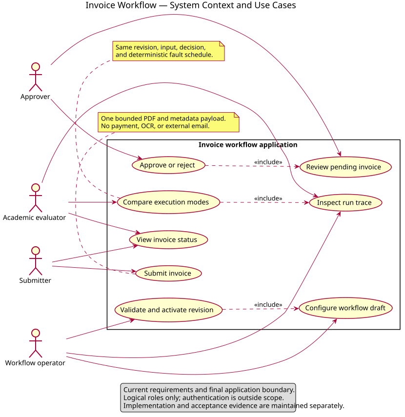

## Explicit boundary

To say it plainly one more time: this system does not place orders, move money, confirm budgets, contact suppliers, send external notifications, make accounting entries, run fraud checks, or talk to an ERP. It does not authenticate anyone, does not spread execution across services, and makes no promise about production uptime. These aren't features I ran out of time for — they were never in scope.

# Objectives, scope, and effort

## Objectives and Must Have scope

The objective was to demonstrate a configurable, persistent, event-driven workflow core through a process a person can actually follow. The Must Have scope I committed to:

| ID | Functional scope | Completion evidence |
|---|---|---|
| M1 | Represent and validate a conditional acyclic workflow | Validator and constructor tests |
| M2 | Activate immutable revisions and bind each run to one revision | Persistence/constructor tests |
| M3 | Submit and validate structured Purchase Request data | Domain and connected journey tests |
| M4 | Persist human approval work and resume the same run | Approval and restart tests |
| M5 | Resolve success/failure transitions deterministically | Resolver tests |
| M6 | Retry classified technical failures within a positive bound | Retry and step-service tests |
| M7 | Execute equivalent semantics by orchestration and choreography | Paired scenario tests |
| M8 | Persist attempts, effects, cursor, decisions, and ordered trace | Persistence and journey evidence |
| M9 | Provide four understandable browser views | HTML inspection and local application smoke evidence |
| M10 | Provide reproducible local and optional single-service container startup | Launcher and Compose verification |

## Exclusions

I left out authentication/RBAC, external integrations, distributed brokers, microservices, arbitrary user code, full BPMN, cycles, parallel fork/join, nested workflows, external notification delivery, production monitoring, high availability, and any verified scalability. Cutting these wasn't about running out of time — it kept the project honest about what one student can actually build and test in the time available, instead of quietly wiring up a framework and calling the wiring "custom engineering."

## One-student, 100-hour justification

I used a peer report as a structural reference only — that project had three students and roughly 300 hours behind it. This one has one student and about 100 hours, which is why it settles on one reference workflow, four task types, one deployable process, a compact browser UI, and no external service integration.

| Activity | Hours |
|---|---:|
| Problem framing, feedback analysis, and scope control | 8 |
| Requirements and traceability | 12 |
| Domain graph, resolver, and retry logic | 16 |
| Persistence, revision, cursor, and transaction design | 15 |
| Human approval, idempotency, and recovery | 13 |
| Orchestration/choreography implementation and comparison | 12 |
| API, UI, and bounded Workflow Designer | 9 |
| Automated verification and debugging | 9 |
| Documentation, UML, report, and defense reconciliation | 6 |
| **Total** | **100** |

This is a retrospective allocation by activity category, put together after the fact from what I actually worked on — not a timesheet, and I'm not going to pretend it tracks individual meetings or dates.

# Requirements engineering

## Stakeholder goals and functional requirements

I organized requirements around the useful outcome each one produces, then traced each back to the code and the tests that exercise it. The full baseline lives in `docs/requirements/requirements.md`; what follows here is a summary of the behavior that's actually active.

A requester has to provide a name, department, item or service, supplier, a positive amount, a three-letter uppercase currency code, a justification long enough to mean something, and a required date that isn't in the past. Domain validation reports every field-specific problem it finds, not just the first one. A valid request moves to exactly one human approval task. The approver sees the context and submits approve or reject — reject requires a reason, approve doesn't. Approval is the only path that leads to a Purchase Authorization; rejection closes that door immediately. Every automatic step persists its own attempt and carries a failure classification, and every run stays isolated, keeps its own ordered trace, and stays bound to the revision it was created against for its entire lifetime.

## Non-functional requirements

Rather than write vague quality statements, I paired each one with a threshold and a way to check it.

| Quality | Metric/threshold | Evidence |
|---|---|---|
| Determinism | Same revision/input/decision/fault schedule produces equivalent semantic outcome in both modes | Paired normalized scenario tests |
| Retry safety | Automatic executions never exceed configured positive `max_attempts` | Retry and step-service tests |
| Restart recovery | Waiting run reaches the same authorized result after real process recreation | Two Uvicorn restart tests |
| Isolation | No request, attempt, decision, effect, or trace crosses run identity | Sequential and controlled concurrent tests |
| Configuration safety | Invalid graph/task configuration cannot activate a revision | Constructor/validator negative tests |
| Trace completeness | Relevant committed state changes have ordered run-local observations | Exact trace and journey assertions |
| Deployment boundedness | Compose defines one application service and no broker | `docker compose config --quiet` and inventory tests |
| API inspectability | Current OpenAPI exposes request, approval, run, and workflow routes | OpenAPI smoke inspection |
| Maintainability | Business algorithms remain independent of FastAPI and SQLite types | Layer/source inspection and domain tests |
| Usability evidence | Four task-oriented headings and business context precede technical controls | HTML/manual inspection; no user-study claim |

There's no response-time, throughput, concurrent-user, or uptime number in this table, because I never had a credible performance environment or a real production workload to measure against.

## Constraints

The stack is Python/FastAPI, SQLAlchemy, Pydantic, SQLite, a static browser client, pytest, and Docker as an optional extra. It stays a modular monolith. Workflow definitions are conditional DAGs. The task catalog is closed. The EventBus is synchronous and in-process. Runtime databases aren't version-controlled. Some of these are feasibility calls, some are deliberate boundaries on what the system claims to be — in practice they're the same list.

## Acceptance criteria and traceability

| Scenario | Input/action | Expected observable result | Automated evidence |
|---|---|---|---|
| Valid approval | Valid request, approve | `AUTHORIZED`; authorization and notification exist | Connected journey in both modes |
| Rejection | Valid request, reject with reason | `REJECTED`; no authorization | Connected journey in both modes |
| Invalid request | Invalid required field | `VALIDATION_FAILED`; no approval work item | Domain/journey tests |
| Retry then success | Valid approval, deterministic transient fault | Two authorization attempts, retry trace, `AUTHORIZED` | Retry scenario tests |
| Retry exhaustion | Valid approval, unavailable scenario | Bound reached, `NEEDS_MANUAL_ACTION` | Exhaustion scenario tests |
| Duplicate decision | Repeat identical decision | Existing result returned; no second advancement | Approval idempotency tests |
| Conflicting decision | Submit different second decision | Controlled conflict; state unchanged | Conflict tests |
| Restart/resume | Stop at wait, recreate process, decide | Same run resumes and reaches `AUTHORIZED` | Two real-Uvicorn tests |

The traceability runs both ways in practice: requirements point down to the code and tests that satisfy them, and the algorithm table later in this report points back up to source files and UML figures. Reading the source tells you the structure is right; it doesn't replace actually running the acceptance tests, which is why both kinds of evidence appear throughout.

# Development process and project control

## Solo incremental method

I worked incrementally, borrowing Scrum concepts where they made sense, without pretending one person constitutes a Scrum team — there were no daily standups, no stakeholder interviews, no formal sprint ceremonies to report, because none of those happened. What I did keep were a product backlog, a Definition of Done, a risk register, an evidence register, and a change record, so implementation and documentation wouldn't drift apart from each other.

The Definition of Done asked for working behavior, tests, consistency between source and docs, a clean dependency direction, a reproducible startup, and evidence proportional to the size of the change. Git served as configuration management: a named branch and atomic commits kept the migration and the final reconciliation reviewable after the fact. CR-003 records the final product correction while keeping the earlier evolution visible rather than erasing it.

## Four honest increments

### Increment 1 — Generic workflow core

My goal here was a reusable conditional workflow engine, so I defined immutable task and transition types, the graph rules, a deterministic resolver, attempts, trace, and isolated runs, and built domain modules over a persistence-backed runtime with tests for the validator, resolver, retry, and isolation. It worked — but reviewing it honestly, the product value was hard to explain through abstract nodes with no recognizable business meaning. I came out of this increment convinced the next one needed a real requester, a real decision, and a result someone would actually want. What I kept from it was a solid reusable core, not yet a product anyone could explain in one sentence.

### Increment 2 — Human lifecycle and dual control

Here I made time and control ownership explicit: a persistent cursor state, approval work that survives a wait, same-run resume, orchestration, and run-scoped choreography, built out as approval services, a coordinator, the synchronous EventBus strategy, state-version checks, and an ordered trace, with tests for waiting/resume, idempotency/conflict, both modes in parallel, and handler cleanup. This is where the two complex functionalities became genuinely testable under shared semantics rather than just described. What was still missing was a business scenario clear enough to hang that technical parity on.

### Increment 3 — Intermediate Invoice/PDF application

I tried attaching the workflow behavior to a concrete artifact by building an Invoice Approval direction with uploaded PDF handling. It made the input tangible, but it dragged in a whole second set of concerns — file safety, parsing, storage — that had nothing to do with workflow management and started to dominate the explanation instead of supporting it. I kept the lesson and dropped the direction; it's preserved here as an honest record of where the project went before I pulled it back.

### Increment 4 — Purchase Request product and reconciliation

The goal for this increment was a structured reference workflow I could explain without any file-processing detour: keep the workflow core, add structured domain validation, internal authorization and notification effects, four browser views, the closed designer, and evidence to back all of it. By the end there were 98 passing tests across domain, application, persistence, presentation, restart, and deployment, and the running system matched what this report describes. The one thing that needed a second pass afterward was the documentation itself — enough terminology had shifted mechanically along the way that it had picked up small contradictions, and I went back through to reconcile them. What's left is the implementation and the report you're reading now.

## Configuration and change management

The repository carries requirements, ADRs, PlantUML sources, rendered SVGs, the report source, the build script, and the final PDF. Runtime databases and caches stay out of version control. Immutable revisions do most of the configuration-management work at the product level on their own: a run never points at a mutable draft, so an edit made later can never quietly change what an earlier run meant.

## Risks and mitigations

| Risk | Impact | Mitigation/evidence | Residual limitation |
|---|---:|---|---|
| Product appears as a node simulator | High | Business-first UI, reference scenario, defense sequence | Evaluator acceptance remains external |
| Modes diverge | High | Shared services and paired normalized tests | Only one-process semantics demonstrated |
| Duplicate decision advances twice | High | uniqueness, idempotency, conflicts, tests | Multi-node database contention not evaluated |
| In-memory event is mistaken for durable state | High | persistent cursor and explicit claim boundary | No durable messaging |
| Retry loops or routes prematurely | High | positive bounds and retry-before-resolver tests | External backoff policies excluded |
| Run data contamination | High | run keys, constraints, versioning, isolation tests | Large-scale concurrency unmeasured |
| Unsafe workflow configuration | Medium | closed catalog and graph validation | No general BPMN features |
| Documentation overclaims evidence | High | claim ledger, stale-term audit, exact commands | Administrative title fields incomplete |

# Evolution history

I don't see the pivots below as something to hide — they're the clearest evidence I have that the requirements work actually happened. The original generic demonstration was built to show engine behavior, and feedback made it obvious that a viewer couldn't connect that behavior to any organizational benefit on their own. The Invoice/PDF direction that followed was a reasonable attempt to fix that by giving the input something tangible, but it created a second center of gravity — file processing — that competed with the workflow story instead of supporting it. The final correction dropped that and settled on structured Purchase Request Approval.

| Core element | Final disposition | Reason |
|---|---|---|
| Graph validation | Preserved | Safe configuration remains fundamental |
| Transition resolver | Preserved | Mode-independent business routing |
| Bounded retry | Preserved and classified | Demonstrates controlled failure without graph cycles |
| Run isolation and trace | Preserved | Necessary for auditability and concurrent correctness |
| Orchestration | Preserved | Accepted complex functionality and clear central control |
| Choreography | Preserved and bounded | Accepted complex functionality; internal comparison only |
| Persistent cursor/recovery | Preserved and strengthened | Human waiting and restart require authoritative continuation |
| Invoice/PDF modules | Removed from active system | Distracted from workflow-management objective |
| Structured Purchase Request validation | Added | Makes business input explicit without file concerns |
| Purchase Authorization/Internal Notification | Added | Provide useful bounded outcomes |
| Four-view UI | Added/reframed | Leads with user work and result |

CR-003 is the authoritative record of this evolution. Whether the final result satisfies the course is, as always, the professor's call to make.

# Product description

The browser client is a single page built around four numbered views. **Submit Request** takes the business fields and starts a run. **Approver Inbox** lists the pending work and gives the approver context before they decide. **Run Status / History** loads the authoritative projection plus an optional technical trace. **Workflow Designer** creates and validates bounded drafts and activates immutable revisions.

Execution mode and the deterministic failure choice sit inside a collapsed **Demonstration Controls** section on purpose — a normal user should see their request and its outcome first, while the examination controls stay reachable without being presented as everyday business functionality.

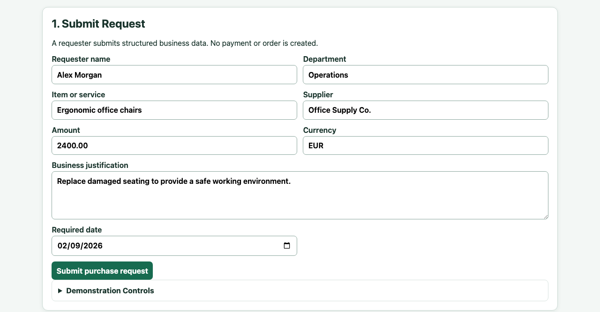

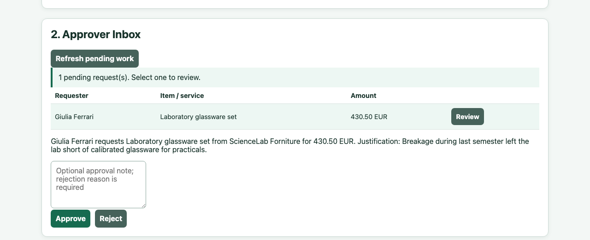

The API mirrors these same four tasks. `POST /api/requests` creates a request and its run. `GET /api/approvals` lists pending work; `GET /api/approvals/{id}` returns one item's context; `POST /api/approvals/{id}/decision` commits a decision. `GET /api/runs/{run_id}` returns status and history. Everything under `/api/workflows` manages drafts, validation, activation, and reading back an activated revision.

Figure 2 shows how these responsibilities are actually split up in the running system.

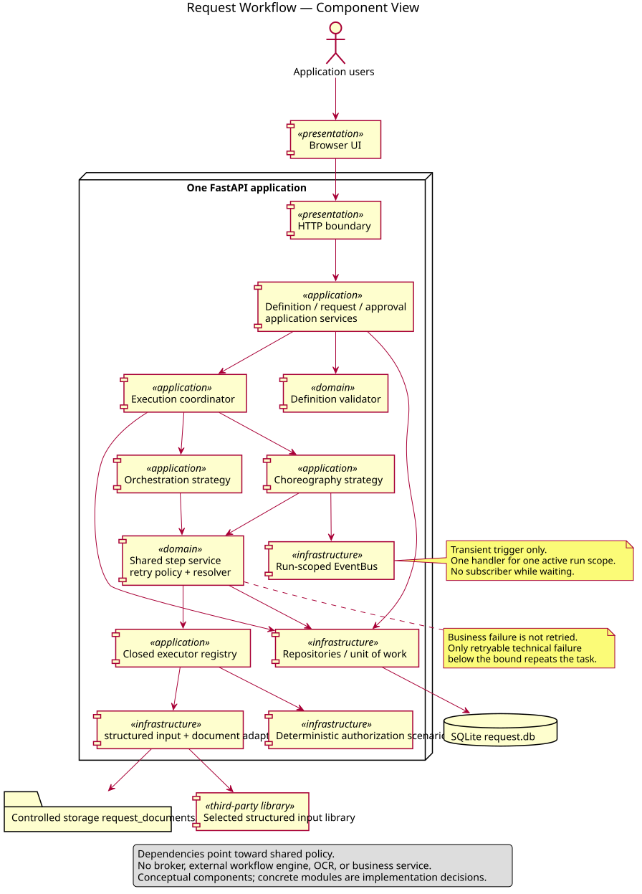

# Reference workflow behavior

The default workflow has four tasks. `REQUEST_VALIDATION` is the start: on success it moves to `HUMAN_APPROVAL`, on failure it follows whatever negative route the revision defines or terminates. Approval success moves to `PURCHASE_AUTHORIZATION`; rejection routes to failure and skips authorization entirely. A successful authorization reaches `CREATE_NOTIFICATION`. If authorization keeps failing past its retry bound, the run passes through the manual-action state before final failure routing takes over.

## Normal approval

A valid request creates the run and cursor state. Validation records one automatic attempt and succeeds. Human approval opens a persistent work item and hands control back. Once the decision comes in, it's committed and the cursor resumes. Authorization succeeds, the notification is recorded, and the run reaches its successful terminal state with `AUTHORIZED` as the request state.

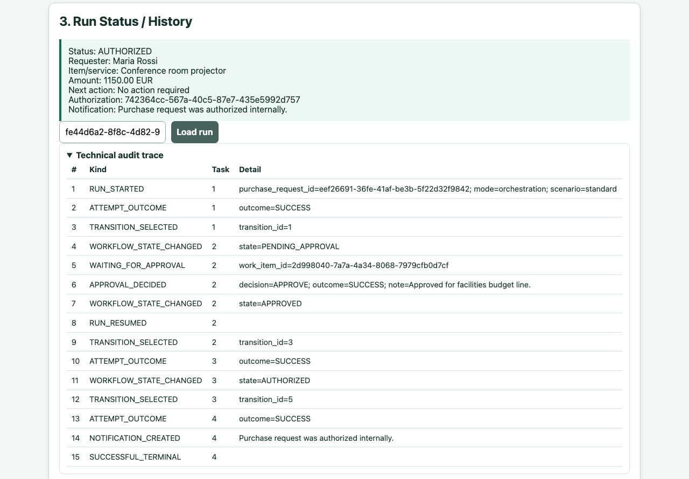

## Rejection

The submission and the wait look identical to the approval case. This time the approver rejects and supplies a reason. That decision maps straight to workflow failure semantics, so authorization never runs. The request settles at `REJECTED`, the notification records that outcome, and the trace shows the decision, the resume, the routing, and the terminal step in order.

## Invalid request

Domain validation reports whatever issues it finds — often more than one at once. The validation executor returns a business failure, and business failures are never retried. No approval work item ever gets created. The configured route handles notification and termination, and the request ends at `VALIDATION_FAILED`.

## Retry then success

The deterministic adapter makes the first authorization attempt fail with a retryable technical error. That attempt gets committed as-is. Since the attempt count is still below the bound, the retry policy keeps the cursor on the same task and records the retry without selecting any transition. The second attempt succeeds, the effects apply, and the run continues down the normal success path.

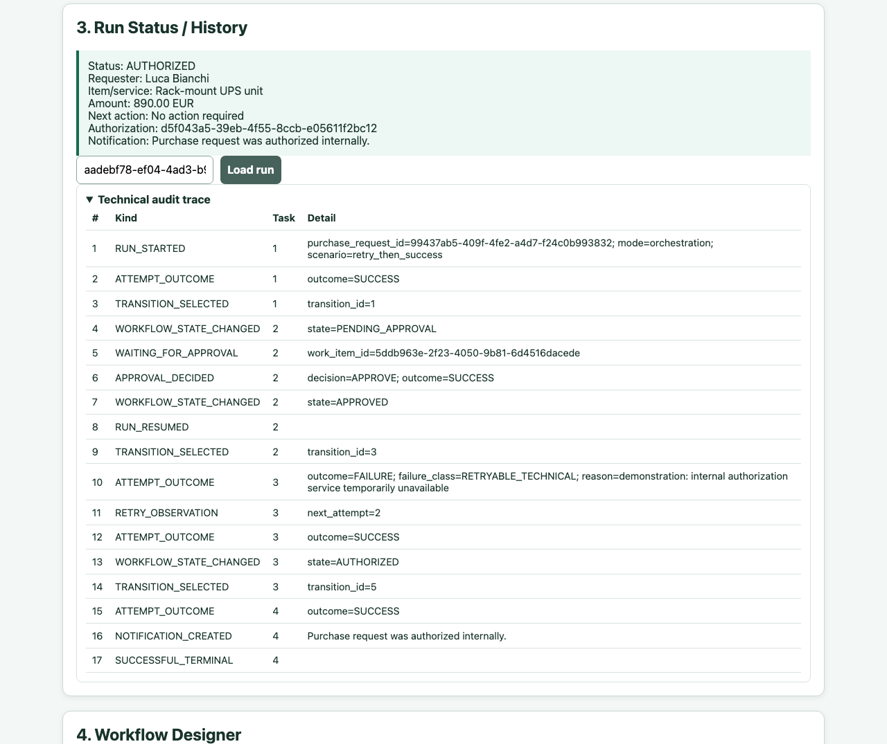

## Retry exhaustion

Here the adapter keeps returning retryable failure for every attempt the task is allowed. Once the completed count hits the bound, retry stops. The business-effect policy surfaces `NEEDS_MANUAL_ACTION`, and only then does final failure enter the ordinary resolver precedence. The run cannot spin forever waiting for an authorization that isn't coming.

## Restart and resume

At the moment a run starts waiting for human approval, everything authoritative is already committed and nothing is being held in memory — no subscriber, no open request. A brand-new application process, pointed at the same database, can pick it up: the decision service loads the work item and cursor, commits the decision, and re-enters whichever mode the run was stored under. The run that resumes is the same run, not a replacement.

Figure 3 lays out this persistent lifecycle end to end.

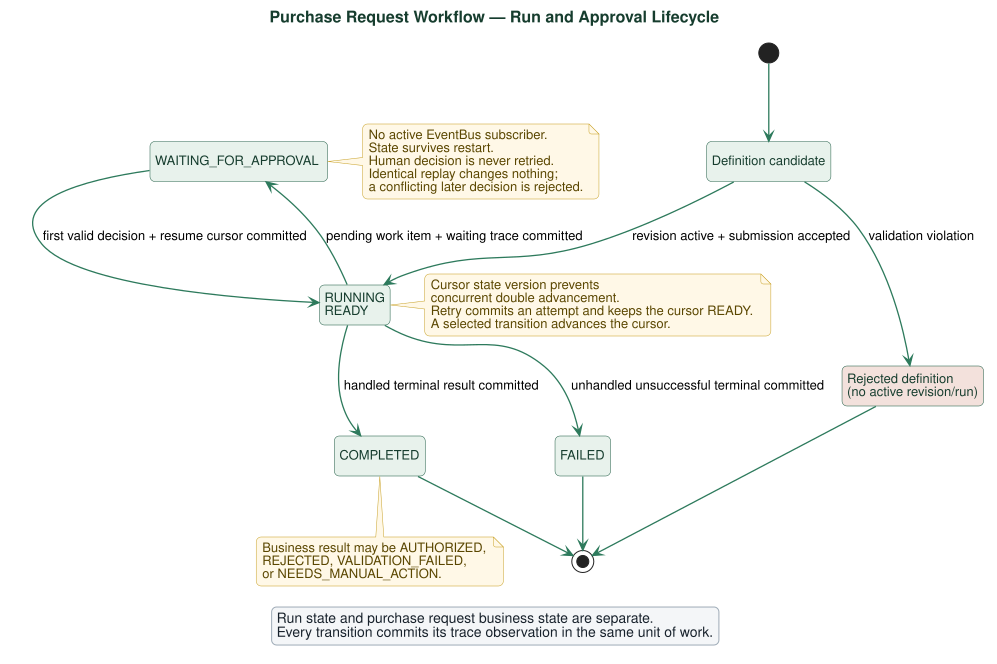

# Architecture

## Modular-monolith rationale

I kept this as one process because the academic comparison here is about control style, not about network distribution — splitting it into services would have added deployment complexity, contracts, new failure modes, and broker operations without making the business-rule evidence any stronger. The layers still separate presentation, application, domain, and persistence responsibilities from each other; it's just that a process boundary isn't the thing enforcing that separation.

That's actually the trade-off worth naming: without a process boundary, nothing stops a route or an infrastructure adapter from reaching in and owning domain policy except source organization, ports, tests, and review discipline. For a project this size, that cost is smaller than the cost of running a distributed topology, so I accepted it.

## Persistence and transaction boundaries

Figure 4 shows the conceptual ownership. Drafts are mutable; revisions, once activated, are not. A run points at exactly one revision and one Purchase Request, and everything downstream of that — cursor, attempts, approval records, effects, trace — belongs to the run/request context, never back to the reusable definition.

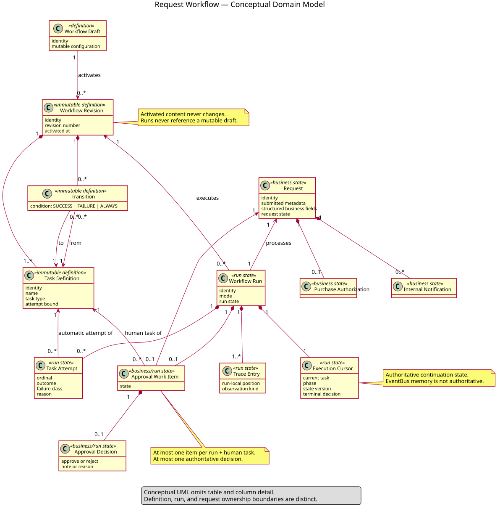

Every observable step commits its state and its trace entry together, in the same unit of work. Submission commits the request, the run, the cursor, and the initial trace in one go. An automatic step commits its attempt, its effect, the updated cursor, and its observations together. Entering approval commits the work item and the waiting state together. A decision commits the authoritative choice and the resumed cursor together. The point of doing it this way is that there's never a "partial" state to explain — recovery just reads the cursor.

## EventBus semantics

The EventBus is a small, synchronous piece of infrastructure — nothing more. The choreographer registers a callback keyed by run, publishes an `AdvanceRun` event, and removes that handler the moment its processing scope ends. The event itself only carries stable identity and version information, never a copy of business state; every advancement re-reads the committed SQLite state fresh.

That's enough structure to compare choreography with orchestration inside one process, and that's all it's meant to be. It is not a queue, has no persistence of its own, no delivery acknowledgment, no replay, no consumer groups, no backpressure handling, and no distributed transaction semantics.

## Deployment

Figure 5 shows the only topology this project supports: a browser, one FastAPI application, and SQLite. Local startup and the Compose file describe the exact same boundary — Compose just adds a named volume for the database, not any additional service.

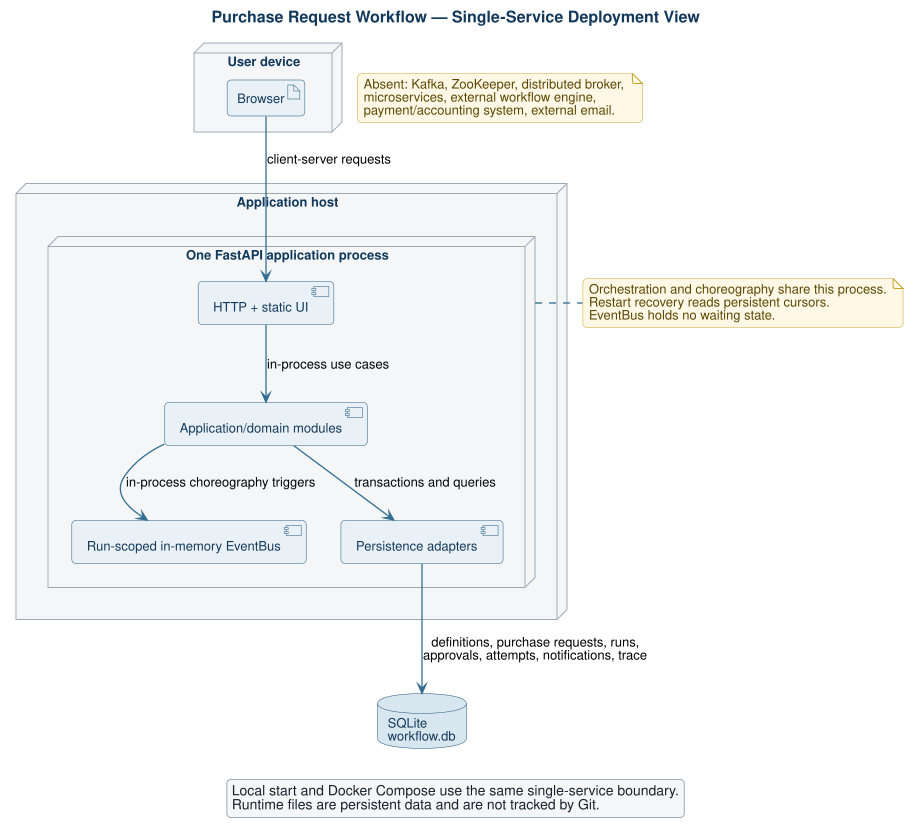

## ADR summary

Nine ADRs record the decisions that shaped this: the modular monolith, definition/revision/run ownership, the shared result/retry/resolver contract, orchestration waiting, transient EventBus choreography, the persistent cursor and atomic steps, the deterministic fault adapter, the structured request boundary, and the closed designer. An ADR status means I made and implemented that decision — it doesn't mean the professor separately approved it.

# Workflow Designer

The point of the designer is to prove the workflow core is reusable beyond one hard-coded sequence, without opening the door to unsafe configuration. A process owner can create a draft, name it, define tasks with stable keys and display names, pick exactly one start task, choose from the four available task types, set a positive attempt bound on automatic tasks, and wire up directed transitions using `SUCCESS`, `FAILURE`, or `ALWAYS`.


Validation catches zero or multiple start tasks, unknown task types, invalid keys, missing references, self-edges, cycles, tasks nothing can reach, missing terminal paths, two edges tied on precedence, missing or invalid attempt bounds, and an attempt bound sitting on a human approval task where it doesn't belong. All of that gets reported before activation, not after. Activating a draft snapshots its accepted content into an immutable revision, and every run from then on references that snapshot — never the mutable draft it came from.

To be clear about what this isn't: it's not a general low-code product. There's no drag-and-drop BPMN parity, no arbitrary scripts or expressions, no plugins, no user-supplied executors, no nested workflows, no cycles, no timers, no parallel gateways, no compensation, no service discovery. Keeping it closed is the actual engineering feature here — every executable type the system can run is known to both the validator and the executor registry, with nothing left unaccounted for.

# Custom algorithms and invariants

| Algorithm | Purpose / input / output | Invariant and failure behavior | Source and tests | UML |
|---|---|---|---|---|
| Graph validation | Input draft/revision graph; output ordered issues or acceptance | Exactly one start, reachable acyclic graph, valid tasks/edges; invalid input never activates | `app/domain/validation.py`, domain/constructor tests | Figure 6 |
| Transition resolver | Input task result and outgoing edges; output selected edge or terminal | Specific outcome precedes `ALWAYS`; ambiguity rejected earlier | `app/domain/resolver.py`, resolver tests | Figure 6 |
| Bounded retry | Input task type/result/count/bound; output retry yes/no | Only retryable automatic failure below bound retries; no edge during retry | `app/domain/retry.py`, step/retry tests | Figure 6 |
| Orchestration | Input run identity/cursor; output waiting or terminal projection | Central loop uses committed shared steps; stops at wait/terminal | `app/application/orchestration.py`, orchestration tests | Figure 7 |
| Choreography | Input run trigger/version; output waiting or terminal projection | One run-scoped handler; cursor authoritative; handler removed | `app/application/choreography.py`, EventBus/choreography tests | Figure 8 |
| Persistent wait/resume | Input human task/decision; output work item then resumed cursor | No open request/subscriber while waiting; same run resumes | `app/application/approval.py`, approval/restart tests | Figures 3, 7, 8 |
| Decision idempotency/conflict | Input work item and choice; output existing/new result or conflict | One authoritative choice; identical replay cannot advance twice | approval domain/service, approval tests | Figure 4 |
| Run/revision isolation | Input run creation/step; output run-owned records | Run keeps one immutable revision; records never cross run identity | constructor/persistence services and tests | Figure 4 |

Figure 6 is the one I'd point to first in a defense — it lays out the exact order retry and routing happen in.

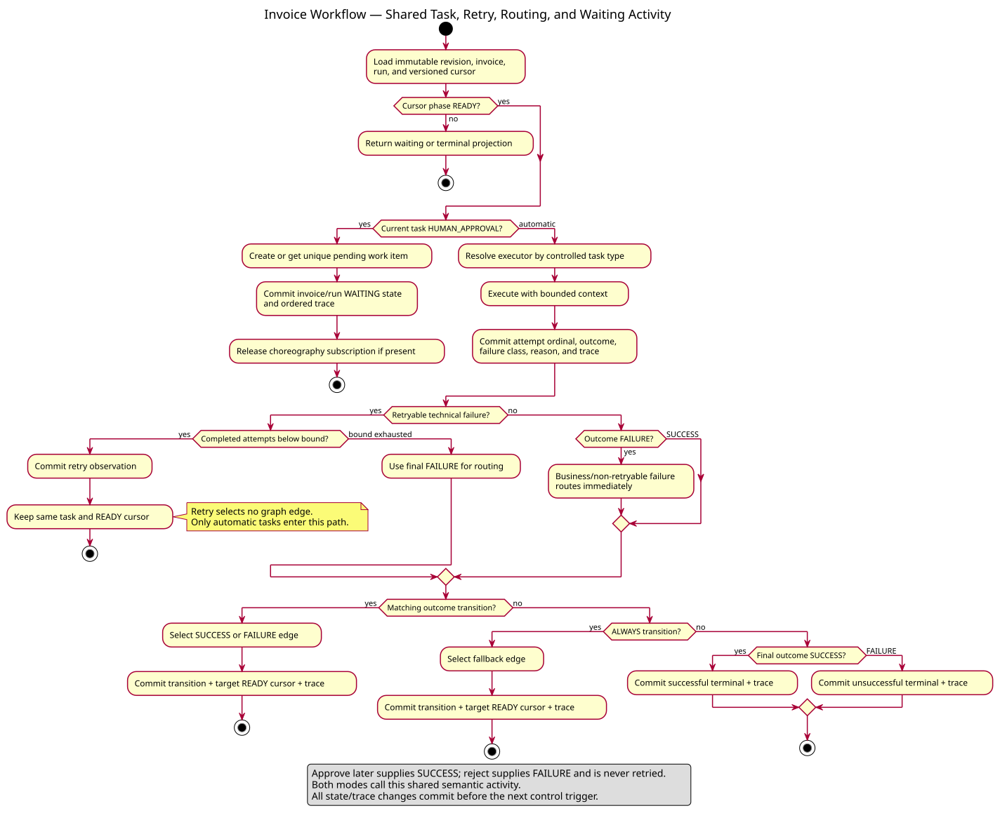

## Graph validation

Validation exists to protect runtime assumptions before a revision ever goes active. It normalizes task types and conditions, checks the structural constraints, computes reachability, walks the graph for directed cycles, and checks that outgoing transitions don't tie on precedence. Clean input returns no issues and activation proceeds; anything else comes back as a deterministic list of what's wrong, and nothing gets activated from a rejected specification.

## Deterministic resolver

I kept the resolver deliberately small and completely unaware of Purchase Request semantics. Given a task result and its outgoing transitions, it picks the one edge that matches the specific outcome. If there isn't one, it falls back to a unique `ALWAYS` edge if one exists. If neither exists, it returns a successful or unsuccessful terminal based on the final result. Retry and business effects both happen outside the resolver on purpose — otherwise the two coordination modes could end up disagreeing about routing.

## Bounded retry

Retry takes the task type, the failure classification, how many attempts have completed, and the configured maximum. Human work is never retried automatically — that path doesn't even reach this logic. Business failures and non-retryable technical failures route immediately, no second attempt offered. Only a retryable technical failure gets repeated, and only while another attempt is still available; once the bound is hit, control goes back to ordinary failure routing. The invariant this guarantees is simple: every automatic task finishes in a bounded number of steps.

## Persistent approval

Reaching human approval doesn't create an automatic attempt — that's a deliberate distinction from every other task type. The service creates or retrieves the work item, records the waiting state, and commits. Decision validation keeps an approval note and a rejection reason as separate things. Replay the same decision and you get the already-established result back unchanged; submit a different one and it conflicts instead of silently overwriting. Once a decision commits, the cursor goes back to ready and the coordinator re-enters whichever strategy the run was already using.

## Isolation and revision consistency

Every read and every write in this system carries a run identity with it, and the uniqueness rules — run keys, task keys — enforce that at the data layer too. A run's revision identifier never changes after creation. That means a later edit to the draft can only ever produce a new revision; it can never reach back and change what an old attempt or an old trace entry meant, which is exactly the guarantee audit interpretation needs.

# Orchestration and choreography comparison

| Dimension | Orchestration | Choreography |
|---|---|---|
| Control owner | Central loop | Temporary run-scoped event handler |
| Trigger | Direct strategy progression | Synchronous `AdvanceRun` publication |
| Business semantics | Shared services/rules/effects | Same shared services/rules/effects |
| Durable state | SQLite cursor and records | Same SQLite cursor and records |
| Human wait | Loop returns | Handler scope ends |
| Resume | Coordinator calls orchestrator | Coordinator creates a new handler scope |
| Strength | Straightforward control and debugging | Explicit event-reaction decoupling of advancement |
| Main risk | Central coordinator can accumulate responsibility | Handler lifecycle/version mistakes can cause leaks or stale work |
| Not claimed | Distributed scheduler | Durable/distributed messaging |

Figure 7 shows the central-control version: the HTTP request returns the moment the run starts waiting, and approval later restarts the loop from whatever was persisted.

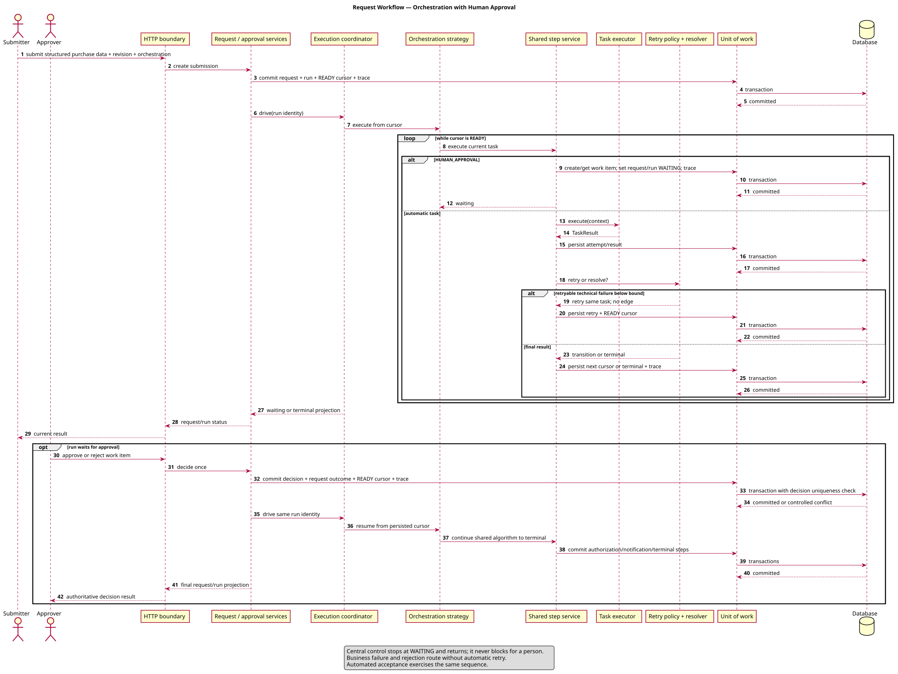

Figure 8 shows the event-reaction version instead. Every commit happens before the next trigger fires, and no handler survives across the waiting period.

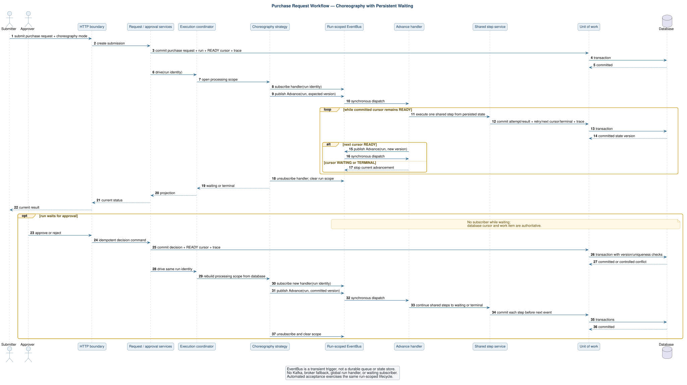

What I'm actually claiming here is semantic parity for this repository's own reference workflows, inputs, decisions, and deterministic fault schedules — nothing broader than that. I am not claiming orchestration and choreography are generally interchangeable once you're talking about distributed systems, and I'd push back on that reading if it came up during defense.

# Verification and evidence

## Evidence classification

| Claim class | Meaning in this report | Examples |
|---|---|---|
| Implemented and tested | Executed automated evidence asserts behavior | resolver, retry, approval, paired modes, restart |
| Implemented and inspected | Source/configuration directly shows structure | API paths, task catalog, SQLite models |
| Manually verified | Verified directly by inspection rather than an automated test | report render, headings, current UI labels |
| Documented limitation | Deliberately absent or unverified | authentication, distribution, performance |
| Historical decision | Earlier direction preserved for evolution | generic prototype, Invoice/PDF increment |
| Professor-approved direction | Explicitly supplied project fact | WMS direction and two complex functionalities |
| Final design decision not separately approved | Implemented choice without approval claim | Purchase Request reference scenario, detailed ADR choices |

## Test categories and result

| Category | Representative coverage | Result |
|---|---|---|
| Domain | Purchase Request fields, approval input, types, graph, resolver, retry | Included in 98 passed |
| Application | step service, constructor, orchestration, choreography, decisions | Included in 98 passed |
| Infrastructure | synchronous EventBus behavior and handler lifecycle | Included in 98 passed |
| Persistence | drafts/revisions, cursor, attempts, effects, conflicts, isolation | Included in 98 passed |
| Presentation | constructor API and connected Purchase Request journeys | Included in 98 passed |
| Deployment | real Uvicorn restart and deployment inventory | Included in 98 passed |
| Quality | dependencies and repository constraints | Included in 98 passed |
| **Total** | Cache-suppressed unchanged repository suite | **98 passed** |

The command that produces this number is:

```bash
PYTHONDONTWRITEBYTECODE=1 python -m pytest -p no:cacheprovider -q
```

I'd rather report the exact count from actually running the unchanged suite than round it or estimate it. And the count on its own isn't the point — what matters is what it's made of: the business matrix, the negative cases, restart behavior, and the source-level boundaries the tests enforce, all described above.

## Restart evidence

The restart tests don't reconstruct application objects inside a single test process — they use a temporary, isolated SQLite database and a real Uvicorn subprocess. Each one starts the server, submits a request, confirms the work is waiting, stops the process entirely, launches a fresh server against that same database, submits the decision, and checks that the same run reaches `AUTHORIZED`. One test does this in orchestration mode, the other in choreography. This is evidence of recovery within this local architecture — it is not high-availability evidence, and I'm not presenting it as such.

## API and OpenAPI evidence

OpenAPI inspection shows 12 current paths: `/api/requests`, the approval collection/detail/decision routes, run status, and the workflow draft/validation/activation/revision endpoints. There's no leftover `/api/v3` runtime anywhere. The connected presentation tests exercise real JSON payloads through the FastAPI boundary itself, not just the domain functions underneath it.

## UI evidence

Source inspection and a local smoke check confirm the exact headings — **1. Submit Request**, **2. Approver Inbox**, **3. Run Status / History**, **4. Workflow Designer** — plus the collapsed **Demonstration Controls** section. The screenshots placed throughout this report (Product description, Reference workflow behavior, Workflow Designer) are not mockups: each one was captured from the actual local application while it was running, against the reference workflow, using the same API calls a real submitter/approver would trigger. I did not invent any usability-study results while reconciling this report — the screenshots stand as inspection evidence of the current UI, not as a substitute for the user research this project never claims to have done.

## Docker and static verification

`docker compose config --quiet` checks Compose syntax and interpolation for the single service — it proves the file is valid, not that a production deployment would succeed. Beyond that: Node checks JavaScript syntax, `pip check` verifies installed dependency consistency, `git diff --check` catches whitespace errors, link and path validation checks repository references, and a terminology search flags language that's gone stale. These are supporting quality checks, not business-scenario tests, and I treat them that way.

# Quality evaluation

## Correctness

Correctness rests on deterministic domain tests, the business journeys, the negative cases, and the fact that both coordination modes walk through the exact same shared semantic path. The design choice doing the most work here is that both modes call the same step service, resolver, retry policy, approval service, and persistence operations — there's very little surface area left where the two could quietly drift apart.

## Reliability and recovery

Bounded attempts rule out an infinite automatic retry loop. Persistent work means the system isn't holding any runtime resource hostage while a person decides. State-version conflicts catch stale advancement before it can do damage. Replaying an identical decision is idempotent. The real-process restart tests cover the long-lived boundary that matters most here. What reliability doesn't cover: this is one application and one SQLite database, with no redundant node and no failover if either goes down.

## Usability

What I have on usability is structural, not experimental. The page leads with the product name, the structured request, the pending work, and the business result; the technical trace and the failure controls sit secondary and collapsed; the context an approver needs shows up right where they need to decide. There's no user interview, no task-completion measurement, no accessibility audit, and no comparative usability study behind any of that, so I'm not claiming any of those things.

## Maintainability

The domain algorithms are small and testable on their own, with no HTTP or database dependency to drag along. Application services coordinate ports and controlled effects. Infrastructure handles the synchronous events and persistence. Because the task catalog is a closed enum, executor completeness is something you can actually check rather than hope for. Immutable revisions protect how history gets interpreted later. If there's a maintainability risk worth naming, it's the amount of persistence/application coordination needed to keep state and trace atomic — focused tests and clear ownership are what keep that manageable.

## Security

Input validation and a closed task catalog cut down on accidental misuse, but that's where it stops: there's no authentication, no RBAC, no CSRF strategy, no secret-management design, no rate limiting, no audit access control, no security-headers review, no penetration testing, and no threat-model validation behind any of it. This should not go anywhere near a production deployment without a lot more work first.

## Scalability

I'm not making a scalability claim here at all. SQLite, synchronous EventBus dispatch, and a single FastAPI service are enough for demonstration and automated testing and nothing more was measured. There are no load-test numbers, no throughput measurements, no queue-depth observations, no horizontal-scaling experiments. A distributed design, if it were ever needed, would require rethinking event durability, idempotency, and partitioning from scratch — none of which this report attempts.

# Reuse disclosure

FastAPI handles HTTP routing and dependency injection; Uvicorn is the ASGI server; Pydantic validates the transport shapes; SQLAlchemy maps persistence; SQLite stores local state; pytest and HTTPX drive the tests; Docker/Compose provide optional packaging; PlantUML renders the diagrams; Pandoc and WeasyPrint build this report. All of that is general-purpose tooling.

None of it supplies this project's graph rules, transition precedence, retry policy, cursor lifecycle, work-item semantics, decision-conflict behavior, revision model, run isolation, audit vocabulary, scenario matrix, or the two control strategies — those are mine. Camunda, n8n, and Temporal were behavioral references only, consulted for ideas; no engine, workflow, UI, or line of source code from any of them is embedded here. The full disclosure lives in `docs/REUSE_DISCLOSURE.md`.

# Limitations and future work

| Current limitation | Consequence | Credible future work |
|---|---|---|
| No authentication/RBAC | Logical actors are not access-controlled | Identity integration, role policies, authorization tests |
| Internal authorization only | No order or budget operation occurs | Explicit procurement adapter and transactional boundary |
| Internal notification only | No external delivery | Outbox and email/provider adapter with delivery evidence |
| Synchronous in-process EventBus | No durable/distributed choreography | Durable broker only if multi-service need is justified |
| SQLite single service | Limited operational topology | Production database, migrations, backup/recovery plan |
| Conditional DAG only | No parallel/cyclic/compensation patterns | Formal semantics and new validator/runtime design |
| Closed designer | Not a general low-code platform | Carefully add bounded configuration, not arbitrary code |
| No measured usability/accessibility | UI quality is structurally inspected only | Task study and WCAG-focused audit |
| No security testing | Unsafe for public production exposure | Threat model, auth, hardening, dependency and penetration review |
| No load/performance evidence | Scalability is unknown | Workload model, benchmarks, observability, capacity targets |
| Deterministic examination faults | Not representative of real integrations | Adapter contract tests and controlled integration sandbox |
| Old Invoice data not migrated | Previous development DB is incompatible | Migration only if historical data becomes a real requirement |

If I were continuing this project, I'd start with identity and security and with real requirements for organizational integration — not with more workflow features that look impressive in a demo but aren't backed by evidence.

# Conclusion

What this project turns into, by the end, is a technical workflow core wrapped in a product a person can actually follow: a requester submits structured purchase information, a manager gets persistent work to act on, and the system resumes that same run to produce either an internal authorization or a controlled negative result, with an ordered trail of evidence either way. Graph validation, deterministic routing, bounded retry, immutable revisions, run isolation, idempotent decisions, and restart recovery are what make that behavior explainable — not just now, but after a failure and after time has passed.

Orchestration and choreography get compared fairly here because they share business semantics and persistence; only the control ownership differs. The orchestrator centralizes advancement, the choreographer reacts through a temporary, synchronous, run-scoped handler. I'm not extending that result to distributed systems, and I don't think the evidence here would support doing so.

This stayed appropriately sized for one student and roughly 100 hours. What I'd point to as its strongest evidence isn't breadth of features — it's how closely the problem, the requirements, the custom logic, the test scenarios, the architecture, and the stated limitations all line up with each other. Whether that's enough is, as it should be, the professor's decision to make.

# References

1. FastAPI documentation, framework concepts used for HTTP presentation.
2. SQLAlchemy documentation, ORM and transaction concepts used for persistence.
3. SQLite documentation, local relational database behavior.
4. pytest documentation, automated test execution.
5. PlantUML documentation, architecture diagram rendering.
6. Docker Compose specification, optional single-service configuration.
7. Project repository: requirements, ADRs, CR-003, source modules, tests, and evidence register.
8. Camunda, n8n, and Temporal public product concepts, consulted only as behavioral references as disclosed in the reuse record.

# Appendix A - Requirement-to-implementation/test traceability

| Requirement group | Implementation responsibility | Test/evidence group |
|---|---|---|
| Graph and routing | `domain/validation.py`, `domain/resolver.py` | validation/resolver tests |
| Retry and attempts | `domain/retry.py`, `application/step_service.py` | retry/step-service/persistence tests |
| Structured request | `domain/purchase_request.py`, submission/validation services | domain and connected journey tests |
| Human decision | approval domain/application/persistence | approval, journey, conflict, restart tests |
| Immutable configuration | constructor service and persistence | constructor domain/API/persistence tests |
| Orchestration | execution coordinator/orchestrator | orchestration and paired journey tests |
| Choreography | choreographer and in-memory EventBus | choreography/EventBus/parity tests |
| Recovery/isolation | cursor/version persistence and coordinator | restart and isolation tests |
| Presentation | request, approval, run, constructor APIs and static UI | presentation and UI-structure tests |
| Deployment | launcher, Dockerfile, Compose | deployment inventory and configuration checks |

# Appendix B - API summary

| Method/path | Purpose |
|---|---|
| `POST /api/requests` | Submit structured Purchase Request data and start execution |
| `GET /api/approvals` | List pending approval work |
| `GET /api/approvals/{work_item_id}` | Read one work item and request context |
| `POST /api/approvals/{work_item_id}/decision` | Commit approve/reject and resume the run |
| `GET /api/runs/{run_id}` | Read business/run state, effects, attempts, and trace |
| `GET /api/workflows/drafts` | List drafts |
| `POST /api/workflows/drafts` | Create a bounded draft |
| `GET/PUT/DELETE /api/workflows/drafts/{draft_id}` | Read, update, or delete a draft |
| `POST /api/workflows/validate` | Validate a supplied draft projection |
| `POST /api/workflows/drafts/{draft_id}/validate` | Validate a stored draft |
| `POST /api/workflows/drafts/{draft_id}/activate` | Create an immutable revision |
| `GET /api/workflows/revisions/{revision_id}` | Read an immutable revision |

# Appendix C - Defense evidence checklist

1. State the problem and system boundary before showing execution details.
2. Submit a valid structured request in orchestration mode.
3. Show persistent approval context and explain that the initial request returned.
4. Approve and show `AUTHORIZED`, authorization identifier, notification, and trace.
5. Demonstrate retry-then-success or show exact retry evidence.
6. Show the bounded Workflow Designer and immutable activation.
7. Compare Figures 7 and 8 while emphasizing shared semantics.
8. Show `98 passed`, including the two real-process restart tests.
9. Show one-service Compose/deployment evidence and the absence of a broker.
10. End with limitations; never imply ordering, payment, distributed choreography, production security, performance, or separate professor approval of the reference scenario.

# Appendix D - Final claim ledger

| Claim | Classification | Evidence/boundary |
|---|---|---|
| WMS direction and two complex functionalities were approved | Professor-approved direction | Project brief supplied for final reconciliation |
| Purchase Request is the reference workflow | Final design decision not separately approved | Current implementation and CR-003 |
| Four task types and immutable revisions exist | Implemented and tested | source, constructor tests |
| Retry precedes routing and is bounded | Implemented and tested | domain/application tests and Figure 6 |
| Both modes preserve repository scenario semantics | Implemented and tested | paired normalized tests |
| Waiting survives real process recreation | Implemented and tested | two Uvicorn restart tests |
| API has current request/approval/run/workflow paths | Implemented and inspected | OpenAPI and routes |
| UI has four task-oriented views | Implemented and inspected | static UI and local smoke evidence |
| Single-service Docker topology is valid | Implemented and inspected | Compose config and inventory tests |
| Report layout is readable | Manually verified | post-build page rendering and visual QA |
| Product is production-secure or scalable | Not claimed | documented limitation; no supporting evidence |
