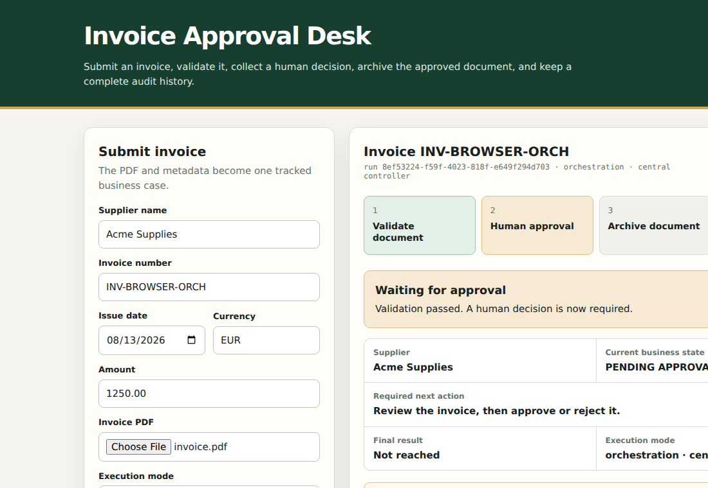
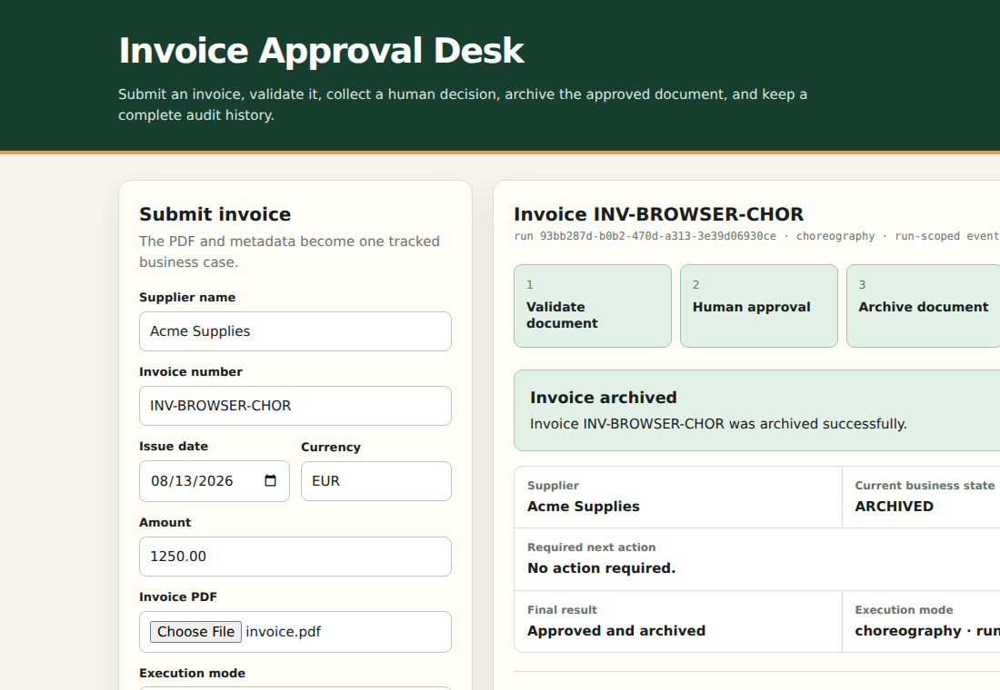
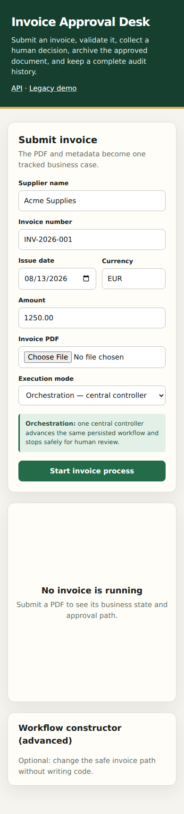

\begin{titlepage}
\centering
{\large UNIVERSITY OF MESSINA\par}
\vspace{0.4cm}
{\large Department of Mathematics and Computer Science\par}
\vspace{0.2cm}
{\large Master Degree in Data Science\par}
\vfill
{\Large\bfseries Software Engineering Project Report\par}
\vspace{1.0cm}
{\Huge\bfseries Invoice Approval Workflow\par}
\vspace{0.5cm}
{\Large Design, implementation, and evaluation of orchestration and choreography\par}
\vfill
\begin{tabular}{ll}
Student: & Yermek Aubayev \quad Matricola 551098 \\
Professor: & Prof. Salvatore Distefano \\
Academic year: & 2025/2026 \\
Submission date: & 21 August 2026
\end{tabular}
\vfill
{\large Messina, Italy\par}
\end{titlepage}

\pagenumbering{roman}
\tableofcontents
\clearpage

# Abstract

This report presents a bounded Invoice Approval Workflow that turns a technically correct workflow prototype into an understandable business application. A submitter uploads invoice metadata and a PDF; the system validates the submission, waits for a persistent human decision, resumes the same run, archives an approved document or records a controlled negative outcome, creates an internal notification, and exposes an ordered audit trace. The same immutable workflow revision is executed through centralized orchestration and run-scoped in-memory choreography. Both strategies share task executors, retry classification, transition resolution, persistence, and business effects, which makes the comparison meaningful. Five deterministic business scenarios are exercised in both modes: approved, rejected, invalid input, retry followed by success, and retry exhaustion requiring manual action. The final result is one FastAPI application with SQLite and controlled document storage, a bounded workflow constructor, synchronized UML/requirements artifacts, and an automated evidence suite. The application is an academic reference system rather than a production accounting or payment platform.

\clearpage
\pagenumbering{arabic}

# Executive summary

This project is a small invoice-approval product and, at the same time, a controlled comparison of two workflow execution strategies. A submitter uploads one PDF invoice and its metadata. The system validates the input, pauses for a human decision, resumes the same run, archives an approved document or records another business outcome, and keeps an ordered audit trace.

The same invoice workflow can run in two modes. In **orchestration**, one central controller advances the process. In **choreography**, a run-scoped in-memory event handler triggers each next committed step. The two modes deliberately share validation, retry, transition resolution, persistence, and business rules. Their purpose is therefore not to produce different business results, but to expose the control-flow trade-off while holding semantics constant.

The final product is a single FastAPI application backed by SQLite and controlled local document storage. It does not call a payment provider, perform OCR, send external email, or require Kafka. Five reference scenarios run in both modes: approved, rejected, invalid, retry-then-archive, and exhausted archive requiring manual action. The repository test suite reports **205 passing tests** after product consolidation. A process-restart test demonstrates that a waiting invoice can be approved after the application process is recreated. Browser structure and connected HTTP behavior are covered by the automated suite; the report also includes the accepted desktop/mobile evidence images.

The main engineering contribution is the combination of: immutable workflow revisions; deterministic DAG routing; classified, bounded retry; persistent human waiting and same-run resume; run isolation; and semantic parity across two execution strategies. This is an academic prototype, not a production accounting system. Its limitations are stated explicitly in Section 12.

# 1. Problem and product purpose

## 1.1 The practical problem

An invoice often passes through several responsibilities before it can be filed: structural validation, human review, archival, and notification. A failure in one step changes what should happen next. The process may also wait for a person much longer than one HTTP request or one application process lifetime.

The product makes that process explicit and auditable. Its immediate user value is not “green workflow nodes”; it is answering concrete questions:

- Which invoice is being processed?
- Is it valid and is it waiting for approval?
- What action is required now?
- Was it approved, rejected, archived, or sent for manual action?
- Which attempts, decisions, and transitions produced that result?

The earlier prototype emphasized abstract task execution. During a demonstration, the visible sequence of successful and failed nodes did not make the useful function clear. That feedback led to change request CR-002: retain the workflow-engine objective, but apply it to one bounded and recognisable business case.

## 1.2 What the system does

The reference workflow contains four safe built-in task types:

1. `DOCUMENT_VALIDATION` checks metadata and whether the uploaded file is a readable, non-encrypted PDF within the size boundary.
2. `HUMAN_APPROVAL` creates one persistent work item and stops execution without blocking a request thread.
3. `ARCHIVE_DOCUMENT` preserves an approved document under its generated storage identity.
4. `CREATE_NOTIFICATION` stores an internal notification describing the final business state.

The application also contains an advanced, bounded constructor. An operator may change task names, select from the four task types, define one start task, set attempt bounds for automatic tasks, and connect `SUCCESS`, `FAILURE`, or `ALWAYS` transitions. The constructor accepts no code, scripts, expressions, or plugins.

{#fig:waiting width=92%}

{#fig:final width=92%}

## 1.3 Actors and system boundary

| Actor | Goal in the product |
|---|---|
| Submitter | Upload an invoice and see its current and final business result. |
| Approver | Inspect pending work and make one authoritative approve/reject decision. |
| Workflow operator | Configure and activate a safe invoice workflow revision. |
| Academic evaluator | Observe the business outcome, inspect evidence, and compare the two control strategies. |

The boundary is intentionally narrow. Payment processing, accounting integration, authentication, OCR/AI extraction, fraud detection, external email, analytics, and arbitrary low-code execution are outside the project.

\clearpage

{width=90%}

\clearpage

# 2. Development and evidence process

## 2.1 Process used

The work used a lightweight iterative process with Scrum-style planning, development, review, and retrospective checkpoints. Because this was a solo academic project, no claim is made that a multi-person Scrum team held formal daily meetings. The useful part of Scrum was retained: short goals, prioritized backlog items, small increments, frequent verification, feedback-driven reprioritization, and a Definition of Done.

The decisive change was moving from “add more workflow features” to “complete one useful workflow product.” Five consolidated iterations describe the actual evolution:

| Iteration | Goal | Main result | Review lesson |
|---|---|---|---|
| 1. Workflow foundation | Define correct conditional graph semantics | Immutable types, graph validation, resolver, retry vocabulary | Correct algorithms still need a concrete user problem. |
| 2. Persistent execution | Run isolated workflows in two ways | Cursor, attempts, trace, orchestration, choreography | Green nodes did not communicate product value. |
| 3. Invoice product | Apply the engine to one bounded process | PDF/metadata validation, persistent approval, archive, notification | Business states made success and failure understandable. |
| 4. Configuration and quality | Add safe configurability and recovery evidence | Draft/revision constructor, parity, restart, isolation, exact traces | Advanced controls must remain secondary to the invoice result. |
| 5. Consolidation and submission | Deliver one coherent product and artifact set | Five scenario selector, one runtime, minimal repository, synchronized report | Simplicity and honest limitations are part of product quality. |

## 2.2 Evidence policy

Claims are classified as **verified**, **reconstructed**, or **not claimed**. A source file proves implementation presence but not that a behavior passed. A test definition is not a test result. A model or UML diagram is design evidence, not runtime evidence. Private correspondence is paraphrased in the process record rather than committed.

This distinction matters because the earlier prototype discussed optional broker behavior, random task outcomes, and cyclic retry that no longer describe the final product. The final report uses current requirements and executable checks instead.

## 2.3 Configuration management

Git is the source of truth for requirements, ADRs, UML sources, code, tests, and report source. Runtime databases, uploaded documents, caches, virtual environments, and local build tools are excluded. Activated workflow revisions are immutable inside the application. The final repository contains one application rather than a legacy and replacement runtime side by side.

## 2.4 Response to feedback

The strongest instructor feedback was not about a missing algorithm. It was about meaning: after watching two executors light successful nodes and one failure scenario, the evaluator still could not explain what the project did. CR-002 treated that as a requirements problem. The response was to introduce a recognizable business object, explicit actors, real validation, a persistent human decision, final business states, and a user-outcome-first dashboard while preserving the approved comparison of orchestration and choreography.

A peer report praised by the professor was also reviewed as a quality reference. Its useful qualities were a formal academic structure, explicit requirements, process/iteration narrative, architecture figures, screenshots, and evidence. Its project content and implementation were unrelated and were not reused. This report adopts the communication qualities without copying the peer system or its text.

## 2.5 Definition of Done

An increment was considered done only when its requirement and architecture impact were understood, focused tests passed, the complete suite still passed, failure paths were controlled, source boundaries remained clean, and user-facing/report claims matched evidence. For the final artifact, the Definition of Done additionally requires one correct startup path, synchronized requirements/UML/report, a reproducible PDF build, disclosed reuse, explicit limitations, and absence of obsolete parallel product files.

# 3. Requirements and acceptance scenarios

## 3.1 Requirement structure

The current specification contains 49 active functional requirements, 11 non-functional requirements, and 14 explicit constraints. The detailed baseline and forward/reverse traceability are repository artifacts; the following table groups the behavior used for evaluation.

| Area | Representative requirements | Observable acceptance |
|---|---|---|
| Definition | FR-002–FR-010, FR-048–FR-052 | One start, acyclic reachable graph, valid conditions, no ambiguity, immutable activation. |
| Execution | FR-013–FR-026 | Shared routing semantics, isolated attempts, bounded retry, persistent ordered trace. |
| Invoice input | FR-031–FR-035 | Bounded metadata/PDF validation; invalid input creates no approval item. |
| Human decision | FR-036–FR-042 | One pending item, durable wait, one authoritative decision, same-run resume. |
| Completion | FR-043–FR-047 | Archive/manual-action behavior, internal notification, retrievable result. |
| User interface | FR-053, NFR-011 | Business identity/state/action/result visible before technical trace. |
| Quality | NFR-001–NFR-010 | Parity, repeatability, restart retention, isolation, complete trace, timing, no prohibited dependency. |

Representative user stories are:

- As a **submitter**, I want to upload an invoice and see its state so that I know whether action is still required.
- As an **approver**, I want one persistent work item and one authoritative decision so that the invoice cannot advance twice.
- As a **workflow operator**, I want to configure a bounded definition and activate an immutable revision so that later changes do not rewrite running history.
- As an **academic evaluator**, I want to replay the same cases in both modes so that I can compare coordination without changing business semantics.

## 3.2 Input boundaries

| Input | Boundary |
|---|---|
| Supplier name | Required, trimmed, 1–120 characters. |
| Invoice number | Required, trimmed, 1–64 characters. |
| Issue date | Required ISO calendar date. |
| Amount | Positive decimal up to `999999999.99`, at most two fractional digits. |
| Currency | Exactly three uppercase ASCII letters. |
| PDF | Exactly one, non-empty, no more than 10 MiB, declared PDF, readable, non-encrypted, at least one page. |
| Rejection reason | Trimmed, 1–500 characters. |
| Approval note | Optional, no more than 500 characters. |

Original filenames are metadata only; generated identities select storage paths. The PDF library checks structure and pages, not invoice meaning.

## 3.3 Reference workflow

| Task | Type | Total attempt bound | Outgoing result |
|---|---|---:|---|
| Validate invoice | `DOCUMENT_VALIDATION` | 1 | Success → Review; Failure → Notify |
| Review invoice | `HUMAN_APPROVAL` | Not applicable | Approve → Archive; Reject → Notify |
| Archive invoice | `ARCHIVE_DOCUMENT` | 2 | Success or final Failure → Notify |
| Notify submitter | `CREATE_NOTIFICATION` | 2 | No edge; terminal after result |

## 3.4 Ten-case acceptance matrix

Each scenario is executed once in orchestration and once in choreography.

| Scenario | Controlled input or action | Expected business result | Critical evidence |
|---|---|---|---|
| S1 Approved | Valid PDF/metadata; approve; no fault | `ARCHIVED`, run `COMPLETED` | Wait/resume, approval success, archive, notification, zero retry. |
| S2 Rejected | Valid input; reject with reason | `REJECTED`, run `COMPLETED` | One decision, failure route, reason retained, no human retry. |
| S3 Invalid | Invalid metadata or malformed PDF | `VALIDATION_FAILED`, run `COMPLETED` | Validation failure, no approval item, notification. |
| S4 Retry then archive | One injected retryable archive failure, then success | `ARCHIVED`, run `COMPLETED` | Two attempts, one retry, no edge during retry, then success edge. |
| S5 Manual action | Retryable archive failure through bound | `NEEDS_MANUAL_ACTION`, run `COMPLETED` | Two failures, one retry, failure edge after exhaustion, notification. |

The deterministic archive behavior is selected explicitly and persisted with the run, not inferred from a display name. This makes failure demonstrations reproducible and prevents renaming a task from changing routing policy.

# 4. Architecture

## 4.1 Architectural style

The system is a layered modular monolith: one deployable FastAPI process with presentation, application, domain, infrastructure, and persistence responsibilities. Dependencies point toward shared policy. The invoice use case is not embedded in the transition resolver, and neither execution strategy owns a separate copy of retry or business rules.

| Layer | Owns | Does not own |
|---|---|---|
| Presentation | HTTP/HTML translation, forms, projections, validation messages | Routing, retry, document paths, strategy-specific business rules |
| Application | Submission, decision, definition activation, execution/resume, queries | PDF internals or duplicate transition policy |
| Domain | Conditions, outcomes, failure classes, retry eligibility, graph rules, state vocabulary | FastAPI, SQLAlchemy sessions, file paths |
| Infrastructure/persistence | Repositories, unit of work, EventBus, PDF/document adapters, deterministic faults | Independent business policy |

\clearpage

{width=84%}

\clearpage

## 4.2 Conceptual model

Activated workflow revisions are immutable. Runs reference one revision and one invoice. Mutable execution data belongs to a run-specific cursor, attempts, approval records, notifications, and trace entries—not to the task definition. This prevents a later or concurrent run from overwriting an earlier run’s history.

\clearpage

{width=90%}

\clearpage

## 4.3 Persistent cursor and human waiting

The execution cursor records the current task, phase, monotonic state version, and terminal decision. Reaching `HUMAN_APPROVAL` creates or retrieves one work item, commits the waiting state and trace, and returns. No request thread waits for the person, and no EventBus subscriber remains registered.

The first valid decision is authoritative. An identical replay returns the existing result; a conflicting later decision is rejected without changing state. The accepted decision changes the cursor back to `READY` and drives the same run from persisted state.

\clearpage

{width=100%}

\clearpage

## 4.4 Deployment view

The target topology is one application service plus a persistent database and controlled document storage. Choreography uses only an in-process run-scoped EventBus. There is no Kafka, ZooKeeper, distributed broker, microservice split, or external workflow engine.

\clearpage

{width=100%}

\clearpage

# 5. Complex custom logic

## 5.1 Definition validation

Before activation, the domain validator checks the complete graph and reports a deterministic list of issues. Important rules include exactly one start, valid endpoints, no self-edge, no directed cycle, reachability from the start, at least one reachable terminal, valid conditions, no equal-precedence ambiguity, positive automatic-task attempt bounds, and a closed task catalog.

Cycle detection uses an iterative depth-first search over **all** task nodes, including unreachable components. Reachability uses a deterministic breadth-first traversal from the single start. No run or persistence state is created when activation validation fails.

## 5.2 Shared step, retry, and routing algorithm

The core algorithm is shared by both modes:

1. Load the immutable revision, invoice, run, and versioned cursor.
2. If the cursor is not `READY`, return its waiting or terminal projection.
3. If the task is human approval, commit one pending item and waiting state, then stop.
4. Otherwise resolve a safe executor by task type and persist the attempt result.
5. Retry only a `RETRYABLE_TECHNICAL` failure while attempts remain. A retry repeats the current task and selects no graph edge.
6. For a final result, select the matching `SUCCESS` or `FAILURE` edge; if absent, use `ALWAYS`; if none exists, classify the terminal result.
7. Commit state and ordered trace before the next control trigger.

Business validation failure, rejection, and non-retryable technical failure route immediately. A human decision is never automatically retried.

\clearpage

{width=95%}

\clearpage

## 5.3 Transaction and idempotency rules

The unit-of-work boundary commits each business change with its trace observations. Database constraints and state-version checks enforce:

- one attempt ordinal per run and task;
- one trace position per run;
- one work item per run and human task;
- one authoritative decision per work item;
- one cursor advancement for the expected state version;
- no cross-run attempt, decision, notification, or trace ownership.

The EventBus carries a trigger with stable run identity and expected version. It never carries the authoritative business object. This is why a process restart can discard all EventBus memory without losing waiting state.

# 6. Orchestration and choreography

## 6.1 Orchestration

The orchestration strategy has an explicit central loop. It asks the shared step service to process the current persisted cursor until the run becomes waiting or terminal. After a human decision, the application service invokes the coordinator again for the same run.

\clearpage
\begin{landscape}
\begin{center}
\includegraphics[width=0.98\linewidth,height=0.84\textheight,keepaspectratio]{architecture/uml/rendered-pdf/orchestration-sequence.pdf}
\par\small Figure 9. Orchestration sequence, including persistent wait and same-run resume.
\end{center}
\end{landscape}
\clearpage

## 6.2 Choreography

The choreography strategy creates one temporary handler for one active run scope, publishes a synchronous advance event, and lets the handler call the same step service. The handler publishes the next event only after the prior state is committed. It is removed when the cursor becomes waiting, terminal, or controlled-error.

After approval, choreography constructs a new processing scope from the database. No subscriber survives the waiting period or a restart.

\clearpage
\begin{landscape}
\begin{center}
\includegraphics[width=0.98\linewidth,height=0.84\textheight,keepaspectratio]{architecture/uml/rendered-pdf/choreography-sequence.pdf}
\par\small Figure 10. Choreography sequence and run-scoped EventBus lifecycle.
\end{center}
\end{landscape}
\clearpage

## 6.3 Comparison

| Dimension | Orchestration | Choreography |
|---|---|---|
| Control location | Central loop | Temporary run-scoped event handler |
| Next trigger | Loop iteration | Synchronous in-process event |
| Business semantics | Shared step/retry/resolver | Same shared step/retry/resolver |
| Waiting state | Persist and return | Persist, unsubscribe, and return |
| Restart | Recreate coordinator from cursor | Recreate handler scope from cursor |
| Auditability | Control order is easier to follow in one function | Event lifecycle needs stronger trace/subscriber discipline |
| Infrastructure | No broker | No broker; EventBus is transient only |

The empirical conclusion is modest: both strategies can implement the bounded process with equal business semantics. Orchestration is simpler to read and debug. Choreography demonstrates decoupled triggering, but it requires stricter handler lifecycle, versioning, and trace discipline. This project does not claim that choreography removes all central coordination or that it is automatically more scalable.

# 7. Implementation

## 7.1 Technology and module map

| Concern | Implementation |
|---|---|
| HTTP and static UI | FastAPI, HTML/CSS/JavaScript |
| Domain and application | Python frozen dataclasses/enums and explicit services/ports |
| Persistence | SQLAlchemy 2.0 with SQLite |
| Validation models | Pydantic 2 |
| PDF structure check | pypdf |
| Server | Uvicorn |
| Verification | pytest and HTTPX; temporary Playwright/Chromium only for browser acceptance |

The product code lives in `app/domain`, `app/application`, `app/persistence`, `app/infrastructure`, and `app/presentation`. `app/runtime.py` is the composition root for database, storage, executors, and coordination services; `app/main.py` exposes one application. The published HTTP contract retains the `/api/v3` prefix as its version identifier, but there is no second or legacy product runtime.

## 7.2 Browser design

The UI is organized by user outcome:

1. invoice submission;
2. explicit deterministic archive scenario and execution mode;
3. invoice identity and current business state;
4. required next action and human decision;
5. final result and ordered technical audit trace;
6. secondary bounded workflow constructor.

This ordering directly addresses the earlier demonstration problem. The constructor remains useful but no longer competes with the primary product story.

{width=32%}

## 7.3 Bounded constructor

The constructor supports draft CRUD, complete validation feedback, graph projection, and immutable numbered activation. It is deliberately not a general BPMN or low-code platform. The task catalog is closed, transition conditions are enumerated, and no user-supplied executable content is accepted.

# 8. Verification results

## 8.1 Executed suite

| Verification | Recorded result | What it supports |
|---|---:|---|
| Complete suite after product consolidation | **205 passed** | Current domain, application, persistence, API, UI-structure, restart, deployment, and hygiene regression result. |
| Five-scenario matrix | 5 scenarios × 2 modes, plus normalized comparisons | Approved, rejected, invalid, retry-success, and manual-action parity. |
| Deployment inventory | 4 focused checks within the complete suite | One application, one volume, non-root image, launcher hygiene, and absence of legacy runtime. |
| Status and trace reads | 100/100 below 1 s in the recorded reference run | NFR-010 local responsiveness threshold. |

The exact duration is environment-dependent; the final acceptance criterion is zero failures in the complete suite.

## 8.2 Behavioral coverage

The acceptance and quality tests cover:

- all five scenarios in both modes and five normalized mode comparisons;
- repeated normalized traces and exact expected trace sequences;
- positive and negative graph-validation paths;
- retry eligibility, bound exhaustion, and absence of transition during retry;
- one authoritative human decision, idempotent replay, and conflicting replay;
- file-backed waiting/restart/resume and real Uvicorn process recreation;
- sequential and threaded two-run isolation;
- fourteen rejected PDF/input classes producing no approval work;
- EventBus handler cleanup after waiting, terminal, and controlled error;
- desktop/mobile layout evidence and connected HTTP/UI structure checks;
- source/deployment inventory rejecting broker dependencies.

## 8.3 What was not verified

No Docker-compatible engine was available in the final report-build environment, so the Dockerfile and Compose inventory were inspected but the image was not built there. Firefox, Safari, assistive technology, and external human usability were not tested. No production migration, external deployment, load test, or security certification was performed.

# 9. Deployment and recovery

The final Compose inventory declares one `app` service and one persistent `invoice_data` volume. The volume contains `invoice.db` and generated document storage. The image runs as a non-root user and has a local HTTP health check. Dependencies are installed at image build time, not every container start.

For each mode, the process-restart test performed the following:

1. start a real Uvicorn process against a disposable persistent directory;
2. submit a readable invoice and reach `PENDING_APPROVAL`;
3. terminate the process and verify the databases/document remain;
4. start a new Uvicorn process against the same directory;
5. retrieve the original run and work item;
6. approve it and resume the original run to `ARCHIVED`/`COMPLETED`.

This supports the architectural claim that the database cursor, not EventBus memory, is authoritative. It does not substitute for the unexecuted container build.

# 10. Reuse and product references

Reuse was intentional and is disclosed rather than disguised. The project uses general-purpose open-source libraries listed in `requirements.txt`; it does not reimplement an HTTP server, ORM, PDF parser, or test runner. These dependencies provide infrastructure, not the invoice workflow policy.

| Reused item | Role | Custom boundary retained in this project |
|---|---|---|
| FastAPI / Pydantic / Uvicorn | HTTP boundary, request models, ASGI server | Use cases, states, idempotency, and workflow semantics |
| SQLAlchemy / SQLite | Persistence mapping and local database | Unit-of-work decisions, constraints, repositories, run ownership |
| pypdf | Structural readability/encryption/page check | Input limits, business validation result, storage identity, no OCR |
| pytest / HTTPX | Automated verification and HTTP client | Acceptance scenarios, exact expected traces, parity criteria |

Camunda, n8n, and Temporal were studied as behavioral references: human-task waiting, visible workflow configuration, and durable execution are established product ideas. Their runtime engines, source code, workflow definitions, diagrams, and UI code are not included. The implementation is independently written for the approved requirements and intentionally much smaller than those products.

The detailed dependency/reference statement is reproduced as `docs/REUSE_DISCLOSURE.md`.

# 11. Traceability and project artifacts

| Concern | Authoritative artifact |
|---|---|
| Approved product change | `docs/evolution/CR-002-invoice-approval-reference-application.md` |
| Atomic requirements | `docs/requirements/requirements.md` |
| Requirements traceability | `docs/requirements/traceability.md` |
| Architecture and decisions | `docs/architecture/overview.md`, `decisions.md` |
| Architecture traceability | `docs/architecture/traceability.md` |
| UML sources and renders | `docs/architecture/uml/*.puml`, `rendered/*.svg` |
| Backlog and process | `docs/process/product-backlog.md`, `development-process.md`, `sprint-record.md` |
| Evidence and limitations | `docs/process/evidence-register.md`, `risk-register.md` |
| Iteration outcomes | `docs/process/sprint-record.md` |
| Defense narrative | `docs/DEFENSE_SCRIPT.md` |

The report embeds the figures and summary tables needed to understand the product without navigating these files. The repository artifacts remain available for detailed verification.

# 12. Limitations and future work

The following are limitations, not hidden features:

- The application does not determine whether a real bank payment succeeded. Task outcomes come from validated input, a human decision, bounded local executor behavior, and deterministic verification faults.
- PDF checking is structural; there is no OCR, semantic extraction, accounting validation, or fraud analysis.
- Notifications are internal records, not external email or messaging.
- Authentication and authorization are out of scope; logical roles are not security identities.
- SQLite and local storage suit this bounded prototype, not multi-host production deployment.
- There is no production migration from every historical schema.
- The container image should be rebuilt and volume restart repeated in the final defense machine environment.
- Cross-browser and assistive-technology testing remain incomplete.
- Parallel fork/join, cycles, arbitrary plugins, external business integrations, and a general BPMN editor are excluded.

The best next work is not another feature. It is to rehearse the five-minute product demonstration, repeat container startup on the defense machine, obtain external usability/accessibility feedback, and request the professor's confirmation of the clarified product direction.

# 13. Conclusion

The final project has a clear practical function: it tracks one invoice through validation, persistent human approval, archival or another controlled outcome, notification, and audit. The architecture comparison remains meaningful because orchestration and choreography execute the same revision and share the same policy rather than being two unrelated demos.

The project’s strongest result is not the number of screens or workflow nodes. It is the controlled behavior around failure and time: invalid input cannot reach approval; a retry does not masquerade as a graph transition; a human can decide after a process restart; duplicate decisions cannot advance a run twice; concurrent runs remain isolated; and both execution strategies produce equivalent business outcomes.

Within its stated boundary, the system is implemented and supported by executable evidence. It is not presented as a production accounting platform, a copied workflow product, or an externally approved release.

# References

1. Course material: *Introduction to Software Engineering*, *Software Processes*, *Requirement Engineering*, *Modeling*, *Software Architecture*, *Reuse and Components*, *Software Evolution and Maintenance*, and *Software Qualities*.
2. Hohpe, G. and Woolf, B. *Enterprise Integration Patterns*. Addison-Wesley, 2003.
3. Richardson, C. *Microservices Patterns*. Manning, 2018.
4. FastAPI, SQLAlchemy, Pydantic, Uvicorn, pypdf, pytest, and HTTPX official documentation for the versions bounded in `requirements.txt`.
5. Camunda, n8n, and Temporal public product documentation, consulted only as behavioral references described in Section 10.

# Appendix A. UML artifact register

All eight UML sources were rendered locally to SVG and inspected after generation. The renderer output was scanned for syntax/error pages before this PDF was built.

| Figure | UML source | Purpose |
|---|---|---|
| 3 | `system-context-use-cases.puml` | Actors, product boundary, supported use cases |
| 4 | `component-view.puml` | Layer/component responsibilities and dependency direction |
| 5 | `domain-model.puml` | Definition/run/invoice ownership and multiplicities |
| 6 | `run-state.puml` | Run waiting/resume/terminal lifecycle |
| 7 | `deployment-view.puml` | One-service physical boundary and exclusions |
| 8 | `routing-retry-activity.puml` | Complex shared algorithm |
| 9 | `orchestration-sequence.puml` | Central execution and persistent human wait |
| 10 | `choreography-sequence.puml` | Run-scoped EventBus lifecycle and same-run resume |

# Appendix B. Final claim ledger

| Claim | Status at report time |
|---|---|
| 205-test consolidated suite | Verified in the final repository environment |
| Five scenarios in both modes | Verified |
| Normalized parity across five pairs | Verified |
| Real-process waiting/restart/resume in both modes | Verified |
| One-service/no-broker Compose inventory | Verified by source/YAML parse |
| Docker image build and container-volume restart | Not executed |
| Chromium desktop/mobile path | Verified in one reference engine |
| Firefox/Safari/assistive technology | Not executed |
| Production migration or external deployment | Not executed |
| One final invoice application with no legacy runtime | Verified by repository inventory test |
| Instructor acceptance of the final implementation/report | Not claimed |
