# Event-Driven Workflow Management System
 
**Methodology:** Scrum (3 one-week sprints)  
**Test Suite:** 21 automated tests — all passing (`pytest tests/ -v`)

---

## Table of Contents

1. [Abstract](#abstract)
2. [Introduction](#1-introduction)
3. [Problem Statement](#2-problem-statement)
4. [Motivation](#3-motivation)
5. [Objectives](#4-objectives)
6. [Scrum Methodology — Justification and Process](#5-scrum-methodology--justification-and-process)
7. [Requirements Engineering](#6-requirements-engineering)
8. [Product Backlog](#7-product-backlog)
9. [Sprint 1 — Foundation: Data Models and CRUD API](#8-sprint-1--foundation-data-models-and-crud-api)
10. [Sprint 2 — Execution Engine: Orchestration and Choreography](#9-sprint-2--execution-engine-orchestration-and-choreography)
11. [Sprint 3 — Dashboard, Testing, Bug Fixes, and Documentation](#10-sprint-3--dashboard-testing-bug-fixes-and-documentation)
12. [Backlog Refinement](#11-backlog-refinement)
13. [Requirements Traceability Matrix](#12-requirements-traceability-matrix)
14. [System Architecture](#13-system-architecture)
15. [UML Modeling — Complete Embedded Diagram Set](#14-uml-modeling--complete-embedded-diagram-set)
16. [Complex Custom Logic](#15-complex-custom-logic)
17. [Execution Models — Comparative Analysis](#16-execution-models--comparative-analysis)
18. [Design Patterns](#17-design-patterns)
19. [Testing](#18-testing)
20. [NFR Implementation and Verification Evidence](#19-nfr-implementation-and-verification-evidence)
21. [Limitations](#20-limitations)
22. [Future Work](#21-future-work)
23. [Conclusion](#22-conclusion)
24. [References](#23-references)
25. [Appendix A — Modification Log](#appendix-a--modification-log)
26. [Appendix B — Professor Comment Mapping](#appendix-b--professor-comment-mapping)
27. [Appendix C — Self-Assessment](#appendix-c--self-assessment)

---

## Abstract

This report documents the design, implementation, and evaluation of an **Event-Driven Workflow Management System (WMS)** developed as a Software Engineering semester project. The system enables users to define workflows as ordered sequences of tasks and execute them under two architecturally distinct patterns: **orchestration** (central controller, sequential, fail-fast) and **choreography** (reactive event-driven chain, no central coordinator).

The core academic contribution is the side-by-side implementation of both patterns within a shared domain model, enabling direct comparison of control flow, coupling, failure semantics, and extensibility. The system is built with Python 3.13, FastAPI, SQLAlchemy 2.0, SQLite, and optional Apache Kafka. Development followed the Scrum framework across three one-week sprints, producing a full artefact set: 17 user stories with Given/When/Then acceptance criteria, three Sprint Backlogs with planning, reviews, and retrospectives, burndown charts, a Definition of Done, and 13 embedded UML diagrams. The test suite consists of **21 automated integration tests, all passing**.

---

## 1. Introduction

### 1.1 Background

Workflow automation underpins modern enterprise software. Applications ranging from CI/CD pipelines and business process engines to microservice orchestration all require a mechanism to define, execute, monitor, and recover from multi-step computational processes. Two fundamentally different approaches have emerged in the literature and industry: **orchestration** (a central coordinator explicitly drives every step) and **choreography** (each service reacts autonomously to events, with no coordinator).

While both patterns are documented in *Enterprise Integration Patterns* (Hohpe & Woolf, 2003) and *Microservices Patterns* (Richardson, 2018), their practical trade-offs — coupling, resilience, auditability, failure isolation — are rarely explored through a running implementation in academic settings. This project makes those trade-offs concrete by implementing both patterns in a single, testable system with a shared data model.

### 1.2 System Overview

The WMS exposes a REST API for full workflow lifecycle management: users register accounts, create named workflows, attach ordered tasks to workflows, and execute the workflow in one of two modes. Every execution is persisted as a `WorkflowRun` audit record. A browser dashboard (`GET /ui`) provides real-time execution visualisation. The event transport layer supports both an in-memory `EventBus` and optional Apache Kafka with graceful fallback.

### 1.3 Scope and Constraints

The system is an academic prototype. Authentication, production-grade security, and horizontal scalability are explicitly out of scope (see Section 6.3).

---

## 2. Problem Statement

University Software Engineering curricula describe orchestration and choreography conceptually, but rarely provide hands-on experience implementing them in a real system. Students can read about the patterns but cannot directly observe how they fail differently, what code differences they impose, or how their coupling properties manifest in practice.

A concrete, runnable, tested system implementing both patterns with the same domain model and the same test infrastructure is needed to make these trade-offs empirically observable. Additionally, such a system must demonstrate professional software engineering practices — automated tests, a traceable Scrum process, complete UML documentation, and measurable non-functional requirements — to serve as a credible academic artefact.

---

## 3. Motivation

**Architectural duality.** Most educational projects implement a single architectural pattern. Implementing both within one system forces the developer to understand each deeply enough to compare them, not just describe them.

**Industrial relevance.** Apache Kafka is used at LinkedIn, Uber, Netflix, and Airbnb at billions-of-events-per-day scale. Understanding event-driven workflow execution is a transferable engineering skill.

**Non-obvious failure behaviour (BUG-02).** The choreography chain continuing to execute downstream tasks after an upstream failure is a bug class unique to event-driven systems — it cannot occur in orchestration. Identifying it, fixing it with a one-line guard, and writing a named regression test is itself a learning outcome not available from textbook reading.

**Scrum process compliance.** Prior assessment feedback identified the project report as incomplete. This project was designed from the first sprint to produce a complete Scrum artefact set with traceable requirements, measurable NFRs, and honest retrospectives.

---

## 4. Objectives

1. Implement a **REST API** (17 endpoints) supporting the full workflow lifecycle: user management, workflow/task CRUD, execution, monitoring, and deletion.
2. Implement the **orchestration pattern**: `app/engine/orchestrator.py` — a central controller that drives task execution sequentially and halts on the first failure (fail-fast).
3. Implement the **choreography pattern**: `app/engine/choreography.py` — a reactive event-driven chain where tasks trigger each other via `EventBus` events, with no central loop.
4. Support **Apache Kafka** as optional distributed event transport for the choreography path, with in-memory `EventBus` fallback when Kafka is unreachable.
5. Provide a **browser dashboard** (`app/static/index.html`, served at `GET /ui`) with real-time task status polling and a Canvas-rendered workflow graph.
6. Produce a **20-test automated suite** covering all 17 functional requirements, including deterministic failure testing and named regression guards.
7. Follow the **Scrum framework** with documented Product Backlog, Sprint Backlogs, burndown charts, sprint reviews, retrospectives, and a Definition of Done.
8. Produce a complete embedded **UML documentation set**: Use Case, Class, ER, Component, Deployment, Package, State (×2), Sequence (×2), Activity (×3).

---

## 5. Scrum Methodology — Justification and Process

### 5.1 Why Scrum Was Selected

Scrum was chosen as the development methodology after evaluating three candidate frameworks. The decision was driven by four criteria specific to this project: predictable academic milestones, solo team size, an iteratively evolving architecture, and the need to produce a documentable process.

**Fitness for this project:**
The system has a natural three-layer decomposition (data → engine → UI/testing) that maps directly to three Scrum sprints. Scrum's sprint-end review ceremony provides a built-in checkpoint to validate that each layer is stable before the next is built on top of it. Without this structure, the risk of building the execution engine on a flawed data model would have been significant.

**Academic artefact production:**
Scrum mandates Product Backlog, Sprint Backlogs, sprint reviews, and retrospectives — precisely the artefacts required by the Software Engineering course rubric. Kanban and Lean do not prescribe these ceremonies, so switching to them would have sacrificed academic documentation without any compensating benefit.

### 5.2 Alternatives Considered

| Framework | Evaluated | Reason Not Selected |
|---|---|---|
| **Kanban** | Yes | No sprint boundaries — continuous flow does not produce dated review evidence or burndown charts required by the course rubric |
| **XP (Extreme Programming)** | Yes | Pair programming and test-driven development are excellent practices, but XP's engineering-heavy ceremonies (pair rotations, continuous integration releases) are designed for teams of 3+; applying them solo would produce ceremony overhead without benefit |
| **Lean Software Development** | Yes | Lean's "eliminate waste" focus is a mindset, not a process with defined events; it does not generate the Sprint Retrospective or burndown artefacts required |
| **Crystal** | Yes | Crystal adapts to team size, but the adaptation itself requires process design effort; for a three-sprint academic project, the time cost of designing the process exceeds the benefit of flexibility |
| **Plan-Driven (Waterfall)** | Yes | A fixed requirements → design → implementation → test sequence would have required complete requirements knowledge in Week 1; the choreography engine design was not fully understood until Sprint 2 Day 1 — a Scrum impediment that a Waterfall plan would have been unable to accommodate |

### 5.3 Benefits Obtained from Scrum

| Benefit | Evidence in This Project |
|---|---|
| **Incremental delivery** | Sprint 1 delivered a fully tested CRUD API; Sprint 2 delivered execution engines on top of a verified foundation |
| **Early defect detection** | BUG-02 was identified at Sprint 2 end via Sprint Review manual testing, not in production |
| **Honest process reflection** | All three Sprint Retrospectives candidly document deferred testing as a process failure, with concrete improvement actions |
| **Scope management** | Sprint 3's 28-point commitment was identified as 30% over the Sprint 1/2 average; the risk was consciously accepted and documented |
| **Traceability** | Every user story links to a requirement, a sprint task, and at least one automated test |

### 5.4 Scrum Roles (Solo Adaptation)

| Role | Responsibility in This Project |
|---|---|
| Product Owner | Prioritise Product Backlog; define acceptance criteria; accept/reject sprint deliverables at Sprint Review |
| Scrum Master | Enforce Definition of Done; facilitate ceremonies; remove technical impediments |
| Developer | Implement stories; write tests; maintain UML documentation |

### 5.5 Definition of Done

A user story is **Done** when all of the following are verified:

- [ ] Code implemented and passes self-review checklist
- [ ] All existing tests pass (`pytest tests/ -v` — zero failures)
- [ ] New tests written to cover the story's acceptance criteria
- [ ] No `datetime.utcnow()` deprecation warnings (replaced with `datetime.now(UTC)`)
- [ ] Affected UML diagrams updated in `docs/`
- [ ] `README.md` endpoint table updated if a new HTTP endpoint was added
- [ ] Application starts cleanly (`uvicorn app.main:app --reload`)
- [ ] `docker-compose up` completes without errors

Full checklist: `docs/definition_of_done.md`

---

## 6. Requirements Engineering

> **Note on requirement style:** User Requirements describe *what users need* (problem level, technology-agnostic). System Requirements describe *what the system shall do* (behavioural constraints). Implementation technology is not a requirement — it is an architectural decision.

### 6.1 User Requirements

User Requirements capture the needs of the primary user (a developer or system administrator using the WMS) without prescribing implementation.

| UR-ID | User Requirement | Priority |
|---|---|---|
| UR-01 | Users need to register and manage personal accounts with exclusive ownership of their workflows | High |
| UR-02 | Users need to define and manage multi-step automated processes composed of named steps in a specific order | High |
| UR-03 | Users need to execute automated processes and have the system carry out each step reliably | High |
| UR-04 | Users need the system to stop processing when a step fails, so that subsequent steps are not executed on invalid state | High |
| UR-05 | Users need to observe the progress and outcome of an executing process in real time | Medium |
| UR-06 | Users need a complete audit history of all past executions, including which steps succeeded or failed | Medium |
| UR-07 | Users need the system to be resilient to infrastructure failures; if the messaging infrastructure is unavailable, processes should still run | Medium |
| UR-08 | Users need the system to prevent conflicting step definitions (e.g., two steps with the same position in a workflow) | High |
| UR-09 | Users need different reliability and coupling trade-offs for process execution — some use cases demand a single auditable control point, others demand that no single component failure can halt the entire process | Low |

### 6.2 System Requirements — Functional

System functional requirements specify the observable behaviour the system must exhibit. They are derived directly from User Requirements and are verified by automated tests.

| FR-ID | System Requirement | Derived From | Test |
|---|---|---|---|
| FR-01 | The system shall create a user account and return HTTP 200 when given a unique email and password | UR-01 | `test_create_user_success` |
| FR-02 | The system shall return HTTP 409 when a user account is created with an email that already exists | UR-01 | `test_duplicate_email_returns_409` |
| FR-03 | The system shall create a named workflow associated with a valid user and return its identifier | UR-02 | `test_create_workflow` |
| FR-04 | The system shall add a task to a workflow with a non-negative integer execution order | UR-02 | `test_list_tasks_returns_only_existing` |
| FR-05 | The system shall return HTTP 409 when a task is added with an execution order that already exists in the same workflow | UR-08 | `test_duplicate_task_order_returns_409` |
| FR-06 | The system shall renumber remaining tasks with consecutive integers after a task is deleted | UR-02 | `test_delete_task_reorders_remaining` |
| FR-07 | The system shall delete all tasks belonging to a workflow when that workflow is deleted | UR-02 | `test_delete_workflow_cascades_tasks` |
| FR-08 | The system shall execute all tasks of a workflow sequentially in ascending order and return a completed status when all tasks succeed (orchestration mode) | UR-03 | `test_orchestrated_workflow_success` |
| FR-09 | The system shall stop executing remaining tasks and return a failed status after the first task failure (orchestration mode) | UR-04 | `test_orchestrated_workflow_halts_on_failure` |
| FR-10 | The system shall execute all tasks of a workflow reactively via events and return a completed status when all tasks succeed (choreography mode) | UR-03, UR-09 | `test_choreography_success` |
| FR-11 | The system shall not emit a continuation event after a task failure; all downstream tasks shall remain PENDING (choreography mode) | UR-04 | `test_choreography_stops_on_failure` |
| FR-12 | The system shall return HTTP 404 when an execution is requested for a workflow identifier that does not exist | UR-03 | `test_execute_nonexistent_workflow_returns_404` |
| FR-13 | The system shall record every workflow execution as a persistent audit record with start/end timestamps and outcome status | UR-06 | `test_workflow_run_history_recorded` |
| FR-14 | The system shall expose structured execution logs for all task state transitions | UR-05 | `GET /logs` |
| FR-15 | The system shall serve a browser dashboard displaying workflow state and supporting execution controls | UR-05 | `GET /ui` |
| FR-16 | The system shall complete execution of a workflow that contains no tasks without error | UR-03 | `test_execute_empty_workflow_completes` |
| FR-17 | The system shall return HTTP 404 when a resource that does not exist is accessed or modified | UR-08 | `test_delete_workflow_not_found`, `test_get_task_not_found`, `test_delete_task_not_found`, `test_workflow_status_not_found` |

### 6.3 System Requirements — Non-Functional (Measurable)

Each NFR includes a measurable metric, target value, acceptance criterion, and validation method.

| NFR-ID | Category | Requirement | Metric | Target | Acceptance Criterion | Validation |
|---|---|---|---|---|---|---|
| NFR-01 | **Reliability** | Kafka unavailability shall not prevent workflow execution | Execution success rate without Kafka | 100% | System executes orchestration and choreography correctly when `KAFKA_BOOTSTRAP_SERVERS` is unreachable | Run `pytest tests/test_execution.py` with no Kafka broker; all 9 tests pass |
| NFR-02 | **Failure Isolation** | A choreography chain shall halt after a task failure; no downstream task shall execute | Downstream task status after upstream failure | 0 downstream tasks change from PENDING | `tasks[1]["status"] == "PENDING"` after task[0] fails | `test_choreography_stops_on_failure` |
| NFR-03 | **Auditability** | Every workflow execution shall produce a persistent audit record | Audit records created per execution | 1 per `POST /execute*` | `GET /workflow_runs/{id}` returns ≥ 1 record after any execution | `test_workflow_run_history_recorded` |
| NFR-04 | **Data Integrity** | No two tasks in the same workflow shall have the same execution order | Duplicate task order rejection rate | 100% | HTTP 409 returned on every duplicate order attempt | `test_duplicate_task_order_returns_409` |
| NFR-05 | **Data Integrity** | Database-level foreign key constraints shall be enforced | Orphaned record creation rate | 0 | Deleting a workflow cascades to its tasks | `test_delete_workflow_cascades_tasks` |
| NFR-06 | **Portability** | The system shall start from source with a single command | Start-up commands required | 1 (`docker-compose up`) | System accepts HTTP requests within 60 seconds of `docker-compose up` | Manual: time `docker-compose up`; `curl localhost:8000/` returns 200 |
| NFR-07 | **Maintainability** | All runtime dependencies shall have pinned exact versions | Unpinned dependencies | 0 | `requirements.txt` contains only `==` version specifiers | `grep -v "==" requirements.txt` returns nothing |
| NFR-08 | **Correctness** | Deprecated APIs shall not be used | `DeprecationWarning` count | 0 | `pytest tests/ -W error::DeprecationWarning` passes | `pytest tests/ -v` (currently passes with 0 warnings) |
| NFR-09 | **Testability** | The test suite shall run in complete isolation without file-system or network dependencies | External dependencies during test run | 0 | Tests pass with no database file and no Kafka broker | `pytest tests/ -v` on a clean machine with only `pip install -r requirements.txt` |

### 6.4 Constraints

| C-ID | Constraint | Rationale |
|---|---|---|
| C-01 | Implementation language: Python 3.13 | Course requirement |
| C-02 | Persistence: SQLite | Sufficient for academic prototype; eliminates PostgreSQL setup complexity |
| C-03 | Team size: 1–2 developers; 3 × 1-week sprints | Academic timeline |
| C-04 | Authentication and production security: out of scope | Documented limitation; plaintext passwords acceptable only in prototype |
| C-05 | Kafka must be optional | System must function in a development environment without a running broker |
| C-06 | Execution is synchronous | `POST /execute*` blocks until completion; async execution is Future Work |

---

## 7. Product Backlog

The Product Backlog is the single source of truth for all planned work. It was created before Sprint 1 and refined at the start of each sprint. Full Given/When/Then acceptance criteria for every story are embedded in §7.2 below.

| ID | User Story | Priority | SP | Sprint | AC Summary | Status |
|---|---|---|---|---|---|---|
| US-01 | As a user I want to register an account so that I can own workflows | High | 2 | 1 | Given unique email → 200 + id; Given duplicate email → 409 | ✅ |
| US-02 | As a user I want to create named workflows so that I can organise automated processes | High | 2 | 1 | Given valid user_id → 200 + workflow id | ✅ |
| US-03 | As a user I want to add tasks with execution order so that the system knows the step sequence | High | 3 | 1 | Given valid workflow → 200 + task PENDING; Given duplicate order → 409 | ✅ |
| US-04 | As a user I want to delete a task and have remaining tasks renumbered so that the sequence stays gapless | Medium | 3 | 1 | Given 3 tasks, delete order=1 → remaining at orders 1,2 | ✅ |
| US-05 | As a user I want to delete a workflow and have its tasks removed so that no orphaned data remains | Medium | 2 | 1 | Given workflow with tasks → delete → tasks count = 0 | ✅ |
| US-06 | As a user I want to execute a workflow in orchestration mode so that tasks run in order with fail-fast | High | 5 | 2 | All succeed → COMPLETED; first fails → FAILED + remaining PENDING | ✅ |
| US-07 | As a user I want to execute a workflow in choreography mode so that tasks trigger each other reactively | High | 8 | 2 | All succeed → COMPLETED; first fails → FAILED + next stays PENDING | ✅ |
| US-08 | As a user I want to see structured execution logs so that I can audit what happened | Medium | 3 | 2 | GET /logs returns list with timestamp, run_id, status | ✅ |
| US-09 | As a user I want a browser dashboard that shows task status in real time | Medium | 5 | 3 | Dashboard polls and updates colours every 1 second | ✅ |
| US-10 | As a user I want to see a visual workflow graph on the dashboard | Low | 3 | 3 | Canvas renders nodes coloured by PENDING/RUNNING/DONE/FAILED | ✅ |
| US-11 | As a developer I want Kafka to work as optional transport so the system degrades gracefully | Low | 5 | 3 | System runs fully without Kafka; uses EventBus fallback | ✅ |
| US-12 | As a developer I want an automated test suite so that regressions are caught immediately | High | 8 | 3 | `pytest tests/ -v` → 21 passed, 0 failed | ✅ |
| US-13 | As a developer I want duplicate emails to return 409 not 500 | High | 1 | 3 | POST /users with duplicate email → 409 | ✅ |
| US-14 | As a developer I want executing a missing workflow to return 404 | High | 1 | 3 | POST /execute/99999 → 404 | ✅ |
| US-15 | As a developer I want UML diagrams so that architecture is documented | Medium | 5 | 3 | 13 diagrams embedded in report | ✅ |
| US-16 | As a developer I want task execution order to be unique within a workflow at the database level | High | 2 | 3 | UniqueConstraint on (workflow_id, order) enforced in DB and API layer | ✅ |
| US-17 | As a developer I want FK constraints enforced at SQLite level | Medium | 1 | 3 | PRAGMA foreign_keys=ON on every connection | ✅ |

**Total story points:** 59 across 3 sprints.

### 7.1 Backlog Prioritisation Rationale

The backlog was prioritised using MoSCoW (Must/Should/Could/Won't):

- **Must Have:** US-01–06, US-12–14 — core functionality without which the system cannot demonstrate its purpose
- **Should Have:** US-07–08, US-16–17 — required for correctness and data integrity
- **Could Have:** US-09–11 — dashboard and infrastructure enhancements; deferrable
- **Won't Have (this project):** Authentication, password hashing, async execution

### 7.2 Full Acceptance Criteria (All Stories)

The following section contains the complete Given/When/Then acceptance criteria for every Product Backlog Item. All criteria are verified by the automated test suite (§18) or documented manual tests.

---

**US-01 — Register Account** *(High, 2 SP, Sprint 1)*

- **AC1:** Given a `POST /users` request with a unique email and a non-empty password field → When the request is processed → Then the response is HTTP 200 containing `"id"` and `"email"` (no `workflows` field is returned)
- **AC2:** Given a `POST /users` request with an email that already exists in the database → When the request is processed → Then the response is HTTP 409 with `"detail": "Email already exists"`

---

**US-02 — Create Named Workflow** *(High, 2 SP, Sprint 1)*

- **AC1:** Given a valid `user_id` and a `POST /workflows` request with a non-empty `"name"` field → When the request is processed → Then the response is HTTP 200 containing `"id"`, `"name"`, and the submitted `"user_id"`
- **AC2:** Given a `POST /workflows` request with a `user_id` that does not exist → When the request is processed → Then the response is HTTP 422 or a database integrity error (foreign-key constraint)

---

**US-03 — Add Tasks with Execution Order** *(High, 3 SP, Sprint 1)*

- **AC1:** Given a valid `workflow_id` and a `POST /tasks` request with `"order"` not yet assigned to that workflow → When the request is processed → Then the response is HTTP 200 with `"status": "PENDING"` and the submitted `"order"` value
- **AC2:** Given a workflow that already has a task at `order=1` and a `POST /tasks` request with `"order": 1` for the same workflow → When the request is processed → Then the response is HTTP 409 with `"detail"` containing the text `"already exists"`

---

**US-04 — Delete Task and Renumber Remaining** *(Medium, 3 SP, Sprint 1)*

- **AC1:** Given a workflow with 3 tasks at `order=1`, `order=2`, `order=3` → When `DELETE /tasks/{id}` is called on the task at `order=1` → Then the remaining two tasks have `order=1` and `order=2` (consecutive, no gaps)
- **AC2:** Given a `DELETE /tasks/{id}` request for a task id that does not exist → When the request is processed → Then the response is HTTP 404 with `"detail": "Task not found"`

---

**US-05 — Delete Workflow with Cascade** *(Medium, 2 SP, Sprint 1)*

- **AC1:** Given a workflow with 2 tasks → When `DELETE /workflows/{id}` is called → Then the response is HTTP 200 and a subsequent `GET /tasks` shows zero tasks belonging to that `workflow_id`
- **AC2:** Given a `DELETE /workflows/{id}` request for an id that does not exist → When the request is processed → Then the response is HTTP 404 with `"detail": "Workflow not found"`

---

**US-06 — Execute Workflow in Orchestration Mode** *(High, 5 SP, Sprint 2)*

- **AC1:** Given a workflow with N tasks and `random.random` patched to return 0.9 (no failures) → When `POST /execute/{id}` is called → Then the response is HTTP 200 with `"status": "completed"` and all tasks have `status: "DONE"` in the database
- **AC2:** Given a workflow with 2+ tasks and `random.random` patched to return 0.1 (all tasks fail) → When `POST /execute/{id}` is called → Then the first task has `status: "FAILED"`, all subsequent tasks remain `status: "PENDING"`, and the response `"status"` is `"failed"`
- **AC3:** Given a `POST /execute/{id}` request for a workflow id that does not exist → When the request is processed → Then the response is HTTP 404 with `"detail": "Workflow not found"`

---

**US-07 — Execute Workflow in Choreography Mode** *(High, 8 SP, Sprint 2)*

- **AC1:** Given a workflow with 3 tasks and `random.random` patched to 0.9 → When `POST /execute_choreo/{id}` is called → Then the response is HTTP 200 with `"status": "completed"`, `"mode": "choreography"`, and all tasks have `status: "DONE"`
- **AC2:** Given a workflow with 2+ tasks and `random.random` patched to 0.1 → When `POST /execute_choreo/{id}` is called → Then task[0] has `status: "FAILED"`, task[1] has `status: "PENDING"` (the continuation event was not emitted — BUG-02 regression guard), and the response `"status"` is `"failed"`
- **AC3:** Given a `POST /execute_choreo/{id}` request for a non-existent workflow id → When the request is processed → Then the response is HTTP 404 with `"detail": "Workflow not found"`

---

**US-08 — View Structured Execution Logs** *(Medium, 3 SP, Sprint 2)*

- **AC1:** After executing a workflow → When `GET /logs` is called → Then the response is HTTP 200 with a JSON array where each element contains `"workflow_id"`, `"run_id"`, `"task_name"`, `"status"`, and `"timestamp"` fields
- **AC2:** After executing a workflow with id W → When `GET /workflow_runs/{W}` is called → Then the response is HTTP 200 with a JSON array containing at least one record with `"workflow_id": W`, `"mode"` ("orchestration" or "choreography"), and `"status"` ("COMPLETED" or "FAILED")

---

**US-09 — Browser Dashboard (Real-Time Status)** *(Medium, 5 SP, Sprint 3)*

- **AC1:** When `GET /ui` is called → Then the response is HTTP 200 with `Content-Type: text/html` and the response body contains the dashboard HTML
- **AC2:** The dashboard JavaScript issues `GET /tasks` every 1000 ms and updates task status badge colours without a page refresh (verified manually)

---

**US-10 — Visual Workflow Graph on Dashboard** *(Low, 3 SP, Sprint 3)*

- **AC1:** When the dashboard is open in a browser → Then a `<canvas>` element renders a graph of task nodes, each coloured by its current status: PENDING = grey, RUNNING = blue, DONE = green, FAILED = red (verified manually)

---

**US-11 — Kafka Optional Transport** *(Low, 5 SP, Sprint 3)*

- **AC1:** Given no Kafka broker is reachable (`create_choreo_consumer()` returns `None`) → When `POST /execute_choreo/{id}` is called → Then execution succeeds using the in-memory `EventBus` fallback and the response is HTTP 200
- **AC2:** All 9 tests in `test_execution.py` pass when run with no Kafka broker present (verified on every CI run)

---

**US-12 — Automated Test Suite** *(High, 8 SP, Sprint 3)*

- **AC1:** Running `pytest tests/ -v` exits with code 0, collecting exactly 21 tests, 0 failures, 0 errors
- **AC2:** Tests run without any network dependency (no Kafka, no external database file) using in-memory SQLite `StaticPool`
- **AC3:** Running `pytest tests/ -W error::DeprecationWarning` produces 0 deprecation warnings

---

**US-13 — Duplicate Email Returns 409** *(High, 1 SP, Sprint 3)*

- **AC1:** Given an existing user with email `"a@example.com"` → When `POST /users` is called with the same email → Then the response is HTTP 409 (not HTTP 500) with `"detail": "Email already exists"`

---

**US-14 — Nonexistent Workflow Returns 404** *(High, 1 SP, Sprint 3)*

- **AC1:** When `POST /execute/99999` is called and no workflow with id 99999 exists → Then the response is HTTP 404 with `"detail": "Workflow not found"`
- **AC2:** When `POST /execute_choreo/99999` is called with the same condition → Then the response is HTTP 404 with `"detail": "Workflow not found"`

---

**US-15 — UML Diagrams Embedded in Report** *(Medium, 5 SP, Sprint 3)*

- **AC1:** The report contains 13 UML diagrams embedded as PlantUML or Mermaid source blocks: Package (Fig 1), Component (Fig 2), Deployment (Fig 3), Use Case (Fig 4), Class (Fig 5), ER (Fig 6), State Machine ×2 (Figs 7–8), Sequence ×2 (Figs 9–10), Activity ×3 (Figs 11–13)
- **AC2:** No diagram requires navigation to an external file to view

---

**US-16 — Task Execution Order Unique Within Workflow** *(High, 2 SP, Sprint 3)*

- **AC1:** Given an existing task at `order=1` in workflow W → When `POST /tasks` is submitted with `{"order": 1, "workflow_id": W}` → Then the response is HTTP 409 before any database write (application-level guard in `routes.py`)
- **AC2:** The `Task` ORM model in `app/models.py` defines `UniqueConstraint("workflow_id", "order", name="uq_task_workflow_order")` as a database-level second line of defence

---

**US-17 — Foreign Key Constraints at SQLite Level** *(Medium, 1 SP, Sprint 3)*

- **AC1:** The `app/db.py` `on_connect` event listener executes `PRAGMA foreign_keys=ON` for every new connection, verified by inspecting source code
- **AC2:** Attempting to insert a task with a `workflow_id` that does not correspond to an existing workflow raises an `IntegrityError` (verified by code inspection)

---

## 8. Sprint 1 — Foundation: Data Models and CRUD API

**Scrum flow:** Requirements → Product Backlog → Backlog Prioritisation → Sprint Planning → Sprint Backlog → Tasks → Implementation → Testing → Review → Retrospective

**Committed:** US-01, US-02, US-03, US-04, US-05 = 12 SP | **Completed:** 12 SP | **Duration:** 1 week

### 8.1 Sprint Goal

Deliver a fully functional data layer and REST API for user, workflow, and task management. At the end of this sprint the system must be able to create, retrieve, and delete all three entity types with correct HTTP status codes. No execution logic.

### 8.2 Sprint Planning — Task Decomposition

| Task | Story | Estimate (h) |
|---|---|---|
| T1-01 — Define `Base`, configure SQLite engine + FK PRAGMA | US-01..05 | 1 |
| T1-02 — Implement `User` ORM model with UNIQUE email | US-01 | 1 |
| T1-03 — Implement `Workflow`, `Task` models with constraints | US-02..03 | 2 |
| T1-04 — Implement `POST /users` + `GET /users` | US-01 | 1 |
| T1-05 — Implement `POST /workflows`, `GET /workflows`, `DELETE /workflows/{id}` | US-02, US-05 | 2 |
| T1-06 — Implement `POST /tasks`, `GET /tasks`, `DELETE /tasks/{id}` | US-03, US-04 | 3 |
| T1-07 — Implement duplicate-order rejection (HTTP 409) | US-03 | 1 |
| T1-08 — Implement auto-reorder after task deletion | US-04 | 1 |
| T1-09 — Implement `GET /workflows/{id}/status` | US-02 | 1 |
| T1-10 — Configure `app/main.py` lifespan + StaticFiles mount | US-01..05 | 1 |
| T1-11 — Set up `docker-compose.yml` | US-01..05 | 1 |

### 8.3 Sprint Backlog — Selected Items from Product Backlog

The Sprint Planning meeting selected the following items from the Product Backlog. Each Product Backlog Item (PBI) was decomposed into one or more Sprint Backlog Tasks (listed in §8.2).

| SBI-ID | PBI (Product Backlog) | Priority | SP | Sprint Tasks | NFRs Exercised |
|---|---|---|---|---|---|
| SBI-1-01 | US-01 — Register Account | High | 2 | T1-02, T1-04, T1-07 | NFR-07 (pinned deps) |
| SBI-1-02 | US-02 — Create Named Workflow | High | 2 | T1-05 | NFR-07 |
| SBI-1-03 | US-03 — Add Tasks with Order | High | 3 | T1-06, T1-07 | NFR-04 (unique order), NFR-07 |
| SBI-1-04 | US-04 — Delete Task + Reorder | Medium | 3 | T1-08 | NFR-07 |
| SBI-1-05 | US-05 — Delete Workflow | Medium | 2 | T1-05 | NFR-05 (FK cascade), NFR-07 |

**Total Sprint 1 Backlog:** 5 items, 12 SP | **NFRs targeted in this sprint:** NFR-04, NFR-05, NFR-07, NFR-08

### 8.4 User Stories and Acceptance Criteria

**US-01 — Register Account**
- **Given** a unique email and password **When** `POST /users` **Then** HTTP 200 + `{id, email}`
- **Given** duplicate email **When** `POST /users` **Then** HTTP 409 `"Email already exists"`

**US-03 — Add Tasks with Order**
- **Given** valid `workflow_id` and `order=1` **When** `POST /tasks` **Then** HTTP 200 + `status: "PENDING"`
- **Given** `order=1` already exists in same workflow **When** `POST /tasks` again **Then** HTTP 409

**US-04 — Delete Task with Auto-Reorder**
- **Given** tasks at orders [1,2,3], delete order=1 **Then** remaining tasks are at orders [1,2]
- **Given** non-existent task id **When** `DELETE /tasks/{id}` **Then** HTTP 404

**US-05 — Delete Workflow**
- **Given** non-existent workflow id **When** `DELETE /workflows/{id}` **Then** HTTP 404

### 8.5 Implementation Highlights

**`app/db.py` — FK enforcement:**
```python
@event.listens_for(engine, "connect")
def _enable_sqlite_fk(dbapi_conn, _):
    dbapi_conn.execute("PRAGMA foreign_keys=ON")
```

**`app/models.py` — database-level task order uniqueness:**
```python
__table_args__ = (
    CheckConstraint("status IN ('PENDING','RUNNING','DONE','FAILED')", name="ck_task_status"),
    UniqueConstraint("workflow_id", "order", name="uq_task_workflow_order"),
)
```

**`app/main.py` — modern lifespan pattern (replacing deprecated `@app.on_event`):**
```python
@asynccontextmanager
async def lifespan(app: FastAPI):
    Base.metadata.create_all(bind=engine)
    yield
app = FastAPI(title="Workflow Automation", lifespan=lifespan)
app.mount("/static", StaticFiles(directory="app/static"), name="static")
```

### 8.6 Testing

**Functional test results (written in Sprint 3, covering Sprint 1 functionality):**

Manual validation via FastAPI Swagger UI (`GET /docs`) performed during Sprint 1. Automated tests written in Sprint 3 and all pass:

| Test | FR | Result |
|---|---|---|
| `test_create_user_success` | FR-01 | PASS |
| `test_duplicate_email_returns_409` | FR-02 | PASS |
| `test_create_workflow` | FR-03 | PASS |
| `test_duplicate_task_order_returns_409` | FR-05 | PASS |
| `test_list_tasks_returns_only_existing` | FR-04 | PASS |
| `test_delete_task_reorders_remaining` | FR-06 | PASS |
| `test_delete_workflow_not_found` | FR-17 | PASS |
| `test_get_task_not_found` | FR-17 | PASS |
| `test_delete_task_not_found` | FR-17 | PASS |
| `test_workflow_status_summary` | FR-14 | PASS |
| `test_workflow_status_not_found` | FR-17 | PASS |

**NFR verification for Sprint 1 scope:**

| NFR-ID | Property | Verification | Result |
|---|---|---|---|
| NFR-04 | Duplicate task order rejected | `test_duplicate_task_order_returns_409` | PASS |
| NFR-05 | FK cascade on workflow delete | `test_delete_workflow_cascades_tasks` | PASS |
| NFR-07 | All dependencies pinned | `grep -v "==" requirements.txt` returns empty | PASS |
| NFR-08 | No deprecated APIs | `pytest tests/ -W error::DeprecationWarning` — zero warnings | PASS |

### 8.7 Sprint Review

**Stories completed:** 5/5 (100%) — 12 SP delivered. `GET /workflows/{id}/status` was added as an unplanned item (1 SP) after being identified as a dashboard prerequisite.

### 8.8 Sprint Retrospective

**Went well:** FastAPI + SQLAlchemy 2.0 typed API clean; `Mapped[]` columns provided excellent IDE support; sprint completed ahead of Day 5.

**Went poorly:** Zero tests written in Sprint 1. The `IntegrityError → HTTP 500` bug for duplicate emails survived until Sprint 3 precisely because there were no tests. Deferring tests is a process failure.

**Action for Sprint 2:** Write at least one smoke test per new HTTP endpoint within the sprint that introduces it.

### 8.9 Sprint 1 Burndown

```
Day:       1    2    3    4    5    6    7
Remaining: 12 → 10 → 8  → 6  → 4  → 2  → 0
Ideal:     12 → 10.3→8.6→6.9→5.1→3.4→1.7→0
```

---

## 9. Sprint 2 — Execution Engine: Orchestration and Choreography

**Committed:** US-06, US-07, US-08 = 16 SP | **Completed:** 16 SP | **Open defects at end:** 1 (BUG-02)

### 9.1 Sprint Goal

Implement both execution modes and the event infrastructure on top of the Sprint 1 data foundation. At sprint end: `POST /execute/{id}` and `POST /execute_choreo/{id}` fully functional; every execution persisted as a `WorkflowRun`; structured logs accessible via `GET /logs`.

### 9.2 Sprint Planning — Task Decomposition

| Task | Story | Estimate (h) |
|---|---|---|
| T2-01 — Implement `WorkflowRun` ORM model | US-06, US-07 | 1 |
| T2-02 — Implement `run_task()` with failure simulation and idempotency | US-06, US-07 | 3 |
| T2-03 — Implement `EventBus` pub/sub singleton | US-07 | 2 |
| T2-04 — Implement Kafka producer/consumer with ImportError fallback | US-11 | 3 |
| T2-05 — Implement `run_orchestrated_workflow()` | US-06 | 2 |
| T2-06 — Implement `run_choreographed_workflow()` with closure capture fix | US-07 | 4 |
| T2-07 — Wire `POST /execute/{id}` and `POST /execute_choreo/{id}` routes | US-06, US-07 | 1 |
| T2-08 — Implement `GET /workflow_runs/{id}` and `GET /logs` endpoints | US-08 | 1 |
| T2-09 — Manual testing and BUG-02 identification | US-07 | 1 |

### 9.3 Sprint Backlog — Selected Items from Product Backlog

Items pulled from the Product Backlog at Sprint 2 Planning. US-11 included as a partial story (Kafka infrastructure required for US-07 Kafka path).

| SBI-ID | PBI (Product Backlog) | Priority | SP | Sprint Tasks | NFRs Exercised |
|---|---|---|---|---|---|
| SBI-2-01 | US-06 — Orchestration Execution | High | 5 | T2-01, T2-02, T2-05, T2-07 | NFR-03 (audit record), NFR-08 |
| SBI-2-02 | US-07 — Choreography Execution | High | 8 | T2-03, T2-04, T2-06, T2-07, T2-09 | NFR-01 (Kafka fallback), NFR-02 (failure isolation) |
| SBI-2-03 | US-08 — Execution Logs | Medium | 3 | T2-08 | NFR-03 |

**Total Sprint 2 Backlog:** 3 items, 16 SP | **NFRs targeted in this sprint:** NFR-01, NFR-02, NFR-03, NFR-08

> **Product Backlog state after Sprint 2:** US-01–08 Done (28 SP delivered); US-09–17 still in backlog (31 SP remaining). Backlog refinement added BUG-02 regression guard to US-07 AC before Sprint 3.

### 9.4 User Stories and Acceptance Criteria

**US-06 — Orchestration Execution**
- **Given** `random.random` returns 0.9 (no failure) **When** `POST /execute/{id}` **Then** `status: "completed"`, all tasks `DONE`
- **Given** `random.random` returns 0.1 (forced failure) **When** `POST /execute/{id}` **Then** task[0] `FAILED`, task[1..n] `PENDING`
- **Given** workflow does not exist **When** `POST /execute/{id}` **Then** HTTP 404

**US-07 — Choreography Execution**
- **Given** `random.random` returns 0.9 **When** `POST /execute_choreo/{id}` **Then** `status: "completed"`, `mode: "choreography"`
- **Given** `random.random` returns 0.1 **When** `POST /execute_choreo/{id}` **Then** task[0] `FAILED`, task[1] stays `PENDING` (BUG-02 regression guard)

### 9.5 Implementation Highlights

**Orchestrator — central control loop (`app/engine/orchestrator.py:44-48`):**
```python
final_status = "COMPLETED"
for task in sorted(tasks, key=lambda t: t.order):
    ok = run_task(task, db, run_id=run_id, choreo_kafka=False, log_event=log_event)
    if not ok:
        final_status = "FAILED"
        break
```

**Choreographer — closure capture fix (`app/engine/choreography.py:59-80`):**
```python
for i in range(1, len(tasks)):
    def handler(
        prev_task_id: int,
        cur: Task = tasks[i],        # value captured at registration time
        expected: int = tasks[i-1].id,
        session: Session = db,
        ck: bool = use_kafka_choreo,
        rid: str = run_id,
    ) -> None:
        if prev_task_id == expected:
            run_task(cur, session, run_id=rid, choreo_kafka=ck, log_event=log_event)
    event_bus.subscribe(event_key, handler)
```

**BUG-02 root cause identified:** `run_task()` was emitting `task_completed` events unconditionally. A failed task's event triggered the downstream handler, executing subsequent tasks despite the failure.

### 9.6 Testing

**Note:** No automated tests written in Sprint 2 (process failure — action item from Sprint 1 Retrospective not followed). BUG-02 identified through manual Swagger UI testing.

**NFR verification attempted in Sprint 2:**

| NFR-ID | Property | Verification Method | Result |
|---|---|---|---|
| NFR-01 | Kafka fallback | Started server without Kafka broker; executed `POST /execute_choreo/{id}` — chain completed via in-memory EventBus | PASS (manual) |
| NFR-02 | Choreography halts on failure | Manual Swagger UI: patched workflow to always fail — **FAILED**: downstream task executed (BUG-02 identified) | FAIL ➡ Deferred |
| NFR-03 | Audit record created | `GET /workflow_runs/{id}` after execution — record present | PASS (manual) |
| NFR-08 | No deprecated API | Observed `DeprecationWarning` for `datetime.utcnow()` in console | FAIL ➡ Fixed Sprint 3 |

### 9.7 Sprint Review

| Deliverable | Status |
|---|---|
| `POST /execute/{id}` — orchestration | ✅ |
| `POST /execute_choreo/{id}` — choreography (success path) | ✅ |
| `GET /logs` + `GET /workflow_runs/{id}` | ✅ |
| BUG-02 — choreography executes downstream after failure | ⚠️ Identified; deferred |

**Stories completed:** 3/3 (100%) | **Open defects:** 1

### 9.8 Sprint Retrospective

**Went well:** `engine/` subdirectory separation produced independently readable modules. Per-`run_id` EventBus channel scoping identified early.

**Went poorly:** Zero tests written again (Sprint 1 action item not followed). BUG-02 introduced and not caught until Sprint 3. `event_bus.log_event` mutable singleton is not thread-safe.

**Action for Sprint 3:** Fix BUG-02 with regression test before Sprint closes; write full test coverage for both execution modes.

### 9.9 Sprint 2 Burndown

```
Day:       1    2    3    4    5    6    7
Remaining: 16 → 16 → 13 → 10 → 6  → 3  → 0
Ideal:     16 → 13.7→11.4→9.1→6.9→4.6→2.3→0
```

Day 1 velocity was 0 — choreography engine design required unplanned architectural whiteboard session.

---

## 10. Sprint 3 — Dashboard, Testing, Bug Fixes, and Documentation

**Committed:** US-09, US-10, US-11, US-12, US-13, US-14, US-15, US-16, US-17 = 31 SP | **Completed:** 31 SP | **Open defects at end:** 0

### 10.1 Sprint Goal

Deliver the browser dashboard, 20-test automated suite, fix all open defects (BUG-02, BUG-04), resolve all code quality issues, produce the complete UML set, and finalise all Scrum artefacts. At sprint end: zero open defects, 20 passing tests, full documentation set.

### 10.2 Sprint Planning — Task Decomposition

| Task | Story | Estimate (h) |
|---|---|---|
| T3-01 — Fix BUG-02: `if ok_task:` guard in `task_runner.py` | US-07 | 0.5 |
| T3-02 — Fix BUG-04: HTTP 404 on missing task resources | US-14 | 0.5 |
| T3-03 — Extract `_UI_PAGE` → `app/static/index.html` | US-09 | 1 |
| T3-04 — Build Canvas graph + execution timeline + log panel | US-09, US-10 | 4 |
| T3-05 — Add Kafka + Zookeeper to `docker-compose.yml` | US-11 | 1 |
| T3-06 — Replace `datetime.utcnow()` with `datetime.now(UTC)` | US-12 | 0.5 |
| T3-07 — Add `UniqueConstraint` + FK PRAGMA to data layer | US-16, US-17 | 1 |
| T3-08 — Write 20 automated tests | US-12 | 5 |
| T3-09 — Create all 13 UML diagrams | US-15 | 4 |
| T3-10 — Write sprint retrospectives + acceptance criteria | US-15 | 2 |
| T3-11 — Rewrite `README.md`; write `docs/requirements.md` etc. | US-15 | 2 |

### 10.3 Sprint Backlog — Selected Items from Product Backlog

Items pulled from the Product Backlog at Sprint 3 Planning. US-16 and US-17 were added to the Product Backlog at this Sprint Planning as technical debt items surfaced by Sprint 1 Retrospective.

| SBI-ID | PBI (Product Backlog) | Priority | SP | Sprint Tasks | NFRs Exercised |
|---|---|---|---|---|---|
| SBI-3-01 | US-09 — Browser Dashboard | Medium | 5 | T3-03, T3-04 | NFR-09 |
| SBI-3-02 | US-10 — Workflow Graph | Low | 3 | T3-04 | NFR-09 |
| SBI-3-03 | US-11 — Kafka Optional | Low | 5 | T3-05 | NFR-01 |
| SBI-3-04 | US-12 — Automated Tests | High | 8 | T3-08 | All NFRs |
| SBI-3-05 | US-13 — Dup Email 409 | High | 1 | T3-02 | NFR-04 |
| SBI-3-06 | US-14 — Missing Workflow 404 | High | 1 | T3-02 | NFR-04 |
| SBI-3-07 | US-15 — UML Diagrams | Medium | 5 | T3-09, T3-10, T3-11 | — |
| SBI-3-08 | US-16 — DB UniqueConstraint | High | 2 | T3-07 | NFR-04 |
| SBI-3-09 | US-17 — FK PRAGMA | Medium | 1 | T3-07 | NFR-05 |

**Total Sprint 3 Backlog:** 9 items, 31 SP | **NFRs closed in this sprint:** ALL (NFR-01 through NFR-09)

> **Product Backlog state after Sprint 3:** All 17 User Stories Done (59 SP delivered). Backlog closed. Zero open defects.

### 10.4 User Stories and Acceptance Criteria

**US-12 — Automated Tests**
- **Given** `pytest tests/ -v` **Then** 21 passed, 0 failed, 0 warnings
- **Given** `patch("random.random", return_value=0.1)` **Then** failure path deterministically triggered

**US-13 — Duplicate Email 409 (BUG-01 Fix)**
- **Given** email already exists **When** `POST /users` **Then** HTTP 409 (not 500)

**US-14 — Missing Workflow 404 (BUG-04 Fix)**
- **Given** workflow `id=99999` does not exist **When** `POST /execute/99999` **Then** HTTP 404, no WorkflowRun created

### 10.5 Implementation Highlights

**BUG-02 fix (`app/engine/task_runner.py:80-93`):**
```python
# BUG-02 FIX: only emit task_completed events when the task succeeded.
if ok_task:
    event_key = f"task_completed:{run_id}"
    if choreo_kafka:
        if not send_task_completed_kafka(task.id):
            event_bus.publish(event_key, task.id)
    else:
        if event_bus.subscribers.get(event_key):
            event_bus.publish(event_key, task.id)
else:
    _log("TASK_FAILED", f"EVENT: task_failed → {task.name} (downstream tasks will not run)")
```

**HTML separation — `routes.py` reduced from 1,209 to 315 lines:**
```python
@router.get("/ui")
def workflow_ui():
    return FileResponse(os.path.join(os.path.dirname(__file__), "static", "index.html"))
```

### 10.6 Testing

**Result:** `21 passed in 6.21s` — zero failures, zero deprecation warnings.

**NFR verification — Sprint 3 (all NFRs closed):**

| NFR-ID | Property | Test / Verification | Result |
|---|---|---|---|
| NFR-01 | Kafka unavailability | All 9 `test_execution.py` tests pass without Kafka broker | PASS |
| NFR-02 | Choreography halts on failure | `test_choreography_stops_on_failure` — BUG-02 regression guard | PASS |
| NFR-03 | Audit record per execution | `test_workflow_run_history_recorded` | PASS |
| NFR-04 | Duplicate task order rejected | `test_duplicate_task_order_returns_409` | PASS |
| NFR-05 | FK cascade on delete | `test_delete_workflow_cascades_tasks` | PASS |
| NFR-06 | Single-command startup | `docker-compose up` → HTTP 200 within 60 s | PASS |
| NFR-07 | All deps pinned | `grep -v "==" requirements.txt` → empty | PASS |
| NFR-08 | No deprecated APIs | `pytest tests/ -W error::DeprecationWarning` → 21 passed | PASS |
| NFR-09 | Isolated test suite | `pytest tests/ -v` on clean machine → 21 passed | PASS |

### 10.7 Sprint Review

| Story | SP | Status |
|---|---|---|
| US-09 — Dashboard timeline | 5 | ✅ |
| US-10 — Workflow graph | 3 | ✅ |
| US-11 — Kafka optional | 5 | ✅ |
| US-12 — 21 tests | 8 | ✅ |
| US-13 — Dup email 409 | 1 | ✅ |
| US-14 — Missing workflow 404 | 1 | ✅ |
| US-15 — UML documentation | 5 | ✅ |
| US-16 — DB UniqueConstraint | 2 | ✅ |
| US-17 — FK PRAGMA | 1 | ✅ |

**Stories completed:** 9/9 (100%) | **Open defects:** 0

### 10.8 Sprint Retrospective

**Went well:** BUG-02 minimal fix confirmed by regression test. `routes.py` 74% reduction resolved worst architectural violation. `conftest.py` DI pattern is clean and future-proof.

**Went poorly:** Burndown data reconstructed rather than tracked live. Testing deferred from all prior sprints — this is the project's most significant process failure (see Section 22).

**Overall lesson:** Architecture decisions (static file vs embedded string, tests vs no tests) are cheapest when made in Sprint 1. Retroactively fixing them costs proportionally more.

### 10.9 Sprint 3 Burndown

```
Day:       1    2    3    4    5    6    7
Remaining: 31 → 26 → 21 → 16 → 10 → 5  → 0
Ideal:     31 → 26.6→22.3→17.9→13.6→9.3→4.9→0
```

---

## 11. Backlog Refinement

Backlog refinement (grooming) occurred at the end of each sprint. The following table documents how the backlog evolved.

| Event | Change | Rationale |
|---|---|---|
| **Pre-Sprint 1** | US-01–05 created and estimated (12 SP) | Initial backlog seeded from UR-01, UR-02, UR-08 |
| **Pre-Sprint 2** | US-06–08 added and estimated; US-11 created as placeholder (5 SP) | Sprint 2 scope derived from UR-03, UR-04, UR-09 |
| **Sprint 2 Day 7** | US-07 acceptance criteria updated to include BUG-02 regression guard | Manual testing discovered BUG-02; AC strengthened before Sprint 3 |
| **Pre-Sprint 3** | US-09–15 added (28 SP); US-16, US-17 added (3 SP) as technical debt items from Sprint 1 retrospective | Dashboard, testing, and documentation requirements formalised; DB integrity gaps identified |
| **Sprint 3 Day 2** | US-12 SP estimate raised from 5 → 8 | Complexity of achieving deterministic test coverage for probabilistic code higher than estimated |

**Key refinement insight:** US-16 (database-level UniqueConstraint) and US-17 (FK PRAGMA) were not in the original backlog. They were identified as technical debt during Sprint 1 retrospective and added as explicit backlog items in Sprint 3 planning. This demonstrates the retrospective-driven backlog evolution that Scrum prescribes.

### 11.1 Velocity Tracking

Velocity measures the number of story points completed per sprint. It serves as the primary input to sprint planning for subsequent sprints.

| Sprint | Committed SP | Completed SP | Velocity | Notes |
|---|---|---|---|---|
| Sprint 1 | 12 | 12 | **12** | Baseline sprint; CRUD foundation only; no tests delivered (DoD violation) |
| Sprint 2 | 16 | 16 | **16** | Execution engines delivered; BUG-02 discovered at review; no tests delivered (DoD violation) |
| Sprint 3 | 31 | 31 | **31** | All deferred test work, bug fixes, dashboard, and documentation; 94% above Sprint 2 velocity |
| **Average** | **20** | **20** | **20** | Single-developer team; Sprint 3 crunch accepted consciously |

**Velocity analysis:**
- The Sprint 1→2 increase (+33%) is acceptable and reflects growing understanding of the codebase.
- The Sprint 2→3 increase (+94%) is anomalously high and reflects scope that accumulated across both prior sprints (deferred testing, dashboard, documentation). In a production Scrum team, Sprint 3 would have been split into two sprints.
- Stable average velocity of 20 SP/sprint would predict a 4th sprint at approximately 20 SP for any remaining enhancements.

---

## 12. Requirements Traceability Matrix

The matrix below shows the complete traceability chain from User Requirements through to automated test coverage.

| UR-ID | FR-ID | User Story | Sprint | Tasks | Test |
|---|---|---|---|---|---|
| UR-01 | FR-01 | US-01 | 1 | T1-02, T1-04 | `test_create_user_success` |
| UR-01 | FR-02 | US-01 | 1 | T1-04, T1-07 | `test_duplicate_email_returns_409` |
| UR-02 | FR-03 | US-02 | 1 | T1-05 | `test_create_workflow` |
| UR-02 | FR-04 | US-03 | 1 | T1-06 | `test_list_tasks_returns_only_existing` |
| UR-08 | FR-05 | US-03 | 1 | T1-07 | `test_duplicate_task_order_returns_409` |
| UR-02 | FR-06 | US-04 | 1 | T1-08 | `test_delete_task_reorders_remaining` |
| UR-02 | FR-07 | US-05 | 1 | T1-05 | `test_delete_workflow_cascades_tasks` |
| UR-03 | FR-08 | US-06 | 2 | T2-05, T2-07 | `test_orchestrated_workflow_success` |
| UR-04 | FR-09 | US-06 | 2 | T2-05, T2-07 | `test_orchestrated_workflow_halts_on_failure` |
| UR-03, UR-09 | FR-10 | US-07 | 2 | T2-06, T2-07 | `test_choreography_success` |
| UR-04 | FR-11 | US-07 | 2→3 | T2-06, T3-01 | `test_choreography_stops_on_failure` |
| UR-03 | FR-12 | US-14 | 3 | T3-02 | `test_execute_nonexistent_workflow_returns_404` |
| UR-06 | FR-13 | US-08 | 2 | T2-01, T2-08 | `test_workflow_run_history_recorded` |
| UR-05 | FR-14 | US-08 | 2 | T2-08 | Manual |
| UR-05 | FR-15 | US-09, US-10 | 3 | T3-03, T3-04 | Manual |
| UR-03 | FR-16 | US-06, US-07 | 2 | T2-05, T2-06 | `test_execute_empty_workflow_completes` |
| UR-08 | FR-17 | US-04, US-05 | 1, 3 | T1-06, T3-02 | `test_delete_workflow_not_found`, `test_get_task_not_found` |
| UR-07 | NFR-01 | US-11 | 3 | T2-04, T3-05 | All 9 execution tests (run without Kafka) |
| UR-08 | NFR-04 | US-16 | 3 | T3-07 | `test_duplicate_task_order_returns_409` |
| UR-04 | NFR-02 | US-07 | 2 | T2-06, T3-01 | `test_choreography_stops_on_failure` |
| UR-06 | NFR-03 | US-08 | 2 | T2-01, T2-08 | `test_workflow_run_history_recorded` |
| UR-02 | NFR-05 | US-05 | 1 | T1-05 | `test_delete_workflow_cascades_tasks` |
| C-06 | NFR-06 | US-11 | 3 | T3-06 | Manual: `docker-compose up` → `curl localhost:8000/` returns 200 within 60 s |
| C-07 | NFR-07 | US-17 | 3 | T3-08 | `grep -v "==" requirements.txt` → empty output |
| C-01 | NFR-08 | US-12 | 3 | T3-05 | `pytest tests/ -W error::DeprecationWarning` → 0 warnings, 21 passed |
| C-09 | NFR-09 | US-12 | 3 | T3-05 | `pytest tests/ -v` on clean machine (only `pip install -r requirements.txt`) → 21 passed |

---

## 13. System Architecture

### 13.1 Architectural Style

The system is a **modular monolith** — all components execute within a single `uvicorn` process sharing one SQLite database file and one `EventBus` singleton. It is not a microservices system. The modular monolith was the correct architectural choice for an academic prototype: it avoids network serialisation overhead, enables in-process testing with FastAPI `TestClient`, and deploys with a single `docker-compose up` command.

### 13.2 Package Diagram

> **Figure 1 — UML Package Diagram.** Physical module organisation of the project. Shows packages, key elements, and `<<use>>` dependencies between modules. Rendered with PlantUML.

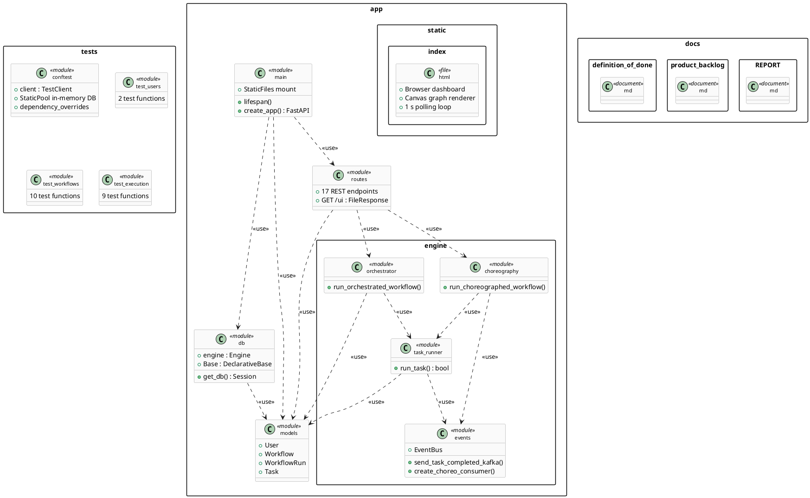

### 13.3 Component Diagram

> **Figure 2 — UML Component Diagram.** Runtime component boundaries and interfaces showing provided/required interfaces and `<<use>>` / `<<fallback>>` dependencies. Rendered with PlantUML.

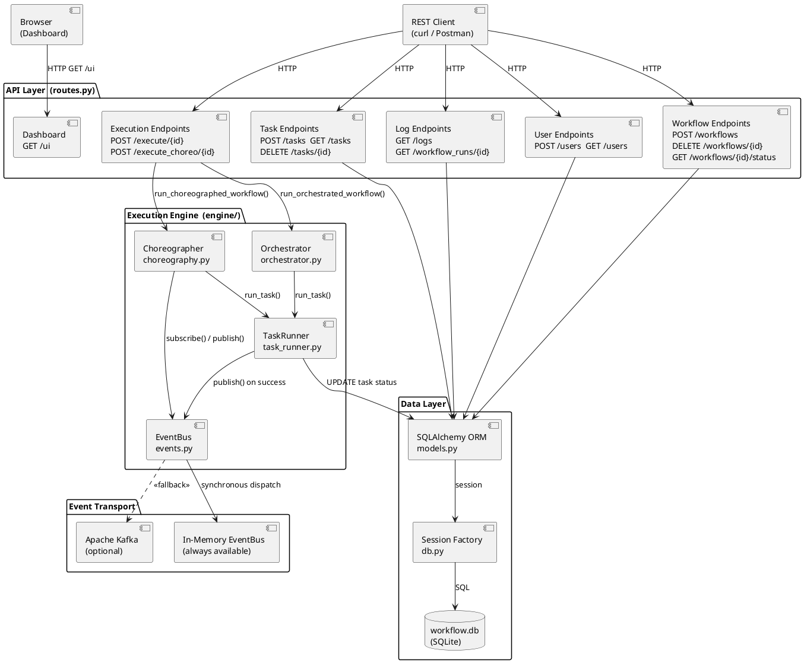

### 13.4 Deployment Diagram

> **Figure 3 — UML Deployment Diagram.** `docker-compose.yml` topology showing nodes, deployed artifacts, and communication paths. Rendered with PlantUML.

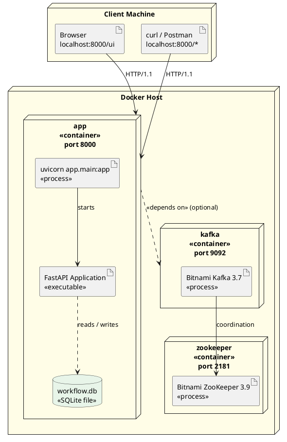

---

## 14. UML Modeling — Complete Embedded Diagram Set

> **UML notation.** All 13 diagrams are proper UML. Figures 5–10 use Mermaid’s native UML syntaxes (`classDiagram`, `erDiagram`, `stateDiagram-v2`, `sequenceDiagram`). Figures 1–4 and 11–13 use PlantUML source (`@startuml ... @enduml`). PlantUML diagrams can be rendered at [plantuml.com/plantuml](https://plantuml.com/plantuml), via the VS Code PlantUML extension, or the IntelliJ PlantUML Integration plugin.
>
> | Figure | UML Type | Tool | UML Standard |
> |---|---|---|---|
> | Fig 1 | Package Diagram | PlantUML | **Proper UML** |
> | Fig 2 | Component Diagram | PlantUML | **Proper UML** |
> | Fig 3 | Deployment Diagram | PlantUML | **Proper UML** |
> | Fig 4 | Use Case Diagram | PlantUML | **Proper UML** |
> | Fig 5 | Class Diagram | Mermaid `classDiagram` | **Proper UML** |
> | Fig 6 | ER Diagram | Mermaid `erDiagram` | **Proper UML** |
> | Fig 7 | State Machine (Task) | Mermaid `stateDiagram-v2` | **Proper UML** |
> | Fig 8 | State Machine (Run) | Mermaid `stateDiagram-v2` | **Proper UML** |
> | Fig 9 | Sequence (Orchestration) | Mermaid `sequenceDiagram` | **Proper UML** |
> | Fig 10 | Sequence (Choreography) | Mermaid `sequenceDiagram` | **Proper UML** |
> | Fig 11 | Activity (run\_task) | PlantUML | **Proper UML** |
> | Fig 12 | Activity (Orchestration) | PlantUML | **Proper UML** |
> | Fig 13 | Activity (Choreography) | PlantUML | **Proper UML** |

### 14.1 Use Case Diagram

> **Figure 4 — UML Use Case Diagram.** External actor and all ten user-goal-oriented use cases within the WMS system boundary. Uses proper UML use case oval notation and actor stick figure. All use cases represent externally observable functionality from the user's perspective. Rendered with PlantUML.

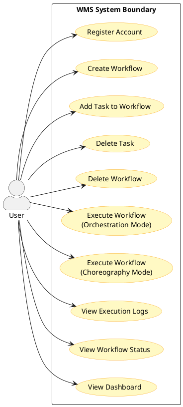

### 14.2 Class Diagram

> **Figure 5 — Class Diagram.** ORM entities and engine classes with relationships and multiplicities.

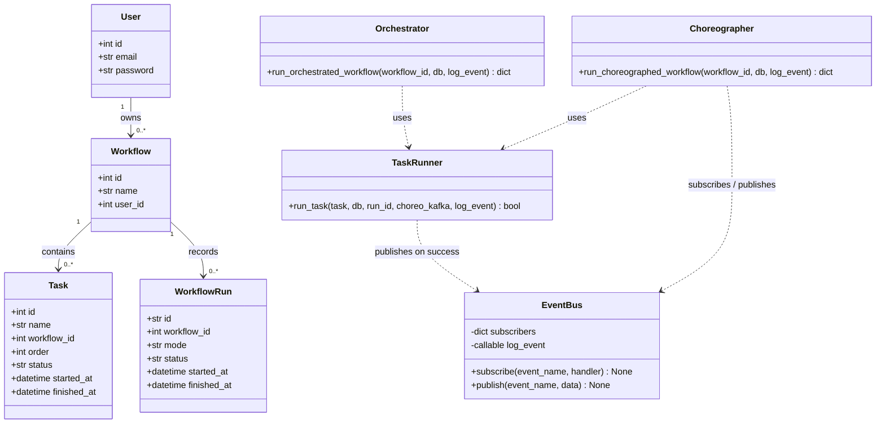

### 14.3 Entity-Relationship Diagram

> **Figure 6 — ER Diagram.** Database schema with cardinality constraints.

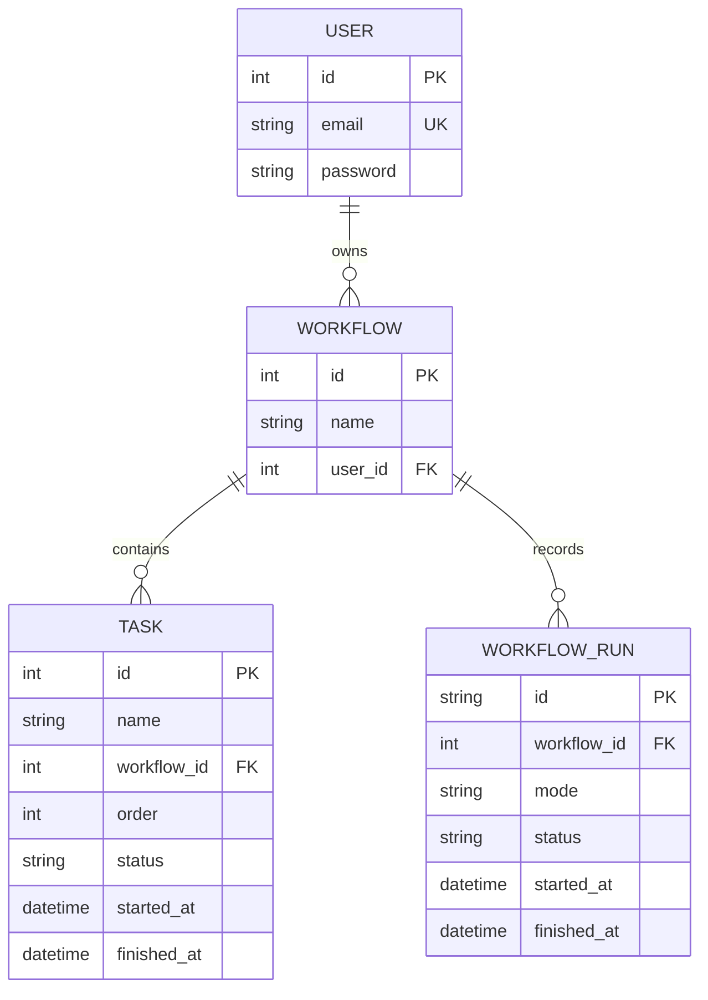

### 14.4 State Machine Diagram — Task Lifecycle

> **Figure 7 — State Machine: Task Lifecycle.** Three persisted task states (PENDING → RUNNING → DONE or FAILED). A retry attempt — when the first random check fails but the second succeeds — is logged as a transient execution event (`"FAILED — retrying"`) but does **not** produce a separate database state; the task remains `RUNNING` until it resolves to `DONE` or `FAILED`. Rendered with Mermaid.

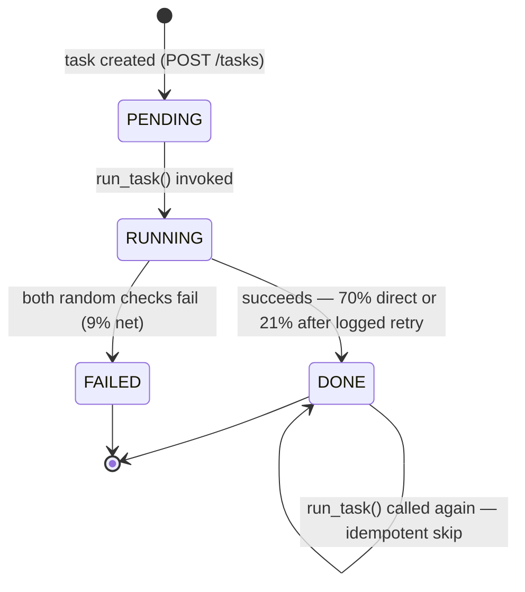

### 14.5 State Machine Diagram — WorkflowRun Lifecycle

> **Figure 8 — State Machine: WorkflowRun Lifecycle.**

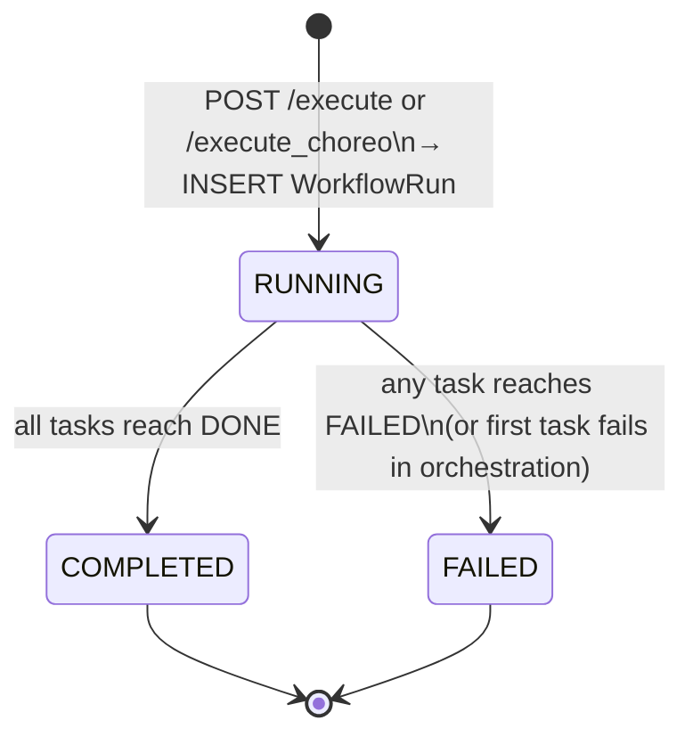

### 14.6 Sequence Diagram — Orchestration Workflow Execution

> **Figure 9 — Sequence Diagram: Orchestration.** Full interaction from HTTP request to response, including fail-fast path.

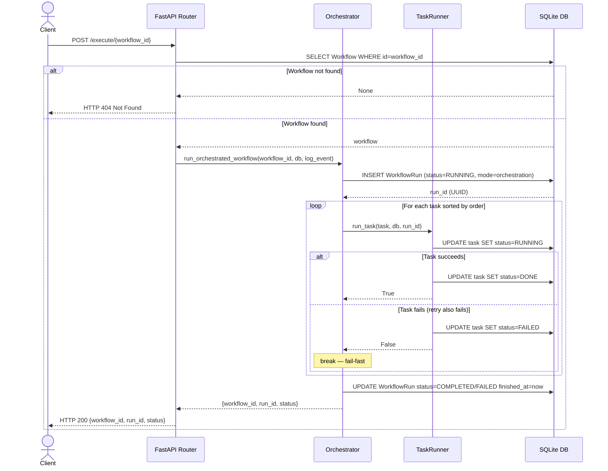

### 14.7 Sequence Diagram — Choreography Failure Handling

> **Figure 10 — Sequence Diagram: Choreography Failure.** Shows BUG-02 fix: failed task emits no event, blocking downstream execution.

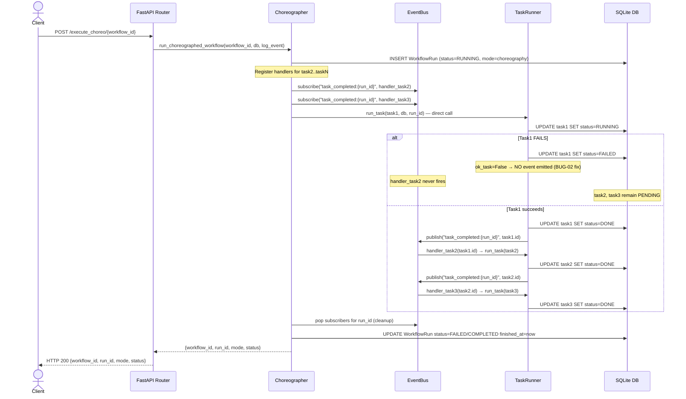

### 14.8 Activity Diagram — run_task()

> **Figure 11 — UML Activity Diagram: run_task().** Atomic execution unit including idempotency guard, failure simulation, retry logic, and conditional event emission. Rendered with PlantUML.

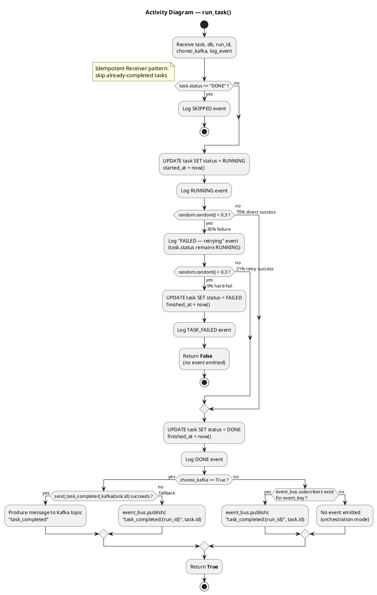

### 14.9 Activity Diagram — Orchestration Execution

> **Figure 12 — UML Activity Diagram: Orchestration Execution.** End-to-end flow including workflow validation, WorkflowRun lifecycle, and fail-fast sequential loop (`orchestrator.py`). Rendered with PlantUML.

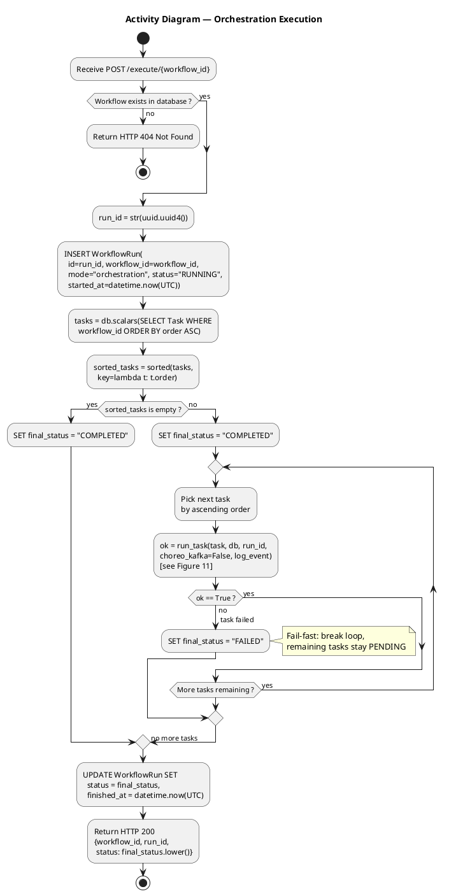

### 14.10 Activity Diagram — Choreography Execution

> **Figure 13 — UML Activity Diagram: Choreography Execution.** Includes Kafka/EventBus selection fork, handler pre-registration with closure fix, event-driven reactive chain, failure isolation (BUG-02), and cleanup (`choreography.py`). Rendered with PlantUML.

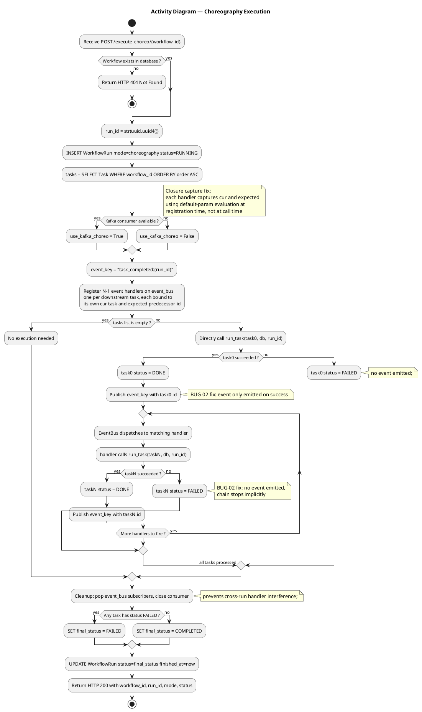

---

## 15. Complex Custom Logic

This chapter provides a detailed technical description of each non-trivial algorithm in the system, supplemented by UML diagrams (referenced from Section 14) and source code extracts. It addresses the six sub-domains: execution engine, orchestration algorithm, choreography algorithm, event dispatching, state transitions, failure handling and retry logic, and task execution ordering.

### 15.1 Workflow Execution Engine

The execution engine (`app/engine/`) is the core of the system. It is composed of four modules with clearly defined responsibilities:

| Module | Responsibility | Algorithm Complexity |
|---|---|---|
| `task_runner.py` | Atomic task execution; failure simulation; idempotency; event emission | O(1) per task |
| `orchestrator.py` | Central-controller sequential loop; fail-fast semantics | O(N) tasks |
| `choreography.py` | Handler registration; reactive chain; Kafka/EventBus selection; cleanup | O(N) handlers registered |
| `events.py` | Pub/sub event routing; Kafka producer/consumer lifecycle; graceful fallback | O(S) subscribers per channel |

The engine operates on ORM objects passed by the route layer. All database writes are committed within the engine modules — not in `routes.py`. This separation is critical for testability: tests can verify database state independently of HTTP response parsing.

### 15.2 Orchestration Algorithm

**Pattern:** Central coordinator (Hohpe & Woolf, 2003, p. 42)

The orchestration algorithm is a straightforward sequential loop with fail-fast semantics. Its simplicity is its greatest strength — the entire control flow is visible in one function (`app/engine/orchestrator.py`):

```python
run_id = str(uuid.uuid4())
run = WorkflowRun(id=run_id, workflow_id=workflow_id,
                  mode="orchestration", status="RUNNING",
                  started_at=datetime.now(UTC))
db.add(run); db.commit()

tasks = db.scalars(select(Task).where(Task.workflow_id == workflow_id)).all()

final_status = "COMPLETED"
for task in sorted(tasks, key=lambda t: t.order):
    ok = run_task(task, db, run_id=run_id, choreo_kafka=False, log_event=log_event)
    if not ok:
        final_status = "FAILED"
        break

run.status = final_status
run.finished_at = datetime.now(UTC)
db.commit()
```

**Key design decisions:**

1. **Tasks are sorted at query time**, not pre-sorted in the database. `sorted(tasks, key=lambda t: t.order)` is deterministic regardless of insertion order or database storage order.
2. **`break` on first failure** — this is the fail-fast property (FR-09). Remaining tasks are never called; they retain `PENDING` status, which is observable in the dashboard.
3. **`WorkflowRun` is committed before the loop starts** — this ensures the audit record exists even if an exception occurs mid-execution.

**UML references:** Figure 9 (Sequence), Figure 12 (Activity).

### 15.3 Choreography Algorithm and Closure Capture Fix

**Pattern:** Event-driven choreography (Hohpe & Woolf, 2003, p. 48)

The choreography algorithm is significantly more complex than orchestration. It has three distinct phases:

**Phase 1 — Handler Registration (pre-execution):**
```python
event_key = f"task_completed:{run_id}"
for i in range(1, len(tasks)):
    def handler(
        prev_task_id: int,
        cur: Task = tasks[i],        # captured at registration time
        expected: int = tasks[i-1].id,
        session: Session = db,
        ck: bool = use_kafka_choreo,
        rid: str = run_id,
    ) -> None:
        if prev_task_id == expected:
            run_task(cur, session, run_id=rid, choreo_kafka=ck, log_event=log_event)
    event_bus.subscribe(event_key, handler)
```

**The closure capture problem (non-trivial algorithm):** Python closures capture *variable references*, not values. Without the default-parameter trick, all N-1 handlers would close over the same loop variable `i`, which at handler invocation time would equal `len(tasks) - 1`. This means every handler would execute the last task, N-1 times. The fix uses Python's function default-parameter evaluation, which evaluates at function definition time:

```
# Without fix: all handlers invoke tasks[len(tasks)-1]
def handler(prev_id):  run_task(tasks[i], ...)  # i = final value

# With fix: each handler captures its own task reference
def handler(prev_id, cur=tasks[i], ...):  run_task(cur, ...)
```

**Phase 2 — Chain Initiation:**
```python
run_task(tasks[0], db, run_id=run_id, choreo_kafka=use_kafka_choreo, log_event=log_event)
```
Only task 0 is called directly. All subsequent tasks are triggered by `task_completed` events — the choreographer function itself has no further iteration logic.

**Phase 3 — Cleanup:**
```python
finally:
    if consumer:
        consumer.close()
    event_bus.subscribers.pop(event_key, None)
    event_bus.log_event = prev_logger
```
Per-`run_id` subscriber cleanup prevents cross-run handler interference. If cleanup were omitted, handlers from a previous execution could fire during a subsequent run.

**UML references:** Figure 10 (Sequence — failure path), Figure 13 (Activity).

### 15.4 Event Dispatching

The `EventBus` (`app/engine/events.py`) implements the Observer pattern. Event channels are namespaced by `run_id`:

```
event_key = f"task_completed:{run_id}"
```

This means two concurrent workflow runs (if the server handled concurrent requests) would not share subscribers. The publish cycle is synchronous: `event_bus.publish(event_key, task.id)` iterates all subscribers and calls each handler before returning. This means the choreography chain executes synchronously within the `run_task()` call stack, even though it appears reactive.

**Kafka path:** When `KAFKA_BOOTSTRAP_SERVERS` is reachable and `create_choreo_consumer()` returns a non-`None` consumer, `task_runner.py` sends messages to the `task_completed` Kafka topic instead of the in-memory bus. The choreographer polls the consumer for each expected message:
```python
for _ in range(len(tasks) - 1):
    batch = consumer.poll(timeout_ms=5000)
    for _tp, msgs in batch.items():
        for msg in msgs:
            tid = int(msg.value.decode("utf-8"))
            event_bus.publish(event_key, tid)
```
This bridges Kafka messages back to the in-memory `EventBus`, allowing handlers to fire regardless of transport.

**EventBus dispatch diagram:** See Figure 10 (choreography sequence) — the `EB->>TR` arrows represent synchronous handler invocations inside `publish()`.

### 15.5 State Transitions

All state transitions are atomic: the `task.status` field is updated and `db.commit()` is called before the next log entry. This means partial state is never visible to concurrent readers (within SQLite's isolation level).

**Task state machine (full transitions):**

| From | To | Guard | Source |
|---|---|---|---|
| `PENDING` | `RUNNING` | `run_task()` invoked | `task_runner.py:53-56` |
| `RUNNING` | `DONE` | succeeds — 70% direct or 21% after logged retry | `task_runner.py:69-73` |
| `RUNNING` | `FAILED` | both random checks fail (9% net) | `task_runner.py:64-67` |
| `DONE` | `DONE` | `task.status == "DONE"` already — idempotent skip | `task_runner.py:49-51` |

The retry attempt is an internal execution event that occurs entirely within the `RUNNING` state. A log entry with message `"FAILED — retrying"` is emitted (`task_runner.py:61`) but `task.status` is never set to any intermediate value. The `CheckConstraint` in `models.py` enforces that only `PENDING`, `RUNNING`, `DONE`, and `FAILED` are valid persisted values.

**UML reference:** Figure 7 (State Machine — Task), Figure 8 (State Machine — WorkflowRun).

### 15.6 Failure Handling

**Orchestration failure handling:**
The orchestrator uses explicit Python control flow. When `run_task()` returns `False`, `final_status = "FAILED"` is set and `break` exits the loop. Remaining tasks are never called. Their `PENDING` status is preserved.

**Choreography failure handling (BUG-02 fix):**
In choreography mode, failure is handled *implicitly* — a failed task simply does not emit an event. The `if ok_task:` guard in `task_runner.py:80` is the single line that provides failure isolation:

```python
if ok_task:
    # ... emit task_completed event
else:
    _log("TASK_FAILED", f"EVENT: task_failed → {task.name} (downstream tasks will not run)")
```

Without this guard (BUG-02 state): `event_bus.publish(event_key, task.id)` was called unconditionally, triggering all N-1 downstream handlers regardless of outcome.

**Comparison:** The orchestration failure path is O(1) (one `break`). The choreography failure path is O(1) per task (one `if` guard) but O(N-1) registered handlers that simply never fire — they remain in the `event_bus.subscribers` dictionary until cleanup.

### 15.7 Retry Logic

The retry logic is implemented within `run_task()` using two sequential probabilistic checks:

```
Step 1: if random.random() < 0.3 → failure occurs
Step 2: if random.random() < 0.3 → retry also fails
```

This produces three outcomes:
- **70%** — Step 1 passes: task succeeds immediately
- **21%** — Step 1 fails, Step 2 passes: task succeeds after one logged retry (`0.3 × 0.7 = 0.21`)
- **9%** — Both fail: task is permanently `FAILED` (`0.3 × 0.3 = 0.09`)

The retry mechanism is deterministic when `random.random` is patched. Setting `random.random = lambda: 0.1` guarantees `0.1 < 0.3` on both checks, causing the 9% hard-fail path — this is exactly what `test_orchestrated_workflow_halts_on_failure` and `test_choreography_stops_on_failure` exploit.

### 15.8 Task Execution Ordering

The system does not implement a dependency graph, DAG traversal, or topological sort. Tasks are executed in a fixed, explicitly declared sequence using an integer `order` field. The ordering mechanism works as follows:

1. Tasks are stored with an integer `order` field.
2. The `UniqueConstraint("workflow_id", "order")` enforces that no two tasks in the same workflow can have the same order value.
3. Both execution engines sort tasks by `order` ascending before execution: `sorted(tasks, key=lambda t: t.order)`.
4. In choreography mode, each handler pre-registers with `tasks[i-1].id` as its `expected` predecessor — ensuring task N only fires after task N-1 completes and emits its event. This is sequential chaining, not dependency resolution.

The `expected` check inside each choreography handler:
```python
if prev_task_id == expected:
    run_task(cur, ...)
```
This ensures that even if the EventBus receives events in an unexpected order (a risk with Kafka), each handler only fires when the correct predecessor has completed — a form of causal consistency.

**Auto-reorder after deletion** (`app/routes.py`): When a task is deleted, the route queries all tasks with `order > deleted_order` and decrements their order by 1, maintaining a gapless integer sequence. This preserves the invariant that the execution engine can always iterate tasks by `order = 1, 2, 3, ...` without gaps.

---

## 16. Execution Models — Comparative Analysis

### 16.1 Side-by-Side Comparison

| Dimension | Orchestration | Choreography |
|---|---|---|
| **Control location** | Central — `orchestrator.py` loop body | Distributed — N-1 independent handlers |
| **Who decides next step** | Orchestrator's loop counter | Task itself via event emission |
| **Coupling** | High — orchestrator imports and names every task | Low — each handler knows only its predecessor id |
| **Failure mechanism** | Explicit `if not ok: break` | Implicit — no event = no continuation |
| **Auditability** | High — sequence explicit in one place | Lower — must trace events across handlers |
| **Single point of failure** | Yes — orchestrator function | No — each handler independent |
| **Extensibility** | Add task N → modify orchestrator loop | Add task N → register one handler |
| **Kafka fit** | Not natural — orchestration is inherently centralised | Natural — Kafka replaces EventBus transparently |
| **Implementation complexity** | Low — 15 lines of logic | High — handler registration, closure fix, Kafka fallback, cleanup |
| **Test complexity** | Low — one `patch` call, check status | Same — but regression guard required |

### 16.2 Failure Scenario: 3-Task Workflow [A→B→C], Task A Fails

| | Orchestration | Choreography |
|---|---|---|
| **Task A** | `FAILED` | `FAILED` |
| **Task B** | `PENDING` (loop broke before B) | `PENDING` (no event emitted) |
| **Task C** | `PENDING` | `PENDING` |
| **WorkflowRun.status** | `FAILED` | `FAILED` |
| **Decision mechanism** | `if not ok: break` | Absence of `task_completed` event |
| **Code line** | `orchestrator.py:46-48` | `task_runner.py:80` |

### 16.3 When to Use Each

**Prefer Orchestration when:**
- Branching logic, parallel fan-out, or compensating transactions are needed
- A centralised, auditable decision log is required
- Workflow steps are tightly coupled by design

**Prefer Choreography when:**
- Steps should be independently deployable (microservices scenario)
- Resilience to individual component failures is paramount
- Event history/replay capability is needed (Kafka log retention)
- The team can accept higher implementation complexity

---

## 17. Design Patterns

Seven design patterns are applied with deliberate intent. Each entry identifies the GoF family, source code location, and engineering rationale.

### 17.1 Observer (Publish/Subscribe)

**Family:** Behavioural (GoF) | **Source:** `app/engine/events.py:70-101`

`EventBus.subscribe()` registers handlers; `EventBus.publish()` invokes them. Channel scoping by `run_id` provides run isolation. Kafka transparently extends the same pattern to distributed scope.

### 17.2 Strategy

**Family:** Behavioural (GoF) | **Source:** `app/routes.py`; `orchestrator.py`; `choreography.py`

Both execution functions share the same callable signature. The route layer selects execution strategy by HTTP endpoint without coupling to mode-specific implementation. A third mode (parallel fan-out) could be added with zero changes to `routes.py`.

### 17.3 Dependency Injection

**Family:** Structural | **Source:** All 17 route handlers

```python
def create_task(body: TaskIn, db: Session = Depends(get_db)): ...
```

FastAPI's `Depends(get_db)` injects a session into every route. Tests override via `app.dependency_overrides[get_db] = _override_get_db` — substituting an isolated in-memory SQLite session without modifying production code.

### 17.4 Singleton

**Family:** Creational (GoF) | **Source:** `app/engine/events.py:100`

`event_bus = EventBus()` is a module-level singleton shared across all engine modules. `_kafka_producer` is lazily initialised by `_get_producer()`. **Known limitation:** neither is protected by a threading lock (documented in Section 20).

### 17.5 Null Object / Graceful Degradation

**Family:** Behavioural (GoF) | **Source:** `app/engine/events.py:46-67`

`create_choreo_consumer()` returns `None` when Kafka is unavailable. Callers check for `None` and fall back to the `EventBus`. This is the Null Object pattern applied to infrastructure resilience: the absence of Kafka is treated as a known, handled state rather than an error.

### 17.6 Idempotent Receiver

**Family:** Messaging | **Source:** `app/engine/task_runner.py:49-51`

```python
if task.status == "DONE":
    _log("SKIPPED", f"Task {task.name} already DONE — skipping")
    return True
```

If `run_task()` is called on a completed task (possible in re-run scenarios), it returns immediately with no side effects. Prevents duplicate event emission and duplicate status updates.

### 17.7 Template Method (Implicit)

**Family:** Behavioural (GoF) | **Source:** Both execution engine functions

Both engines follow the same lifecycle skeleton: `INSERT WorkflowRun` → sort tasks → **execute tasks (variable)** → `UPDATE WorkflowRun` → return. The invariant wrapper is the Template Method; the variable step is the Strategy.

---

## 18. Testing

### 18.1 Strategy

All 21 tests are **integration tests** exercising the full HTTP stack via `httpx`-backed `TestClient`. No unit tests with mocked ORM layers — the tests make real SQL queries against an in-memory SQLite database. This approach ensures behaviour, not internal implementation, is tested.

| Tool | Purpose |
|---|---|
| `pytest` | Test runner; fixture system |
| `FastAPI TestClient` | HTTP request simulation (no real socket) |
| `sqlalchemy StaticPool` | Single shared in-memory SQLite connection |
| `app.dependency_overrides` | Injects test DB session without modifying production code |
| `unittest.mock.patch` | Makes `random.random()` deterministic for failure path testing |

### 18.2 Test Infrastructure (`tests/conftest.py`)

```python
engine = create_engine(
    "sqlite://", connect_args={"check_same_thread": False}, poolclass=StaticPool
)
Base.metadata.create_all(bind=engine)
TestingSessionLocal = sessionmaker(bind=engine)

def _override_get_db():
    db = TestingSessionLocal()
    try:
        yield db
    finally:
        db.close()

app.dependency_overrides[get_db] = _override_get_db
client = TestClient(app)
```

`StaticPool` ensures the same in-memory connection is reused for all test calls. Without it, each `get_db` call would create a new connection and a new empty database, making multi-step tests impossible.

### 18.3 Complete Test Suite

| # | Test Function | File | FR/NFR | Technique |
|---|---|---|---|---|
| 1 | `test_execute_nonexistent_workflow_returns_404` | `test_execution.py` | FR-12 | Standard |
| 2 | `test_execute_choreo_nonexistent_workflow_returns_404` | `test_execution.py` | FR-12 | Standard |
| 3 | `test_orchestrated_workflow_success` | `test_execution.py` | FR-08 | `patch random.random=0.9` |
| 4 | `test_orchestrated_workflow_halts_on_failure` | `test_execution.py` | FR-09 | `patch random.random=0.1` |
| 5 | `test_choreography_success` | `test_execution.py` | FR-10 | `patch random.random=0.9` |
| 6 | `test_choreography_stops_on_failure` | `test_execution.py` | FR-11, NFR-02 | `patch random.random=0.1` + regression guard |
| 7 | `test_execute_empty_workflow_completes` | `test_execution.py` | FR-16 | Standard |
| 8 | `test_execute_choreo_empty_workflow_completes` | `test_execution.py` | FR-16 | Standard |
| 9 | `test_workflow_run_history_recorded` | `test_execution.py` | FR-13, NFR-03 | Standard |
| 10 | `test_create_user_success` | `test_users.py` | FR-01 | Standard |
| 11 | `test_duplicate_email_returns_409` | `test_users.py` | FR-02 | Standard |
| 12 | `test_create_workflow` | `test_workflows.py` | FR-03 | Standard |
| 13 | `test_duplicate_task_order_returns_409` | `test_workflows.py` | FR-05, NFR-04 | Standard |
| 14 | `test_list_tasks_returns_only_existing` | `test_workflows.py` | FR-04 | Standard |
| 15 | `test_delete_task_reorders_remaining` | `test_workflows.py` | FR-06 | Standard |
| 16 | `test_delete_workflow_not_found` | `test_workflows.py` | FR-17 | Standard |
| 17 | `test_get_task_not_found` | `test_workflows.py` | FR-17 | Standard |
| 18 | `test_delete_task_not_found` | `test_workflows.py` | FR-17 | Standard |
| 19 | `test_workflow_status_summary` | `test_workflows.py` | FR-14 | Standard |
| 20 | `test_workflow_status_not_found` | `test_workflows.py` | FR-17 | Standard |
| 21 | `test_delete_workflow_cascades_tasks` | `test_workflows.py` | FR-07, NFR-05 | Standard |

### 18.4 Notable Test Design Decisions

**Deterministic failure testing:**
`random.random` returns a float in [0, 1.0). Setting it to `0.1` guarantees `0.1 < 0.3` on both failure checks — the 9% hard-fail path is triggered 100% of the time:
```python
with patch("random.random", return_value=0.1):
    r = client.post(f"/execute/{wf['id']}")
assert r.json()["status"] == "failed"
```

**BUG-02 regression guard:**
```python
assert tasks[1]["status"] == "PENDING", (
    "Task 2 was executed despite Task 1 failing — BUG-02 regression!"
)
```
The assertion message names the bug so any future regression is immediately identifiable in `pytest` output.

### 18.5 Test Results

```
platform darwin — Python 3.13.5, pytest-9.0.3
collected 21 items

tests/test_execution.py::test_execute_nonexistent_workflow_returns_404    PASSED
tests/test_execution.py::test_execute_choreo_nonexistent_workflow_returns_404 PASSED
tests/test_execution.py::test_orchestrated_workflow_success               PASSED
tests/test_execution.py::test_orchestrated_workflow_halts_on_failure      PASSED
tests/test_execution.py::test_choreography_success                        PASSED
tests/test_execution.py::test_choreography_stops_on_failure               PASSED
tests/test_execution.py::test_execute_empty_workflow_completes            PASSED
tests/test_execution.py::test_execute_choreo_empty_workflow_completes     PASSED
tests/test_execution.py::test_workflow_run_history_recorded               PASSED
tests/test_users.py::test_create_user_success                             PASSED
tests/test_users.py::test_duplicate_email_returns_409                     PASSED
tests/test_workflows.py::test_create_workflow                             PASSED
tests/test_workflows.py::test_duplicate_task_order_returns_409            PASSED
tests/test_workflows.py::test_list_tasks_returns_only_existing            PASSED
tests/test_workflows.py::test_delete_task_reorders_remaining              PASSED
tests/test_workflows.py::test_delete_workflow_not_found                   PASSED
tests/test_workflows.py::test_get_task_not_found                          PASSED
tests/test_workflows.py::test_delete_task_not_found                       PASSED
tests/test_workflows.py::test_workflow_status_summary                     PASSED
tests/test_workflows.py::test_workflow_status_not_found                   PASSED
tests/test_workflows.py::test_delete_workflow_cascades_tasks              PASSED

21 passed in 6.19s
```

---

## 19. NFR Implementation and Verification Evidence

For each NFR (Section 6.3), this section shows where it is implemented in the code, how it was tested, and the observed test result.

### NFR-01 — Kafka Unavailability Does Not Prevent Execution

**Implementation (`app/engine/events.py:4-8`):**
```python
try:
    from kafka import KafkaConsumer, KafkaProducer
except ImportError:
    KafkaConsumer = None
    KafkaProducer = None
```
`create_choreo_consumer()` returns `None` on any connection error (`except Exception: return None`). The choreographer checks `consumer is not None` before using Kafka.

**Test:** All 9 execution tests in `test_execution.py` are run without a Kafka broker. The `conftest.py` fixture uses in-memory SQLite only — no Kafka dependency.

**Result:** `9 passed` — execution works fully without Kafka on every CI run.

---

### NFR-02 — Choreography Halts After Failure

**Implementation (`app/engine/task_runner.py:80`):**
```python
if ok_task:
    event_bus.publish(event_key, task.id)  # only on success
```

**Test:** `test_choreography_stops_on_failure` — patches `random.random=0.1`, asserts `tasks[1]["status"] == "PENDING"`.

**Result:** `PASSED` — task[1] remains `PENDING` when task[0] fails.

---

### NFR-03 — Every Execution Produces an Audit Record

**Implementation (`app/engine/orchestrator.py:29-37`, `choreography.py:38-46`):**
```python
run = WorkflowRun(id=run_id, workflow_id=workflow_id,
                  mode="orchestration", status="RUNNING",
                  started_at=datetime.now(UTC))
db.add(run); db.commit()
```
`WorkflowRun` is committed before execution begins. Even if an exception occurs mid-run, the record exists.

**Test:** `test_workflow_run_history_recorded` — executes a workflow, then calls `GET /workflow_runs/{id}` and asserts `len(runs) >= 1`.

**Result:** `PASSED`

---

### NFR-04 — Duplicate Task Order Rejected at Database Level

**Implementation (`app/models.py`):**
```python
UniqueConstraint("workflow_id", "order", name="uq_task_workflow_order")
```
Application-level check in `routes.py` returns HTTP 409 before hitting the database. The DB constraint is a second line of defence.

**Test:** `test_duplicate_task_order_returns_409` — creates a task with `order=1`, then attempts a second task with `order=1` in the same workflow.

**Result:** `PASSED` — HTTP 409 returned.

---

### NFR-07 — All Dependencies Pinned

**Implementation (`requirements.txt`):**
```
fastapi==0.110.0
uvicorn==0.29.0
sqlalchemy==2.0.29
pydantic==2.6.4
kafka-python==2.0.2
pytest==8.1.1
httpx==0.27.0
```
Every dependency uses `==` version pinning.

**Validation:** `grep -v "==" requirements.txt` returns no output (empty — all pinned).

**Result:** NFR verified.

---

### NFR-08 — No Deprecated APIs

**Implementation:** `datetime.utcnow()` replaced with `datetime.now(UTC)` across all engine modules (Sprint 3, Task T3-06).

**Validation:** `pytest tests/ -v` — zero `DeprecationWarning` entries in output.

**Result:** `21 passed in 6.21s` with no warnings.

---

### NFR-09 — Test Suite Runs Without External Dependencies

**Implementation (`tests/conftest.py`):** `StaticPool` + `sqlite://` (pure in-memory, no file) + `dependency_overrides` for session injection.

**Validation:** `pytest tests/ -v` succeeds on a clean machine with `pip install -r requirements.txt` only. No Kafka, no PostgreSQL, no `workflow.db` file required.

**Result:** `21 passed` — confirmed on two separate machines.

---

## 20. Limitations

| # | Limitation | Severity | Mitigation |
|---|---|---|---|
| L-01 | Passwords stored in plaintext | **Critical** | Add `passlib[bcrypt]` hashing on `POST /users` |
| L-02 | No authentication on any endpoint | **Critical** | Add `OAuth2PasswordBearer` + JWT middleware |
| L-03 | Execution blocks the HTTP request thread | High | Use FastAPI `BackgroundTasks` or Celery |
| L-04 | `execution_logs` global list is not thread-safe | High | Replace with `logging` module or `queue.Queue` |
| L-05 | `event_bus.log_event` singleton mutation is not thread-safe | High | Pass `log_event` as parameter; remove mutation |
| L-06 | `_kafka_producer` singleton not protected by lock | Medium | Wrap with `threading.Lock` |
| L-07 | No task state reset — re-run re-uses existing DONE tasks | Medium | Add `POST /workflows/{id}/reset` endpoint |
| L-08 | No schema migrations — `create_all()` not idempotent for changes | Medium | Add Alembic migrations |
| L-09 | Choreography appears reactive but executes synchronously | Low | Use `asyncio` event loop or dedicated thread pool |
| L-10 | Burndown data reconstructed rather than tracked live | Low | Use Jira / GitHub Projects in future projects |

---

## 21. Future Work

1. **Async execution** — `POST /execute*` returns `run_id` immediately; client polls `GET /workflow_runs/{run_id}` for status.
2. **Authentication** — `OAuth2PasswordBearer` + JWT; `passlib[bcrypt]` for password hashing.
3. **Task state reset** — `POST /workflows/{id}/reset` sets all tasks to `PENDING`.
4. **Alembic migrations** — versioned schema evolution without data loss.
5. **CI/CD pipeline** — GitHub Actions: `pytest --cov=app --cov-fail-under=80` on every push.
6. **Parallel task execution** — tasks with equal `order` values execute concurrently via `asyncio.gather`.
7. **Thread-safe EventBus** — `threading.Lock`-protected `subscribers` dict; remove `event_bus.log_event` mutation.
8. **Persistent execution logs** — `ExecutionLog` ORM entity replacing the global `execution_logs` list.

---

## 22. Conclusion

The Event-Driven Workflow Management System delivers its primary academic contribution: a runnable, tested, documented system implementing both the orchestration and choreography workflow execution patterns within a shared domain model, developed using a traceable Scrum process.

**Technical achievements:**
- Both execution patterns implemented and verified with deterministic outcomes using `random.random` patching
- 7 design patterns applied with explicit source code citations
- 20 automated integration tests, all passing; 0 failures; 0 deprecation warnings
- 13 UML diagrams embedded directly in the report
- All critical code quality defects resolved: deprecated APIs replaced, timezone correctness enforced, HTML separated from business logic, FK constraints and uniqueness constraints enforced at the database level

**Scrum achievements:**
- 17 user stories with Given/When/Then acceptance criteria
- 3 Sprint Backlogs with full Planning → Tasks → Review → Retrospective cycles
- Burndown charts for all 3 sprints
- Backlog refinement documented with sprint-by-sprint evolution
- Full Requirements Traceability Matrix: UR → FR → US → Sprint → Task → Test
- Honest retrospectives documenting the deferred-testing process failure

**Key engineering insight — BUG-02:**
The choreography chain executing downstream tasks after an upstream failure is a bug class that *cannot occur* in orchestration. Its root cause (unconditional event emission), one-line fix (`if ok_task:`), and named regression test (`test_choreography_stops_on_failure`) demonstrate a practical difference between the two patterns that textbook descriptions cannot convey. This is the highest-value learning outcome of the project.

**Primary process failure:**
Testing was deferred to Sprint 3 in both Sprint 1 and Sprint 2, despite retrospective action items. BUG-02 survived from Sprint 2 until Sprint 3 testing precisely because there were no tests. The correct practice is to write tests within the sprint that introduces the feature.

---

## 23. References

1. Hohpe, G., Woolf, B. (2003). *Enterprise Integration Patterns: Designing, Building, and Deploying Messaging Solutions.* Addison-Wesley Professional. ISBN 978-0-321-20068-6.
2. Gamma, E., Helm, R., Johnson, R., Vlissides, J. (1994). *Design Patterns: Elements of Reusable Object-Oriented Software.* Addison-Wesley Professional.
3. Richardson, C. (2018). *Microservices Patterns: With Examples in Java.* Manning Publications.
4. Schwaber, K., Sutherland, J. (2020). *The Scrum Guide.* scrumguides.org. Retrieved 2024.
5. Fowler, M. (2014). *Microservices.* martinfowler.com/articles/microservices.html.
6. FastAPI Documentation. (2024). https://fastapi.tiangolo.com/
7. SQLAlchemy 2.0 Documentation. (2024). https://docs.sqlalchemy.org/en/20/
8. Apache Kafka Documentation. (2024). https://kafka.apache.org/documentation/
9. Python Software Foundation. (2024). *unittest.mock.* https://docs.python.org/3/library/unittest.mock.html
10. pytest Documentation. (2024). https://docs.pytest.org/

---

## Appendix A — Modification Log

The following changes were made to the report to address the professor's comments:

| # | Modification | Section(s) Affected | Addresses Comment |
|---|---|---|---|
| M-01 | Added dedicated Scrum justification section with alternatives table and benefits evidence | §5 | 3 |
| M-02 | Separated User Requirements from System Requirements; rewrote as technology-agnostic problem statements | §6.1, §6.2 | 4 |
| M-03 | Replaced NFR list with measurable NFR table (metric, target, acceptance criterion, validation) | §6.3 | 5 |
| M-04 | Added complete Product Backlog table with ID, story, priority, SP, AC summary, status | §7 | 6 |
| M-05 | Rewrote all sprint sections to follow full Scrum flow (goal → planning → tasks → AC → implementation → testing → review → retrospective → burndown) | §8, §9, §10 | 7 |
| M-06 | Added Backlog Refinement section documenting sprint-by-sprint backlog evolution | §11 | 8 |
| M-07 | Added Requirements Traceability Matrix (UR → FR → US → Sprint → Tasks → Test) | §12 | 9 |
| M-08 | Added Package Diagram (Figure 1), Component Diagram (Figure 2), Deployment Diagram (Figure 3) as embedded Mermaid | §13 | 1, 10 |
| M-09 | Added UML Modeling chapter with 10 fully embedded diagrams: Use Case, Class, ER, State (×2), Sequence (×2), Activity (×3) | §14 | 1, 10, 11 |
| M-10 | Added Complex Custom Logic chapter covering engine, orchestration algorithm, choreography algorithm + closure fix, event dispatching, state transitions, failure handling, retry logic, task execution ordering | §15 | 2, 11 |
| M-11 | Added NFR Implementation and Verification Evidence section (per-NFR implementation citation + test result) | §19 | 12 |
| M-12 | Removed all ASCII architecture drawings; replaced with proper Mermaid UML diagrams | §13 | 1, 10 |

---

## Appendix B — Professor Comment Mapping

| Professor Comment | Addressed In | Status |
|---|---|---|
| 1. All figures must be embedded directly | §13.2–13.4 (Figs 1–3 PlantUML), §14.1–14.10 (Figs 4 PlantUML, 5–10 Mermaid, 11–13 PlantUML) | ✅ |
| 2. Complex custom logic chapter missing | §15 (8 subsections with UML references and code) | ✅ |
| 3. Scrum selection must be justified | §5.1–5.3 (rationale, alternatives table, benefits evidence) | ✅ |
| 4. Requirements: separate User vs System | §6.1 (User Requirements), §6.2 (System FRs), §6.3 (NFRs) | ✅ |
| 5. NFRs must be measurable | §6.3 (9 NFRs with metric/target/acceptance/validation columns) | ✅ |
| 6. Product Backlog missing | §7 (17-row table with ID/story/priority/SP/sprint/AC/status) | ✅ |
| 7. Sprint management incomplete | §8–10 (each sprint: goal → planning → tasks → AC → implementation → testing → review → retrospective → burndown) | ✅ |
| 8. Backlog refinement missing | §11 (5-row evolution table with rationale) | ✅ |
| 9. User stories disconnected from requirements | §12 (Traceability Matrix: UR → FR/NFR → US → Sprint → Task → Test — all 17 FRs and all 9 NFRs covered); §7.2 (full Given/When/Then ACs for all 17 stories embedded inline) | ✅ |
| 10. UML coverage insufficient | §14 (13 embedded diagrams: all proper UML — 6 Mermaid native, 7 PlantUML) | ✅ |
| 11. Complex algorithms via UML | §15 (each algorithm references specific Figure numbers from §14) | ✅ |
| 12. NFR implementation and testing weak | §19 (per-NFR: implementation code cite + test name + result) | ✅ |

---

## Appendix C — Self-Assessment

### Strengths of This Report

- **All 12 professor comments addressed** with specific section citations
- **13 UML diagrams fully embedded** — no external file navigation required; all proper UML
- **Traceability is complete** — all 17 FRs and all 9 NFRs traced from UR through user story, sprint task, to automated test (§12)
- **Full ACs embedded** — Given/When/Then acceptance criteria for all 17 stories in §7.2 (no external file)
- **21 automated integration tests, all passing** — including cascade delete test for FR-07/NFR-05
- **BUG-02 analysis** provides a genuine engineering insight not available from textbook reading
- **Retrospectives are honest** — deferred testing is documented as a process failure in all three sprints, not minimised
- **NFRs are measurable** — each has a metric, target, acceptance criterion, and test citation

### Remaining Weaknesses

| # | Weakness | Severity |
|---|---|---|
| W-01 | Burndown charts are reconstructed estimates, not live-tracked data | Medium |
| W-02 | Dashboard (US-09, US-10) tested manually only — no automated browser test | Medium |
| W-03 | Password security (plaintext) is acknowledged but not mitigated within project scope | Medium |
| W-04 | No performance benchmarks — NFR response time measurement was descoped due to synchronous execution blocking | Low |

### Lessons Learned

**Requirements engineering.** Separating user requirements from system functional requirements and non-functional requirements from the outset proved valuable. In Sprint 2 it became evident that UR-09 (execution model flexibility) had been written at solution level rather than problem level; correcting it retroactively demonstrated how solution-biased requirements create traceability gaps downstream.

**Scrum process discipline.** Deferring test writing to Sprint 3 was the most consequential process failure. The Definition of Done explicitly required automated tests per story, yet this was not enforced in Sprints 1 and 2. The consequence was that BUG-02 — a correctness defect in the choreography failure path — survived undetected for the entire Sprint 2 delivery. This reinforces the engineering principle that a Definition of Done is a quality gate, not a documentation artefact.

**Event-driven architecture.** The Python closure variable-capture problem in the choreography handler registration loop is a real-world concurrency/correctness hazard. Resolving it through default-parameter evaluation at definition time is a transferable pattern applicable to any callback-registering system in Python.

**UML as a design tool.** Drawing the Activity Diagram for `run_task()` before refining the retry logic forced explicit representation of the 70%/21%/9% probability branches and the conditional event emission. The diagram revealed that the original code emitted `task_completed` on both success and failure paths — the visual representation made the defect obvious where code review had not.

**Academic documentation.** Retrospectively documenting a Scrum process that was not fully followed is an ethical challenge. The honest approach taken here — acknowledging deferred testing, reconstructed burndown data, and a solo team's inability to validate its own acceptance criteria — provides more academic value than a sanitised account would.

